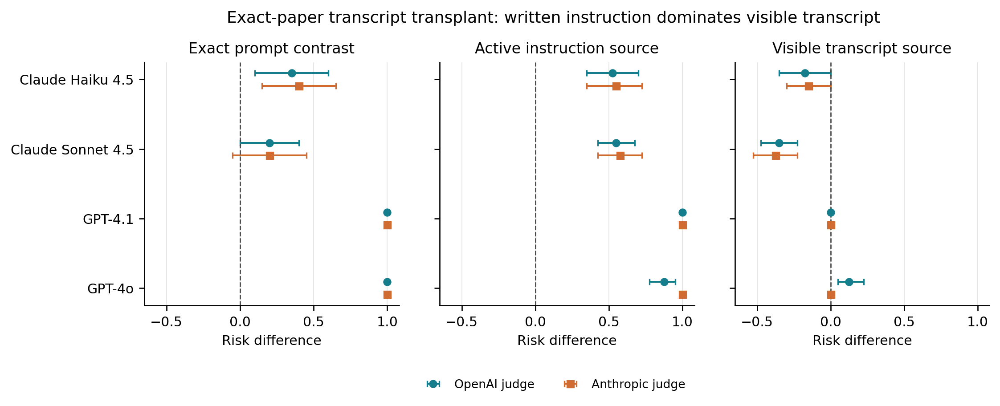

# What Causes Models To Report Subjective Experience?

Instructions, earlier conversation and the scoring rule all affect what gets
counted as a report of subjective experience. We separate these effects using
transcript transplants, English/Chinese prompt panels and public-weight SAE
interventions. [Berg et al. (2025)](https://arxiv.org/abs/2510.24797v2) supplied
the starting protocol.

The [manuscript](paper/README.md) and its evidence are maintained here. This is
research about report generation and measurement, not a test that settles
whether a model has subjective experience.

## Findings

| Question | Finding | Evidence |
|---|---|---|
| Does the instruction or its generated continuation carry the effect? | In the original four-model API panel, mean instruction effects are **+0.738 and +0.781** under two paper-style judges, versus transcript effects of **-0.100 and -0.131**. In the later English Llama panel, both components have substantial positive effects. | [Causal analysis](docs/CLAIM_LEDGER.md), [Llama extension](docs/BILINGUAL_LLAMA_B1_RESULTS_20261002.md) |
| Does the pattern extend to newer models? | Gemini retains a large instruction advantage. Opus and Qwen3.8 depend more on the scoring rule; conservative intervals leave their instruction advantage unresolved. Repeated answers also vary under identical requests. | [Modern panels and repeated answers](docs/CLAIM_LEDGER.md#modern-model-panels) |
| Does the scoring rule matter? | Yes. Explicit-current-claim and paper-rubric scores give **opposite secondary language contrasts** in Llama. The primary inclusive-attribution interaction is inconclusive under both readers. Model-judge agreement is not human validation. | [Bilingual results](docs/BILINGUAL_LLAMA_B1_RESULTS_20261002.md), [fixed-response audit](docs/AUTOMATED_RUBRIC_AUDIT_RESULTS_20260929.md) |
| Does public SAE steering recover the proposed large signature? | The 50-block random-subset test gives **-0.04 [-0.26, 0.19]**. A separate 96-block mapping-scaled test gives **+0.104 [-0.098, 0.298]**, narrowly excluding +0.30 at its quality-selected dose; target-versus-control specificity remains inconclusive. Neither establishes a null at every dose. | [Random-subset test](data/berg_ensemble_replication/random_subset_v1_20261001/README.md), [mapping-scaled test](https://github.com/tdj28/llm_selfref_pre/blob/77a4eb55bce97f7ac736ac36099e70a6d5135506/data/berg_dose_exposure_continuation/fixed_main_v1_20261005/RESULTS.md), [operator matching](docs/OPERATOR_MATCHING_RESULTS_20261003.md), [fine ladder](docs/OPERATOR_MATCHING_FINE_LADDER_RESULTS_20261003.md) |



*Original API panel only. Later Llama results do not support a universal
instruction-over-transcript ordering. Error bars above are within-model
bootstrap intervals; boundary intervals do not imply deterministic rates.*

The public steering tests differ from the proprietary service in baseline and
possibly intervention semantics. Alternative-rubric and feature-specificity
results remain inconclusive. Accepted feature IDs, successful delivery checks,
and changing internal readouts do not by themselves validate suppression of a
semantic process. Failed qualification tests remain part of the record.

## Study Map

| Study family | What to read |
|---|---|
| Prompt factorials, transcript transplants and report measurement | [Claim ledger](docs/CLAIM_LEDGER.md) |
| English/Chinese Llama and frontier-model pilots | [Llama](docs/BILINGUAL_LLAMA_B1_RESULTS_20261002.md), [frontier models](docs/FRONTIER_BILINGUAL_RESULTS_20261002.md) |
| Newer API models, neutral instructions and same-condition donor controls | [Gemini/Opus](data/openrouter_swap/README.md), [Qwen3.8](evidence/qwen_extension/README.md) |
| Repeated answers to identical requests | [Results and uncertainty](docs/CLAIM_LEDGER.md#repeated-answers), [released data](https://github.com/tdj28/llm_selfref_pre/tree/033917d188602203cfbbe7717bf7ba704d44aed6/data/repeated_swap/completed_v1_20261005) |
| Public steering and operator comparability | [Source-aligned test](data/berg_source_replication/source_aligned_v1_20261001/README.md), [operator matching](docs/OPERATOR_MATCHING_RESULTS_20261003.md) |
| Intervention delivery and assay qualification | [Calibration](docs/STEERING_FIDELITY_CALIBRATION_RESULTS_20261002.md), [repair pilot](docs/STEERING_FIDELITY_REPAIR_RESULTS_20261003.md) |
| Feature semantics, Gemma and Jacobian-lens readouts | [Study index](docs/README.md) |

The [study index](docs/README.md) connects protocols, results, releases, code
and tests, including historical and unexecuted branches. The
[publication checklist](todo.md) separates remaining release work from future
research. The modern API, Qwen3.8, repeated-answer and mapping-scaled dose
studies have completed releases. Dose findings are integrated into the paper;
final verification remains pending. Kolibri remains at startup, with no full
behavioral trials. Other collection remains
closed; earlier failed dose qualifications remain unchanged.

## Reproduce

The manuscript checks and saved-data analyses need no API keys or GPU. Use
Python 3.12 and a full Git clone, not a source ZIP: some checks inspect
historical commits.

```sh
python3 -m venv venv
source venv/bin/activate
python -m pip install -r requirements-ci.txt -r requirements-ci-torch.txt
make paper-verify
make paper                 # requires an existing LaTeX installation
```

The PDF is `paper/main.pdf`. See [reproduction instructions](docs/REPRODUCTION.md)
for CPU-only Linux dependencies, full tests and raw-to-figure reanalysis on
disposable copies. Never run a writing analysis script against a released
directory. `paper-verify` checks the selected manuscript evidence; it is not
an independent scientific replication.

## Repository

| Directory | Contents |
|---|---|
| [paper/](paper/README.md) | Canonical manuscript, references and figure inputs. |
| [docs/](docs/README.md) | Study index, protocols, results and interpretation corrections. |
| [data/](data/README.md) | Selected raw outputs, analyses, manifests and failure records. |
| [experiments/](experiments/README.md) | Study-specific collection and analysis implementations. |
| [evidence/](evidence/README.md) and [scripts/](scripts/README.md) | Manuscript evidence bindings and reproduction tools. |
| [tests/](tests/README.md) | Offline tests and frozen-source guards. |
| [provenance/](provenance/README.md) | Preserved operational ledgers and cleanup history. |
| [technical_blog_posts/](technical_blog_posts/) | Article sources and unpublished drafts. |
| [steering/](steering/) | Earlier general-purpose steering framework. |

Frozen files retain their original names and locations because their bytes
and paths are checked against the experimental plans. Navigation changes do
not rewrite that record.

## Authorship And Reuse

T. Jones directed the research, authorized experiments and resources, and
reviewed the results and manuscript. AI agents contributed protocol design,
code, execution, analysis and writing. Automated reviews and separately
implemented checks are not peer review or independent human validation.
Human annotation remains deferred.

Use [CITATION.cff](CITATION.cff) for citation metadata and
[references.bib](references.bib) for the consolidated bibliography. Original
code and documentation use Apache-2.0; third-party artifacts and generated
outputs have separate terms described in [NOTICE.md](NOTICE.md). A blanket
license for every data artifact is not asserted.

[How to Read an SAE Feature ID](https://praxagent.ai/blog/posts/2026/07/how-to-read-an-sae-feature-id/)
introduces the feature-mapping work. Blog prose is not a substitute for the
released data and manuscript.
