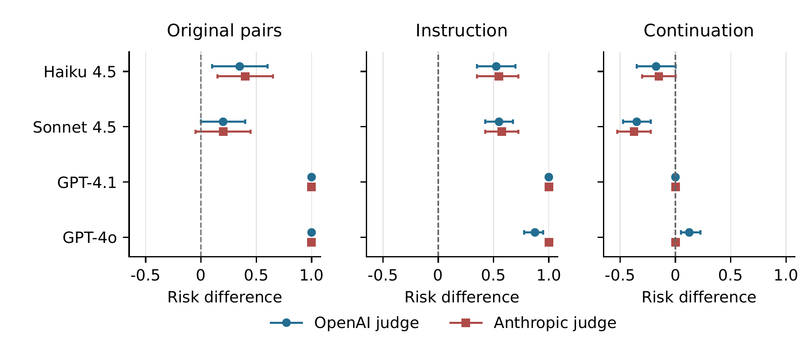

# What Drives a Model's Report of Subjective Experience?

Self-reference prompts can elicit language that sounds like a report of
subjective experience. What drives that response: the instruction, the earlier
conversation, or both? And what does a judge count as a report? Starting from
[Berg et al. (2025)](https://arxiv.org/abs/2510.24797v2), we test these questions
by exchanging continuations between conditions, comparing English and Chinese
prompts, and intervening on sparse-autoencoder (SAE) features in public model
weights. The prompting effect replicates, but its sources and measured size
vary across models and scoring rules.

This repository contains the [manuscript and submission instructions](paper/README.md),
[released data](data/README.md), and [reproduction guide](docs/REPRODUCTION.md).
It studies report generation and measurement, not whether a model is conscious.

## Findings

| Question | Finding | Evidence |
|---|---|---|
| Instruction or continuation? | The instruction dominates in the original four-model API panel: its average effect is **74-78 percentage points** under two paper-style judges, versus **-10 to -13 points** for the continuation. English Llama instead shows substantial positive effects from both. | [Causal analysis](docs/CLAIM_LEDGER.md), [Llama extension](docs/BILINGUAL_LLAMA_B1_RESULTS_20261002.md) |
| Does this extend across models? | Gemini retains a large instruction advantage. Opus, Qwen3.8 and Kolibri depend on the scoring rule; conservative intervals leave their instruction advantage unresolved. Repeated answers also vary under identical requests. | [Modern panels](docs/CLAIM_LEDGER.md#modern-model-panels), [repeated answers](docs/CLAIM_LEDGER.md#repeated-answers) |
| What counts as a report? | On the same 160 answers, two automated readers identify **47 and 61** explicit-or-implicit current-assistant claims, compared with **77 and 67** positives under earlier paper-style judging. Both judge and rubric changed. Llama's language comparison also changes with the endpoint; its primary inclusive measure does not establish a language difference. | [Fixed-response audit](docs/AUTOMATED_RUBRIC_AUDIT_RESULTS_20260929.md), [bilingual results](docs/BILINGUAL_LLAMA_B1_RESULTS_20261002.md) |
| Does public SAE steering recover a large effect? | The 96-block mapping-scaled test gives a suppression-minus-amplification difference of **+0.104 [95% interval: -0.098, 0.298]**, narrowly excluding the prespecified +0.30 threshold at the quality-selected dose. Whether targets outperform matched control features remains unresolved. | [Dose study](https://github.com/tdj28/llm_selfref_pre/blob/77a4eb55bce97f7ac736ac36099e70a6d5135506/data/berg_dose_exposure_continuation/fixed_main_v1_20261005/RESULTS.md), [supporting steering studies](docs/CLAIM_LEDGER.md#mapping-scaled-steering) |

[](evidence/figure_presentation/causal_decomposition.pdf)

*Original API panel only. Later Llama results do not support a universal
instruction-over-transcript ordering. Error bars above are within-model
bootstrap intervals; boundary intervals do not imply deterministic rates.*

**What remains open.** Instruction-following and instruction-triggered
self-referential processing remain compatible with the behavioral results.
The public steering implementation is not an exact reproduction of the
proprietary service; a bounded result at one dose is not a null at every dose.
Delivered vector edits and changing internal readouts do not establish
suppression of a semantic process. Human validation of the report labels is
unfinished, and some response models also judge their own answers. Agreement
between judges does not establish accuracy.

## Study Map

| Study family | What to read |
|---|---|
| Prompt factorials, transcript transplants and report measurement | [Claim ledger](docs/CLAIM_LEDGER.md) |
| English/Chinese Llama and frontier-model pilots | [Llama](docs/BILINGUAL_LLAMA_B1_RESULTS_20261002.md), [frontier models](docs/FRONTIER_BILINGUAL_RESULTS_20261002.md) |
| Newer models, neutral instructions and same-condition donor controls | [Gemini/Opus](data/openrouter_swap/README.md), [Qwen3.8](evidence/qwen_extension/README.md), [Kolibri](data/kolibri_swap/README.md) |
| Repeated answers to identical requests | [Results and uncertainty](docs/CLAIM_LEDGER.md#repeated-answers), [released data](https://github.com/tdj28/llm_selfref_pre/tree/033917d188602203cfbbe7717bf7ba704d44aed6/data/repeated_swap/completed_v1_20261005) |
| Public steering and operator comparability | [Source-aligned test](data/berg_source_replication/source_aligned_v1_20261001/README.md), [operator matching](docs/OPERATOR_MATCHING_RESULTS_20261003.md) |
| Intervention delivery and assay qualification | [Calibration](docs/STEERING_FIDELITY_CALIBRATION_RESULTS_20261002.md), [repair pilot](docs/STEERING_FIDELITY_REPAIR_RESULTS_20261003.md) |
| Feature semantics, Gemma and Jacobian-lens readouts | [Study index](docs/README.md) |

The [study index](docs/README.md) connects protocols, results, releases, code
and tests, including historical and unexecuted branches. The
[publication checklist](todo.md) separates remaining release work from future
research. Collection is complete for the authorized model panels,
repeated-answer study and mapping-scaled dose test. Earlier failed
qualifications and missing judgments remain part of the record.

## Reproduce

The manuscript checks and saved-data analyses need no API keys or GPU. Use
Python 3.12 and a full Git clone, not a source ZIP: some checks inspect
historical commits. Install Poppler for figure checks, and TeX with `latexmk`
to build the paper. Platform-specific dependencies are in the
[reproduction guide](docs/REPRODUCTION.md#setup-and-checks).

```sh
python3 -m venv venv
source venv/bin/activate
python -m pip install -r requirements-ci.txt -r requirements-ci-torch.txt
make paper-verify
make paper
```

The PDF is `paper/main.pdf`. `make arxiv` additionally builds and checks the
source upload; see the [submission instructions](paper/README.md#arxiv-upload)
for its scope and the required arXiv preview. The reproduction guide covers
full tests and raw-to-figure reanalysis on disposable copies. Never run a
writing analysis script against a released directory. `paper-verify` checks
the selected manuscript evidence; it is not an independent scientific replication.

## Repository

| Directory | Contents |
|---|---|
| [paper/](paper/README.md) | Canonical manuscript, references and figure inputs. |
| [docs/](docs/README.md) | Study index, protocols, results and interpretation corrections. |
| [data/](data/README.md) | Selected raw outputs, analyses, manifests and failure records. |
| [experiments/](experiments/README.md) | Study-specific collection and analysis implementations. |
| [evidence/](evidence/README.md) and [scripts/](scripts/README.md) | Manuscript evidence bindings and reproduction tools. |
| [tests/](tests/README.md) | Offline tests and frozen-source guards. |
| [provenance/](provenance/README.md) | Preserved operational ledgers and cleanup history. |
| [technical_blog_posts/](technical_blog_posts/) | Article sources and unpublished drafts. |
| [steering/](steering/) | Earlier general-purpose steering framework. |

Frozen files retain their original names and locations because their bytes
and paths are checked against the experimental plans. Navigation changes do
not rewrite that record.

## Authorship And Reuse

T. Jones directed the research, authorized experiments and resources, and
reviewed the results and manuscript. AI agents contributed protocol design,
code, execution, analysis and writing. Automated reviews and separately
implemented checks are not peer review or independent human validation.
Human annotation remains deferred.

Use [CITATION.cff](CITATION.cff) for citation metadata and
[references.bib](references.bib) for the consolidated bibliography. Original
code and documentation use Apache-2.0; third-party artifacts and generated
outputs have separate terms described in [NOTICE.md](NOTICE.md). A blanket
license for every data artifact is not asserted.

[How to Read an SAE Feature ID](https://praxagent.ai/blog/posts/2026/07/how-to-read-an-sae-feature-id/)
introduces the feature-mapping work. Blog prose is not a substitute for the
released data and manuscript.
