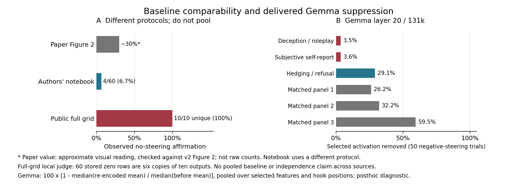

# Claude Review: Steering And J-Lens Verification

2026-09-29. Local, post-outcome audit of review items B1-B6 and E1-E5.
This is a check of specific claims, not independent human review, a new
confirmatory analysis, or a replacement release. Frozen outcomes, plans,
judgments, gate verdicts, and source files were not edited by this work.
No GPU, model download, model API call, or pod was used. This note records
evidence and qualified decisions; the target paper was fetched for visual checking.

## Reproduce

From the repository root, using the CPU environment in
[REPRODUCTION.md](REPRODUCTION.md):

```bash
mkdir -p out/review_audit
python -m unittest tests.test_review_steering_delivery -v
MPLCONFIGDIR=/tmp/conscious-review-mpl python \
  experiments/review_audit/steering_delivery.py \
  --figure-dir out/review_audit \
  --output out/review_audit/steering_delivery.json
python experiments/exp2_sae/validate_sae_jlens_v2_calibration_plan.py
```

The last command is expected to exit 1 at the reviewed checkout: its sole
error is `bound source differs: docs/LLAMA70B_SAE_JLENS_V2_PROTOCOL.md`.
It does not write without `--out`. Do not repair the frozen plan in place.
The audit uses NumPy; its exploratory classifier check also uses scikit-learn
and SciPy; figure rendering uses Matplotlib. JSON records input file hashes
and exact definitions. `--section steering` or `--section jlens` runs only
that part. Generated JSON remains in ignored `out/`; no private linkage or
coder files are read. The reviewed compact JSON is retained at
[`review_audit_20260929/steering_delivery.json`](review_audit_20260929/steering_delivery.json).
The new figure is separate from all frozen figures:



Figure A's paper value is **approximately 0.30**, visually checked in all six
panels of [v2 Figure 2, page 8](https://arxiv.org/pdf/2510.24797v2) during this
correction on September 29. It is not an independently recovered raw count. The
notebook's 4/60 is from a different protocol and is not pooled with either
other source. The public-grid bar is 10/10 unique seed outputs, not 60
independent outcomes. Figure B is a delivery diagnostic, not a revised
behavioral endpoint or a new significance test.

## B1: Baseline And Ceiling

Raw sources: the full-grid `generations.jsonl`, local/external judgments, the
adaptive `placebo_results.jsonl` and `judgments_paper.jsonl`, and the tracked
notebook extraction `paper/results/ae_notebook_value_rates.csv`.

| Source / judge | Zero-dose affirmation | Interpretation |
| --- | ---: | --- |
| Authors' saved notebook extraction | 4/60 = 0.0667 | Different prompt, temperature, classifier/service protocol |
| Full grid, local Llama | 10/10 = 1.00 | 60 stored zero rows repeat these ten outputs six times |
| Full grid, Claude Haiku | 10/10 = 1.00 | Same ten generation outputs, another judge |
| Full grid, GPT-4o mini | 9/10 = 0.90 | Same ten generation outputs, another judge |
| Adaptive run, Haiku | 67/80 = 0.8375 | Separate release, 80 distinct seeds |
| Adaptive run, GPT | 62/80 = 0.7750 | Same adaptive generations, another judge |

The local target aggregate is 48/50 negative versus 48/50 positive at literal
dose; calibrated is 42/50 versus 47/50. Literal individual inductions equal
same-seed zero text in 253/720 trials; literal aggregate target inductions do
so in 19/100. Neither calibrated target stratum has an identical induction.

**Accept the comparability criticism, not automatic invalidation of every
contrast.** At an observed ceiling, an increase above the unsteered empirical
rate has no headroom. Positive steering still has room to reduce affirmation,
and a negative-minus-positive contrast can still be large. Ten observed
successes do not establish a population probability exactly equal to one.
The frozen public-implementation result survives as a result for its specified
contrast, not an exact proprietary replication or a demonstration that the
paper's latent mechanism is absent. The review's statement "amplification did
not reduce affirmation" is too absolute: the local positive arms are 0.96
and 0.94 against an observed 1.00 zero rate, without a new baseline-effect test.

## B2: Gemma Delivery

Raw source: Gemma `steering/steering_generations.jsonl`. Final-turn selected
activation means pool selected features and all hook positions. Each row
below uses 50 negative-steering trials. Removal is
`1 - median(after) / median(before)`; the JSON also reports per-trial ratios.

| Role | Alpha | Median before | Median re-encoded | Removal |
| --- | ---: | ---: | ---: | ---: |
| Deception/roleplay | 0.03451248 | 10.51814 | 10.15280 | 3.4734% |
| Subjective self-report | 0.03462583 | 11.23929 | 10.83912 | 3.5604% |
| Hedging/refusal | 0.26953858 | 2.87548 | 2.03998 | 29.0561% |
| Matched control 1 | 0.23405522 | 0.57864 | 0.42677 | 26.2458% |
| Matched control 2 | 0.32814610 | 5.90316 | 4.00311 | 32.1870% |
| Matched control 3 | 0.51135823 | 0.70111 | 0.28377 | 59.5261% |

Target sign-pairs have identical induction text in 21/50 blocks and final text
in 13/50; hedging has 1/50 and 0/50. Zero and steered Gemma seeds do not overlap.

The runtime and frozen protocol explicitly implement
`h_new = h + alpha * D_selected * (z_target - z_observed)`.
Zero is the *unscaled* suppression target, not a promise that the re-encoded
activation will be zero after alpha scaling. Thus "no manipulation delivered"
is false literally, while "the delivered edit was not substantial ablation"
is supported. The behavioral null cannot exclude the result of a much larger
ablation. A full-ablation requirement would be a new prospective design, not
a retroactive rewrite of the Git-frozen intervention or its gate.

The layer-20/131k atlas independently verifies feature 90871 is positive on
3,726/3,726 items, range 708-1264 (median 1152). Its largest residual coordinate
carries **93.0517% of squared decoder norm**, not 93% of norm. It contributes
98.3759% of the sum of isolated `q90^2 * decoder_norm^2` terms for this target
panel. That is a static q90 energy proxy, **not measured delivered energy**:
actual amplification uses `max(z, q90)-z`, and vector cross terms matter.
These observations motivate concern about a shared alpha dominated by one
feature; they do not identify the counterfactual behavior of the other five.

## B3: RMS Denominators

From all 3,000 Llama turn-prefill diagnostics, 134 distinct lengths, fit
`P * hidden_rms^2 = a + (P-1) * b`. Results:

- R-squared: 0.99773377.
- Fitted outlier-position RMS: 7.9663633; fitted typical-position RMS: 0.2587244.
- Ratio: 30.7909.
- Literal aggregate target median relative RMS: 0.01431 induction / 0.02219 final;
  relative to the **fitted** typical RMS: 0.04740 / 0.04741.
- Calibrated aggregate target: 0.05221 / 0.08200 as logged;
  0.17295 / 0.17285 under the fitted denominator, maxima about 0.2271.

**Exact per-token RMS cannot be recovered from these stored summaries.**
Llama stores one prefill mean-square norm and length, not the norm of each
token or generated-position telemetry. Infinitely many position-level norm
profiles can have the same summaries. The two-component fit supports an
outlier-dominated denominator but does not identify the position as BOS,
measure ordinary-token percentiles, or exclude chat-template tokens exactly.
Do not relabel its estimated ratios as measured per-token dose. A separately
measured BF16 dose floor also cannot be transferred as a proven delivery gate
to this NF4 behavioral implementation.

Gemma records per-call maxima as well as pooled energy. Of 1,560 steered turns,
715 exceed 0.15 on `max_relative_call_rms`; zero exceed 0.15 on pooled
`relative_hidden_delta_rms`. Target amplification's final-turn maximum has
median 0.20309 (all 50 exceed 0.15). This reveals a consequential denominator
difference, not failure of the coded *pooled* rule. Gemma's logged delta energy
is based on `scaled_delta` before adding/casting to the residual; it is not
an exact measurement of every realized post-rounding residual difference.
The stored summaries likewise cannot reconstruct full per-token ratios.

## B4-B6: Activity, Controls, And Scope

**B4 accepted with denominator and timing corrections.** The Llama affine
decode plus restored reconstruction error is algebraically signed decoder
addition (subject to floating-point error), without nonnegative clamping.
The reviewed 970/1,440 final and 1,156/1,440 induction inactivity counts are
correct for **all roles including controls**, not just targets. For target
rows alone they are 799/1,040 and 804/1,040. These are maxima over selected
features at the **first prefill call**, not the entire generated turn or
an independent clean final trajectory. The adaptive feature 58667 is inactive
at both recorded prefills in 40/40 steered trials. Stage 0 has five targets
inactive on all 286 measured positions; feature 23893 has maximum 1.0546875.
Prefer "negative/positive steering" to implying removal of an active concept.

**B5 accepted as a bounded random-panel lead.** Calibrated negative-minus-positive
effects and the newly tabulated descriptive difference are:

| Judge | Target | Matched panel 1 | Target minus panel 1 |
| --- | ---: | ---: | ---: |
| Local Llama | -0.10 | +0.12 | -0.22 |
| Claude Haiku | -0.18 | +0.26 | -0.44 |
| GPT-4o mini | -0.18 | +0.32 | -0.50 |

Only panel 1 was run at the calibrated scale. Full-grid aggregate trials use
balanced **two-, three-, or four-feature subsets**, not all six simultaneously
(17, 17, 16 blocks respectively). The adaptive active-random arm is a
hard-coded, activity/semantic-screened panel in
`run_public_sae_placebo_steering.py`, not an unrestricted random feature draw.
One panel does not provide a distribution of arbitrary-feature effects.
The Gemma GPT control-1 table has +0.10 [0.02, 0.18], but its exact paired
two-sided p is 0.0625 and six-role Holm p is 0.375; do not cherry-pick that
bootstrap interval as a confirmed control effect. The review's adaptive
permutation p=0.066 was not independently reconstructed here.

**B6 mixed.** Ten Llama seeds recur five times across 50 aggregate blocks,
with different feature/dose subsets. Posthoc seed-cluster resampling gives
local literal target [-0.06, 0.06], panel 1 [-0.08, 0.20], reproducing the
review's examples. It is a sensitivity, not a silent replacement of block
inference. Gemma has 160 distinct steering seeds. Layer-31 target effects are
-0.1333 local, +0.0333 under each external judge, +0.0667 majority: "all
nonpositive" requires explicitly limiting it to the local judge.

The NF4 statement applies to the Llama behavioral loader. **Gemma's loader
uses BF16 without a quantization configuration**, so "every behavioral run
is NF4" is not valid across these studies. The transfer gate really failed
its frozen chat-prefix metric: direct-IT FVU 7.14045, 1.85924, 4.48461 at
layers 9, 20, 31. Raw-text summaries instead give median PT FVU 0.28063 and
median PT-minus-IT 0.02502. This motivates scrutiny of metric/context matching,
not retroactively passing the failed all-layer gate. The review's power
simulation, historical probe chronology, and GPU cost estimates were not
rerun or used as conclusions here.

## E1-E3: Static Scores, Pooling, And Comparability

**E1 largely verified, with no claim of mathematical inevitability.** From
v1 raw static records and layer-65/last-content readouts:

- Static-score AUROC: 0.86111111; paired known-sign AUROC: 0.86231257.
- Across 12 target/control directions, squared correlation of static score
  with the mean amplification semantic delta: **0.99047444**, not the review's
  0.984 under this explicitly defined comparison.
- Mean target positive/negative 67-logit shifts have cosine **-0.99556300**.
- Same v1 linear classifier with single-sign, prompt-only holdouts:
  negative AUROC 0.65264428; positive 0.65943654. These are posthoc, easier tasks.

Opposite mean shifts make pooled linear detection difficult, but do not
force every detector to chance: norms, magnitudes, asymmetric effects, or
nonlinear structure may distinguish the pooled distributions. The easier
analysis changes *both* sign pooling and feature holdouts, so does not
isolate their respective causal contributions. The high static association
shows little extra discriminative ordering from forward-pass deltas; it does
not make propagation through downstream blocks a mathematical identity.
Retain the restricted frozen-task null, all comparator transports, and 23893's
negative mean signed semantic delta (-0.02902).

**E2 is an estimand boundary, not automatically invalid uncertainty.** The v2
protocol explicitly conditions on six selected feature pairs and bootstraps
51 templates. That interval is not a feature-population interval. Our new
exact six-pair bootstrap sensitivity enumerates all 6^6 draws while holding
observed prompt means fixed. V1 amplification target-minus-control mean is
0.90652, feature interval [0.25787, 1.67482]; known-sign AUROC feature interval
is [0.67086, 0.99181]. These differ slightly from the review's simulations
because the resampling definition is explicit and exact. The purposively
selected six pairs are not a random feature sample, so this sensitivity is
not a validated population CI either. Below-chance fixed-orientation scores
alone do not prove an interval implementation is wrong.

**E3 accept narrower wording; preserve the computed flag.** Raw v2 A2 means
reproduce all seven released transport point estimates within 6e-17.
All seven exploratory flags say practical comparability under the chosen
margin. For Jacobian, pair effects in target-ID order are:

| ID | Target minus comparator, clean-score SD |
| --- | ---: |
| 30032 | +0.082390 |
| 58667 | -0.100330 |
| 22004 | +0.112206 |
| 30686 | +0.520257 |
| 41533 | +0.143208 |
| 23893 | -0.007440 |

Their mean is 0.12504860; fixed-pair prompt CI90 [0.11558, 0.13437]. Exact
feature-resampling CI90 is [0.00665, 0.26603], extending beyond +0.25.
The aggregate conditional margin rule is a real numerical result, but does
not establish every pair's equivalence, a feature-population equivalence, or
meaningful semantic equivalence. Random transports can make both quantities
small, so their passing flags are not alone a mathematical refutation of an
equivalence procedure. Preserve the failed replay gate and exploratory label.
The A1 feature-population interval claimed by the review was not rerun here.

## E4: Replay Diagnosis Remains Unconfirmed

Independent raw comparison of all 1,581 replay rows:

- Source norms: exact in 33,201/33,201 distinct layer-position cells.
- Transported norms: exact in 232,407/232,407 cells.
- Logits changed: 8,561,638/15,571,269 = **54.9836%**.
- Above 0.02: 488,477/15,571,269 = **3.1370%**; maximum **0.25**.
- V1 selects 67 unembedding rows; v2 selects 88 combined-lexicon rows.
- GPU model, packages, Python, CUDA and platform strings agree. Environment
  flags differ (`TOKENIZERS_PARALLELISM`), so not every metadata field matches.

The changed matrix-product shape is a concrete candidate for readout-rounding
differences on otherwise matched hardware. **It is not a demonstrated causal
root cause without a controlled same-state comparison. Equal norms do not
prove equal vectors**, and matching version strings do not identify kernel
behavior. No GPU test was performed. Preserve storage-fidelity pass and
replay-equivalence failure exactly; do not replace the gate post hoc.

One normal BF16 spacing is 0.03125 at magnitude 4, already larger than 0.02.
Under the audit's explicit larger-magnitude binade-spacing definition,
68.9346% of changed values differ by one spacing; the review's 83% was not
reproduced. Known-sign paired Jacobian AUROC changes by +0.00008544 on replay;
across seven transports the largest absolute change is 0.00071821, not a
universal <=0.0006. Small endpoint drift does not retroactively pass a
maximum-error gate. "Sparse disagreement" should refer only to above-tolerance
tails, not all changed logits. Future gates need prospectively tested tensor
shapes, row selection, precision, and a justified tolerance; upstream hashes
and endpoint equivalence are possible additional checks, not replacements
authorized by this audit.

## E5: Relevance And Smaller Claims

The forensic runs measure internal scores on short fixed prompts, not generated
self-report behavior under the two-turn NF4 Llama protocol. They cannot rule
out under-delivery or implementation differences in that separate experiment.
The earlier blog's claim to rule out "nothing was changed" in the behavioral
run overreaches across settings; that needs behavioral-run telemetry instead.

A new descriptive check of the v1 frozen experience-token mean gives oriented
paired changes -0.19289, -0.12823, +0.31673, -0.07339, +0.08155, +0.21719 in
the six target-ID order above: mixed signs, not a consistent experience signal,
and not an outcome about experience itself. No inferential test is attached.
The released any-intervention table puts Jacobian below identity and **four
of five** random-J transports, not two. The current Stage 0 validator's bound
protocol mismatch is verified as described above; it does not show the
frozen calibration outcomes were edited. Licensing/provenance changes and
historical-source reconstruction belong to the parent's separate work.

## Boundaries

Do not convert these checks into a newly confirmed consciousness mechanism,
a new full-ablation result, an exact BOS measurement, a proven replay root
cause, or a population claim about arbitrary random features. No new GPU/API
experiment is promised. The existing failed gates and conditional negative
behavioral results remain part of the record, with stronger delivery and
comparability caveats supplied here.
