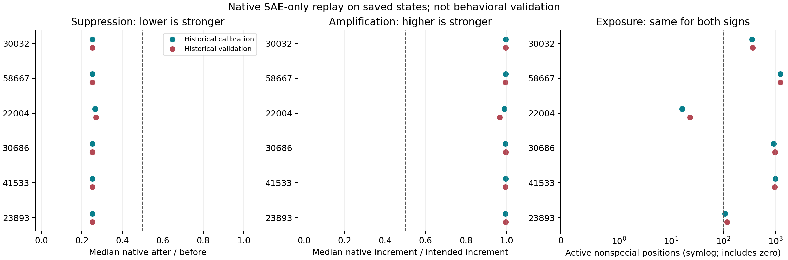
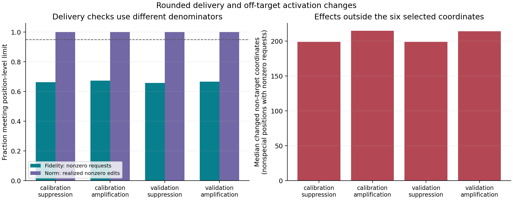

# Native Delivery Improves; The Assay Still Does Not Qualify

The capped active-support operator survives native BF16 re-encoding much better
than a geometry-only prediction could establish. All six coordinates meet the
median efficacy threshold in both directions and both historical splits, and
every realized edit meets the residual-norm limit. However, vector fidelity
passes on only 65.8--67.4% of requests, against the unchanged 95% requirement.
Feature 22004 still has too few active positions. **No behavioral assay is
qualified, and no consciousness-report outcome was generated.**

## What Was Run

This is SAE-only engineering on all 544 previously saved Llama residual states,
not a new Llama forward or fresh validation. The operator uses selected encoder
rows to target a 75% decrease/increase on already-active coordinates, with a
4% continuous residual-norm cap. It is not the paper's proprietary intervention
and is not a decoder-vector replication. Requested vectors are formed in FP32,
written once into BF16 states and measured with the full 65,536-wide native
encoder, one position at a time. Zero and all-inactive positions are exact no-ops.

- Initial result-free freeze: `077ce9d50d97cf8d94d90f6d0640baaeb9cffcbc`.
  No pod or outcome was created under it because the A6000 was unavailable.
- Executed freeze: `9ddc9c7a8764b594a94486981fbd150a7506ef56`.
  The [outcome-blind amendment](SAE_ASSAY_REPLAY_HARDWARE_AMENDMENT_20260930.md)
  substitutes a cheaper A40, changing no scientific setting.
- Executed plan: `data/sae_assay_replay/plan_20260930a/PLAN.json`, SHA-256
  `80a10ef81f38ffecbea5225a200676a93af1c36052846a4df45bfee938121fcb`.
- All 544 rows have all three arms. The complete receipt/input/geometry audit
  passes. No row was rerun, dropped or selected using its effect.

The [raw release](../data/sae_assay_replay/native_replay_20260930/) contains the
native telemetry, environment, full audit, two figure pairs, numeric tables,
streaming checks, lifecycle/cost projection and artifact hashes. SAE and model
weights, credentials, SSH details and the private lifecycle ledger are excluded.

## Results

| Historical panel | Sign | Nonzero requests | Fidelity pass rate | Norm pass rate |
|---|---|---:|---:|---:|
| Calibration | Suppression | 2,261 | 66.25% | 100% |
| Calibration | Amplification | 2,261 | 67.36% | 100% |
| Validation | Suppression | 2,323 | 65.78% | 100% |
| Validation | Amplification | 2,323 | 66.59% | 100% |

Fidelity requires cosine >=0.95 and relative error <=0.20 for a nonzero
request. Norm requires a realized nonzero edit <=5% of clean norm. Both
component gates require at least 95% of their respective denominators.
No nonzero request rounds completely away, but many realized vectors differ
too much from the requested vector. Coordinate efficacy and vector fidelity
are different measurements; passing one does not erase failure of the other.

Across the six IDs, native median suppression after/before ranges from
0.2510 to 0.2695. Native median amplification achieved/intended increment
ranges from 0.9661 to 0.9966. All 24 feature-by-sign-by-split median checks
pass. Amplification's denominator remains the original `0.75 * before`, not
the norm-capped prediction. These are descriptive medians, not population
estimates or token-independent confidence intervals.

Exposure remains 16 positive positions in 13 calibration texts and 23 in 20
historical-validation texts for 22004. Both fall below 100 positions; the
six-text minimum alone is insufficient. The other five targets clear both
minima. The historical split names do not make this fresh validation.

Non-target coordinates also move. Among nonspecial positions receiving a
nonzero request, the median number with any changed native activation is 199
under suppression and 214--215 under amplification. A nonzero numerical change
does not establish a meaningful semantic change. The all-position median is
zero because most positions receive no request; both denominators are retained
in the table. The requested-only neighbor summary is a post-outcome descriptive
addition for the figure, not a new gate or an alternate efficacy denominator.





## Numerical And Operational Checks

Native clean measurements differ from the older GPU at three of 84,150 selected
coordinate entries, by at most 0.000030517578125. No active/inactive status
changes. Thus the replay is extremely close, but not bit-exact. Promoted-FP32
preactivation checks and clean-norm checks pass their frozen tolerances.
Selected-width encoding disagrees with three suppression component decisions
because it gives zero for some native-positive baselines, making those ratios
undefined. It never substitutes for the authoritative full-width measurement.

The synthetic CUDA qualification passes. The first-five local audit passes
before bulk approval. A live snapshot then catches a file written before its
receipt: 174 receipted rows plus one in-flight raw row. The auditor correctly
rejects it. The next snapshot passes with 300 completed rows; the entire earlier
receipt prefix and all 175 raw files are byte-identical, and the in-flight row
is now receipted. The failed check, receipt prefixes and reconciliation remain
in `monitoring/`. No measurement was regenerated to repair this snapshot race.
The complete 544-row audit passes with no unresolved dispatch.
Separate agent-written arithmetic reconstruction, without importing the analysis
module, agrees on all 24 medians, exposure, fidelity/norm denominators and source
differences. Its report is `analysis/independent-arithmetic.json`. It checks
saved telemetry, not an independent SAE execution or human scientific review.

Only newly owned pod `mv3qjsgn79vjos` was used. All artifacts were retrieved and
hash-checked before DELETE 204; direct GET 404 and an empty inventory confirm
deletion. No other pod was modified. Rental duration was 25.48 minutes,
including slow network-filesystem setup, audit pauses and retrieval; recorded
per-state compute totals 155.08 seconds. The conservative new cost bound is
$0.250534, and the cumulative diagnostic/repair bound is $27.635070 of $200.
These are accounting bounds including a storage allowance, not an invoice.

## Reproduce And Continue

From the released source and data, with the repository CPU dependencies:

```sh
python -m experiments.sae_assay_replay.report \
  --run data/sae_assay_replay/native_replay_20260930 \
  --plan data/sae_assay_replay/plan_20260930a/PLAN.json \
  --out out/native-replay-rebuild
```

The output directory must not exist. This rebuilds the frozen audit and tables
and renders figures without overwriting raw data or requiring a GPU/API key.
The publication renderer is later descriptive code; the primary analysis was
frozen before execution. Automated reconstruction is not independent human
scientific review.

The [224-text exposure panel](SAE_ASSAY_EXPOSURE_DESIGN_20260930.md) is authored,
family-disjoint and exactly tokenized, but has **not** been activation-screened.
The next useful repair must address delivery fidelity as well as rare-feature
exposure; solving coverage alone cannot qualify this operator. Preserve the
existing thresholds. New full-model work still needs a separate executable
freeze, fresh-state validation, downstream NLL, a behavioral positive control
and adequate baseline headroom before any target-report steering. These results
neither confirm nor refute consciousness or the proprietary Berg intervention.
