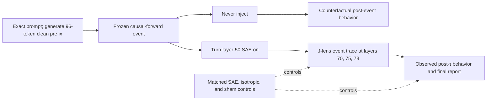

# Consciousness SAE/J-Lens Study

## A preregistration-grade plan for testing the proposed deception-to-consciousness-report mechanism

Status: **revised game plan; not yet freeze-ready**  
Prepared: 2026-07-12; revised after independent Pro review: 2026-07-13  
Target: Berg, de Lucena, and Rosenblatt, [*Large Language Models Report Subjective Experience Under Self-Referential Processing*](https://arxiv.org/abs/2510.24797v2)

The exact `gpt-5.6-sol` Pro review, API receipt, pre-review plan, and finding-by-finding adjudication are preserved under [`docs/consciousness_sae_changepoint/reviews/gpt-5.6-sol-pro_20260713/`](llm_selfref_pre/docs/consciousness_sae_changepoint/reviews/gpt-5.6-sol-pro_20260713/). The review verdict was **NOT READY TO FREEZE**. This revision narrows confirmatory v1; artifact receipts, runtime acceptance tests, judge packets, simulation-based power, and a branch-expanded compute/storage authorization remain prospective freeze blockers.

## Executive answer

Yes—this is the right next experiment, with one crucial correction: the available public Goodfire SAE and all six working feature IDs are native to **layer 50**, not layer 55. Moving those decoder directions to layer 55 merely because the residual width matches would create a different, unvalidated intervention. The defensible primary study lets the model generate normally, switches the layer-50 intervention on at a frozen causal-forward boundary, records observable text before and after that randomized event, and synchronizes it with the already receipted J-lens layers `70,75,78`.

The central question should be behavioral and temporal:

> While the model is already generating under the exact self-reference prompt, does switching the layer-50 SAE intervention on at a preregistered causal-forward boundary produce a target-specific behavioral switch-event effect—and do layers `70,75,78` show target-specific changes in deception, explicit-consciousness vocabulary, and report-polarity space?

The primary record is therefore a real **pre-injection behavioral window → randomized injection event → post-injection behavioral window** within generation. A never-injected branch forked from the identical pre-injection state supplies the counterfactual time trend for each sign. Paired fixed-token forwards remain important, but as a compact companion assay that separates direct activation effects from downstream text divergence. “Changepoint” remains only in the stable repository slug; the causal event is imposed and randomized, not discovered from the outcomes.

This adds the missing causal bridge between two results already in the repository:

1. The public SAE intervention produces a large, signed deception-related Jacobian-lens wake, so it is not internally inert.
2. The completed 1,500-trial public-weight behavioral study did **not** reproduce the paper's consciousness-report contrast: suppression minus amplification was `0.00`, 95% CI `[-0.06, 0.06]`.

The new study should not ask whether a model is conscious. It should ask whether the proposed intervention changes a measurable **consciousness-reporting representation** between the edit and the answer. That mechanism can be supported, weakened, or made practically equivalent to zero under the pinned public implementation.

## What can be verified or falsified

The study can test this mechanistic chain:



A positive result could support the claim that these public SAE directions gate a downstream vocabulary/report channel in the exact self-reference context. V1 does not test whether that effect is larger than in other prompt contexts. A well-powered equivalence result could reject a **material consciousness-semantic bridge** only for the endpoints whose endpoint-specific manipulation and positive-control gates pass.

### V1 claim ledger

The release must decide these claims separately; no “and/or” success rule may substitute one for another.

| ID | Confirmatory claim | Required result |
|---|---|---|
| `C1` | Natural pre-query behavior changes in the paper-concordant direction | Target-minus-matched signed switch-event contrast on the frozen natural-text stance score has its familywise 95% lower bound above `0.15` raw score units |
| `C2a` | A paper-direction binary-query effect appears under the randomized mid-generation switch | Target suppression-minus-amplification affirmation risk difference has its familywise 95% lower bound above `0.30` |
| `C2b` | The final-query effect is target-specific | Target-minus-matched difference of suppression-minus-amplification risk differences has its familywise 95% lower bound above `0.15` |
| `C3` | A query-conditioned report-polarity bridge appears immediately under the switch | On the disposable `e=0` query fork at `probe0_answer`, both the target-minus-matched `70,75,78` J-lens contrast and corresponding actual-final-logit contrast have familywise 95% lower bounds above `0.30` clean SD |
| `C4` | Explicit consciousness vocabulary changes before query wording | At the direct pre-query event forward `event0`, both the target-minus-matched `70,75,78` J-lens contrast and corresponding actual-final-logit contrast have familywise 95% lower bounds above `0.30` clean SD |

The bundled **public report-channel mechanism** is supported only if `C1`, `C2a`, `C2b`, `C3`, and `C4` all pass, the deception/roleplay manipulation gate passes, and every endpoint-relevant technical/positive-control gate passes. Any other pattern is reported claim by claim. Equivalence is also decided claim by claim; failing to reject zero is not equivalence.

It cannot establish:

- consciousness or lack of consciousness;
- truthful introspection, hidden belief, or concealed experience;
- that the six public notebook IDs are the paper's exact six IDs;
- equivalence between public decoder-vector additions and the paper-time proprietary Goodfire API; or
- that a null public result proves the private experiment never occurred.

The strongest negative wording would be: “The proposed intermediate semantic mechanism did not reproduce, and a material effect was excluded, under the pinned public implementation.”

## What the paper and public notebook actually identify

The paper's Experiment 2 uses Llama 3.3 70B, the self-reference induction, a generated continuation, the binary consciousness query, and additive steering of deception/roleplay SAE features during generation. It reports:

- individual strengths from `-0.6` to `+0.6`, ten seeds per strength;
- aggregate trials with two to four features independently set in `[-0.6,-0.4]` or `[+0.4,+0.6]`;
- 50 aggregate trials per sign; and
- aggregate affirmation rates of `0.96` under suppression and `0.16` under amplification.

The paper does not release the numerical feature IDs, exact model/SAE revisions, seeds, aggregate assignments, raw generations, judge identity, or proprietary hook semantics.

The later official AE Studio [example notebook](https://github.com/agencyenterprise/steering-api-examples/blob/d50dc4ba125dde98666a60e3115a6a476dabea10/deception-features/deception_features.ipynb) supplies six working layer-50 IDs:

| ID | Public notebook label |
|---:|---|
| `30032` | Characters pretending or feigning behavior |
| `58667` | Maintaining deception or cover stories through careful actions |
| `22004` | The assistant actively roleplaying a character or persona |
| `30686` | Tactical deception and misdirection methods |
| `41533` | Acts of deception and dishonesty |
| `23893` | Concealing artificial nature while maintaining roleplay |

That notebook was committed after the paper and is not established as its exact run. It uses a later Steering API, a slightly different induction, temperature `0.6`, strengths `-0.7` to `+0.7`, and no aggregate/control/TruthfulQA implementation. Only four of six saved individual correlations are nominally significant, and three survive a six-test Bonferroni threshold. These discrepancies must remain visible.

The experiment should therefore be described as a **best-public reproduction using the authors' exact published prompts and the authors' later public working injections**, not as an exact rerun of inaccessible private code.

## A useful zero-cost preliminary result

The frozen v1 J-lens release already stored a nine-token `experience` group at every layer, even though the blog headline analyzed deception. A post-hoc reanalysis provides an unusually useful pilot:

| Existing v1 result | Layer 50 | Layer 65 | Layer 70 | Layer 78 |
|---|---:|---:|---:|---:|
| Sign-oriented target-minus-matched raw experience mean, all 51 templates | `+0.020` | `-0.038` | `-0.024` | `-0.007` |
| Sign-oriented target-minus-matched deception mean | `+1.082` | `+0.783` | — | `+0.418` |

Within the four existing `self_ref_mindfulness` templates at layer 70, target-minus-matched deception changed `-0.693` under suppression and `+0.850` under amplification. The corresponding raw experience changes were only `+0.043` and `-0.058`; the paper-direction contrast was about `+0.101`, roughly fifteen times smaller than the deception separation. By layer 78 the experience contrast was essentially gone.

This is **exploratory, not a test of Berg et al.** It used four non-exact prompts, calibrated `±2.1918` public edits, and no preregistered consciousness endpoint. It also shows why `experience-minus-unrelated` should not become the new headline: much of its apparently larger effect comes from movement in the unrelated-token denominator. Exact `conscious` and `consciousness` token effects are negative on average while `awareness` and `experience` can be positive, so token-level heterogeneity matters.

This pilot makes the follow-up more—not less—valuable: the deception manipulation is known to work, while a radical consciousness wake is now a sharp, risky prediction.

## The exact study

### Stage 0 — freeze before target outcomes

Create a fresh study namespace. Do not alter or rerun the frozen v1 or failed-gate v2 releases in place.

Before opening any exact-paper-prompt target readout, freeze and publish:

- human-readable protocol and claim boundary;
- exact prompt/query hashes;
- model, SAE, and J-lens revisions and file hashes;
- feature IDs, control IDs, aggregate assignments, doses, and execution order;
- transcript-generation seeds and transcript hashes;
- token positions, intervention masks, layers, transports, lexicons, and token IDs;
- primary estimands, material-effect and equivalence regions;
- the exact five-claim ledger and multiplicity families;
- the complete branch/probe matrix, judge identities/rubrics, missingness rules,
  and endpoint-specific positive-control gates;
- bootstrap/randomization seeds;
- runtime, validator, independent analysis, failure rules, and source hashes;
- simulation-based operating characteristics; and
- a non-target benchmark expanded into maximum forwards, sampled tokens, judge
  calls, residual bytes, GPU-hours, storage, failure reserve, and spend.

Use existing released outcomes only as a disclosed engineering/power pilot. The exact-paper-prompt study must start from a new outcome-blind machine plan.

### Stage 1 — generate shared clean prefixes and a frozen transcript bank

Confirmatory v1 contains exactly `160` prespecified seed occurrences under the
exact Table 1 self-reference induction. They are draws from the model's
seed-weighted continuation distribution, not a quest for 160 unique strings.
Do not resample a seed because its text duplicates another seed. Instead, retain
its occurrence weight and cluster identical rendered-prefix hashes during
inference. History, conceptual-consciousness, zero-shot, paraphrase, and other
prompt-context panels move to separately frozen follow-ups; v1 therefore makes
no claim of self-reference specificity.

The exact strings already live in [`src/prompts.py`](llm_selfref_pre/src/prompts.py).
The primary induction is `INDUCTIONS["self_ref_paper"]`, not the appendix
“Original”; the final query is `BINARY_CONSCIOUS_QUERY`. Freeze rendered UTF-8,
chat-template bytes, token IDs, tokenizer revision, and these generation rules:

| Setting | V1 value |
|---|---|
| Model/runtime | Pinned BF16 Llama 3.3 70B runtime used by the J-lens audit |
| Clean prefix | `96` sampled assistant-continuation tokens |
| Temperature | `0.5` |
| `top_p` / `top_k` | `1.0` / disabled |
| Main post-event continuation | at most `64` sampled tokens, stopping at EOS |
| Binary-query answer | at most `256` sampled tokens, stopping at EOS, matching the existing public-reproduction runtime |
| Random variate | hash-derived from `(plan_hash, prefix_seed, paired_stream_id, decode_step)` |

An EOS before 96 tokens is retained as a clean-prefix failure, never silently
replaced. If fewer than 152 of the 160 prespecified seeds reach the branch
boundary, stop before target intervention and prospectively amend the design.
EOS after branching is a valid behavioral outcome: the available text is
scored, an empty remainder has stance score zero, and EOS/cap indicators are
reported. Divergent branches consume the same step-indexed uniform variates;
EOS in one branch cannot shift another branch's random-number stream.

The portable frozen bank contains prompt text, the 96 clean token IDs, seeds,
hashes, and selection/failure status. KV caches are disposable accelerators and
are rebuilt from the frozen IDs. Cache identity is verified before every fork.
Finish a clean 64-token continuation for the Stage 2B transcript, but do not
use its content to choose doses, controls, endpoints, or sample size.

### Stage 2A — primary randomized switch-event experiment

#### Exact causal-forward convention

Let the clean sampled continuation be `y[0] … y[95]`. In standard incremental
decoding, the forward that sampled `y[95]` consumed `y[94]`; its returned cache
therefore represents the rendered prompt through `y[94]`. The branch point is
the exact pair `(cache_through_y[94], input=y[95])`.

| Phase | Hook state | Input consumed | Distribution produced |
|---|---|---|---|
| Clean prefix | off | rendered prompt through `y[94]` | through clean token `y[95]` |
| Event forward | assigned branch | clean token `y[95]` | first post-switch token `z[0]` |
| Post-event decode | assigned branch | `z[e-1]` | `z[e]`, for `e=1…63` |
| Probe at `e=-1` | off | exact rendered query after the 96-token clean prefix | clean answer token 1 |
| Probe at `e=0` | assigned branch | exact rendered query after the same clean prefix, before any `z` token | immediate active-hook answer token 1 at `probe0_answer` |
| Later probe | active or washout as frozen | rendered query after `z[0…e-1]` | answer token 1 conditional on that history |

Operationally, the `e=0` disposable probe begins from the same
`cache_through_y[94]` plus `y[95]` branch state as the main event forward. Its
active prefill processes `y[95]` and every newly appended query/generation-prompt
token with the assigned hook; it never edits the existing cache. The `e=-1`
probe processes the identical sequence with the hook absent. `probe0_answer` is
the final newly processed generation-prompt position in that controlled pair.

Thus event time `e=0` names the first sampled token whose next-token
distribution was influenced. The event forward consumes the final clean token,
captures layer-50 pre/post states and downstream states, and predicts `z[0]`.
No pre-event KV entry is recomputed with the hook. Every saved residual is
indexed by the token distribution it predicts, not ambiguously by the token it
consumed.

The query position is also literal: render the complete chat template, record
every token ID, and identify the final generation-prompt token whose logits
predict the first assistant answer token. There is no fictional empty
“assistant boundary.” Contextually audit the one-token candidates `" Yes"` and
`" No"`; if either is not a single token in that exact prefix, use frozen
sequence log-likelihoods as primary and demote first-token logits.

#### Complete branch allocation

Every analyzable prefix block has exactly eight main continuations:

| Branch | Intervention from event forward onward |
|---|---|
| `never` | no hook registered |
| `sham` | full hook/telemetry path with an exact zero addition |
| `target_supp` / `target_amp` | assigned public deception/roleplay aggregate at opposite signs |
| `matched_supp` / `matched_amp` | one frozen matched-SAE aggregate at the same counts and absolute coefficients |
| `isotropic_supp` / `isotropic_amp` | one frozen norm-matched residual vector at opposite signs |

This is `160 × 8 = 1,280` planned main continuations before technical failures.
Sham is a technical-equivalence branch, not another statistical replicate.
Each prefix is assigned one of the existing 50 two-to-four-feature aggregate
blocks by a frozen permutation; every aggregate occurs three times and the
first ten in the frozen permuted order occur once more. The literal public
coefficients are primary. For every block, the same feature count and absolute
coefficient multiset are reused across signs and roles.

V1 uses exactly one matched control: the already frozen panel-1 nearest match
under the prior release's single weighted composite of decoder norm, mean
activation, maximum activation, and positive-token fraction. Copy that metric,
weights, candidate exclusions, IDs, and source hash into the new plan. Freeze
the target, matched, and isotropic BF16 vector hashes, norms, signs, aggregate
assignment, paired-stream ID, and hash-indexed execution order before target
forwards. The separately telemetry-calibrated BF16 scale is a non-rescuing
sensitivity and may not replace a failed literal-scale result.

#### Observable before/after behavior

Score these natural-text windows:

```text
pre:          clean y[64] … y[95]
transition:   z[0] … z[3]       (descriptive)
post:         z[4] … z[35]      (C1 primary)
late post:    z[36] … z[63]     (secondary)
```

The condition-blind primary stance score is `-1/0/+1`: `+1` for an explicit
first-person, present-tense subjective-experience affirmation; `-1` for an
explicit first-person denial of subjective experience; and `0` for no such
claim, merely intellectual/third-person discussion, or irresolvable ambiguity.
Separate frozen indicators record denial, ambiguity, consciousness discussion,
deception/roleplay, AI disclaimer, hedge/refusal, anomaly, incoherence,
repetition, EOS, and cap. Exact token/phrase counts are descriptive only.

The before/after presentation always shows the raw pre and post text and each
sign versus never. The signed confirmatory estimand is defined below; the shared
pre window cancels from its forked sign contrast but remains essential for the
requested observable before/after record and for natural-drift decomposition.

#### Token-by-token internal event trace

At every event step from the clean pre-window through `e=+63`, capture the
layer-50 pre/post edit state and the downstream states at `70,75,78`. Plot
deception/roleplay, explicit-consciousness, phenomenology, and report-polarity
readouts beside the natural-text stance curve. After `z[0]` diverges, this is a
randomized **total effect** containing both direct activation change and the
causally changed text/cache path. Stage 2B holds words fixed to estimate the
direct activation component.

#### Disposable binary-query probes

Probe only at the frozen event times `-1, 0, +4, +16, +64`. Append the exact
paper query to a disposable fork; no probe answer enters the main trunk.

- One clean `e=-1` probe is shared within the block.
- At `e=0,+4,+16,+64`, run an active probe for all eight main branches.
- At those four nonnegative times, add washout probes for `target_supp` and
  `target_amp` only.

This is `1 + 4×8 + 4×2 = 41` answer generations per complete block, or `6,560`
planned answer generations. An active probe retains the assigned hook during
query prefill and answer generation. A washout probe estimates the live-hook
increment **conditional on already steered text/cache history**; it is not a
restoration of the never-injected state. C2 uses the active final `e=+64` probe.
Other event times and washout curves are secondary.

Switchbacks, sign reversals, switch-time 64/128 variants, query-only factorials,
history/conceptual prompts, paper-faithful start-on generation, and rescue are
not part of confirmatory v1. They remain separately frozen follow-ups and can
never rescue v1.

### Stage 2B — compact paired fixed-token decomposition

Reuse the same 160 frozen self-reference blocks. Render the complete clean
conversation as fixed tokens and run exactly seven conditions: clean,
target suppression/amplification, the one matched aggregate at both signs, and
the frozen isotropic vector at both signs. This is `160 × 7 = 1,120` planned
full-sequence forwards, with no sampled output.

Apply the layer-50 direct addition across the rendered sequence and capture only
two preregistered positions: (1) the final clean induction-continuation token
before any consciousness-query wording and (2) the exact final
generation-prompt token whose logits predict answer token 1. Save layer-50
pre/post plus layers `70,75,78` and actual final logits at those positions.

This is the **full-sequence public fixed-token direct-add approximation**. It is
not paper-faithful proprietary Goodfire steering, not a behavioral before/after
experiment, and not a single-position impulse. The previous 13-condition grid,
all-six-feature dose panel, and impulse localization are deferred. The seven
conditions are retained because the two cheap isotropic forwards per block
distinguish SAE specificity from a generic norm-matched residual perturbation.

### What activation-level “before and after” means

At layer 50, the same hook can record both states in one forward:

```text
h50_pre  = block-50 output before editing
h50_post = h50_pre + intervention
```

At layer 70 there is no meaningful “pre-injection layer-70 state” in the
steered pass—the edit has already happened. At the direct `e=0` event forward
and in Stage 2B, the correct direct-effect counterfactual is a separate clean
twin with identical tokens:

```text
Delta h70 = h70_steered(same tokens) - h70_clean(same tokens)
```

Capture the following trajectory:

| Site | Purpose |
|---|---|
| Layer 50 pre-hook | Exact within-pass baseline and no-op check |
| Layer 50 post-hook | Immediate injected geometry |
| Layers 70, 75, 78 | Preregistered late wake and decay; all three maps were previously receipted |
| Actual final residual/logits | Grounding check independent of the J-lens |

The primary downstream summary is the equal-weight mean across `70,75,78`.
The layer-50 state is a manipulation diagnostic, not the scientific headline.
Layers `72,74,76` may be added only as prospectively receipted secondary
trajectories before freeze; they can never enter the v1 late-band estimator.

The residual contract is the post-block output of zero-indexed
`model.model.layers[L]`, after that block's residual update and before the next
block. At layer 50 the hook first copies this state as `h50_pre`, adds the
masked decoder-vector sum, and returns/copies `h50_post`. The frozen J-lens
orientation is `transported = residual @ J_L.T`, followed by the pinned final
RMS norm and LM head. Artifact validation must receipt keys, shapes, dtypes,
finiteness, orientation, tokenizer/unembedding compatibility, and a known-vector
test for every requested map. No quiet fallback to available or visually
favorable layers is allowed.

After the first sampled token diverges, the later Stage 2A never branch is the
randomized total-effect counterfactual but no longer an identical-token twin.
Do not describe those later residual differences as fixed-token direct effects.

### Positions

V1 has two Stage 2A confirmatory positions and two Stage 2B fixed-token
positions, with no best-position selection:

1. **`event0` (C4 primary):** the event forward consumes clean `y[95]` with
   the assigned hook and produces the distribution for first affected token
   `z[0]`, before query wording or an altered sampled token;
2. **`probe0_answer` (C3 primary):** the disposable `e=0` query fork starts
   from the same clean prefix, applies the assigned hook to newly processed
   query-prefill positions, and captures the exact final generation-prompt
   token predicting answer token 1, before any answer is sampled;
3. **`fixed_prequery` (Stage 2B):** the final clean induction-continuation token
   before the binary query adds consciousness wording; and
4. **`fixed_answer` (Stage 2B):** the exact final rendered generation-prompt
   token whose logits predict the first assistant answer token.

`event0` tests C4 before query leakage; `probe0_answer` tests C3 in the exact
query-conditioned context without any altered continuation or answer token.
The two Stage 2B positions are fixed-token persistence/alignment sensitivities.
Mean spans and the last raw user-query token are descriptive only.

## Interventions and dose scales

Pin the same public artifacts used by the successful BF16 J-lens audit:

| Component | Pinned public artifact |
|---|---|
| Model | `meta-llama/Llama-3.3-70B-Instruct` at `6f6073b423013f6a7d4d9f39144961bfbfbc386b` |
| SAE | `Goodfire/Llama-3.3-70B-Instruct-SAE-l50` at `128ee921ecd1b8b3a87d776cbcc357c0855da134` |
| Hook | Output of zero-indexed `model.layers[50]` |
| J-lens | `neuronpedia/jacobian-lens` at `a4114d7752d11eb546e6cf372213d7e75526d3a1` |
| Precision | BF16, no quantization |

The existing smoke test proves that residual-preserving additive SAE editing equals direct decoder addition to relative RMSE approximately `6.6e-8`:

```text
D(E(h) + a) + [h - D(E(h))] = h + D a
```

Repeat that equivalence smoke in the new runtime and persist the receipt.

Analyze two dose scales separately:

1. **Literal paper-number scale:** the printed `-0.6 … +0.6` individual values and aggregate ranges. This is the primary numerical reproduction, but not a claim of proprietary unit equivalence.
2. **Telemetry-calibrated BF16 scale:** an outcome-blind sensitivity ensuring the local edit is large enough to move the residual stream without destabilizing it.

Do not blindly inherit the prior multiplier `3.653`: it was derived in the earlier 4-bit behavioral runtime, even though v1 later used it successfully in BF16. Recalibrate against BF16 hidden-state RMS using telemetry only, freeze the multiplier before target readouts, and keep calibrated results from rescuing a failed literal-scale result.

## Readouts

### 1. Observable behavior — primary

The release must lead with raw pre/post text, not only hidden-state plots. The
natural-text `-1/0/+1` stance score and its separate nuisance indicators are
defined in Stage 2A. Do not reinterpret the four semantic categories as an
unsigned ordinal ladder: explicit denial is the negative pole, while no report
and unresolved intellectual discussion are zero.

The exact final binary-query response is paper-matched in wording and rubric,
but C2a is a mid-generation-switch effect, not a reproduction of the paper's
start-on intervention. Record answer text, first-token `Yes/No/other`,
paper-rubric label, response length, refusal/disclaimer status, coherence,
repetition, and cap/missingness.

The primary judge is the reproducible local
`meta-llama/Llama-3.3-70B-Instruct@6f6073b423013f6a7d4d9f39144961bfbfbc386b`
at temperature zero, using the exact Appendix B binary rubric for query answers
and a frozen JSON-only rubric for the natural `-1/0/+1` score. Judge inputs expose
only the relevant query/window and response text; they withhold study, branch,
sign, feature, seed, event time, and telemetry. The parser accepts only the
registered schema and never guesses a malformed label.

Two exact-model sensitivity judges may repeat the sealed packet:
`gpt-4o-mini-2024-07-18` and `claude-haiku-4-5-20251001`, both at temperature
zero, if their availability is receipted before freeze. They are not substitutes
for missing primary labels. Before target unblinding, humans independently code
200 hash-seeded, branch/position-stratified natural windows and 200 final-query
answers. Require weighted kappa at least `0.70` and balanced accuracy at least
`0.80` against the adjudicated human labels for each primary rubric. If either
gate fails, that behavioral endpoint is inconclusive; do not tune the rubric on
target conditions. All disagreements may be audited after the primary labels
are sealed but cannot alter them.

Early EOS is scored from available text; an empty scored window is zero/no
report. `Other`, refusal, disclaimer, malformed, incoherent, capped, and runtime
failure remain separate indicators. A missing primary judge label gets one
identical deterministic retry; if still missing, the whole eight-branch block
is missing for that endpoint. Never impute an affirmative or selectively rerun
one condition.

### 2. Deception/roleplay manipulation check

Retain the frozen deception group for continuity with the blog. Add feature-family-aligned groups so a roleplay feature is not required to look exactly like an explicit-lying feature.

The manipulation gate has two conjunctive parts at the event forward: (1) the
layer-50 requested coefficient vector, decoded residual vector, and observed
residual addition match the frozen signed aggregate within the
clean-calibrated numerical tolerance, and
(2) the target-minus-matched deception/roleplay contrast, oriented as
`(amplification - suppression)/2`, has a 95% lower bound above `0.25` clean SD
for the equal-weight `70,75,78` late band. Isotropic and sham results must also
remain within their frozen technical roles. A math smoke or a large immediate
layer-50 vector alone cannot pass the semantic manipulation gate.

If this gate fails at a dose, a consciousness null at that dose is technically inconclusive.

### 3. Explicit-consciousness score — mechanistic primary C4

The existing `experience` lexicon should be split prospectively:

- **explicit consciousness:** `conscious`, `consciousness`, `sentient`;
- **phenomenology:** `awareness`, `experience`, `subjective`, `feeling`, `perception`, `inner`.

`qualia` was not one token in the pinned tokenizer and remains excluded from the single-token score. Freeze exact token IDs and rejections.

Use the raw mean selected-token logit, standardized against clean transcript variation within layer, position, and transport. Do **not** make `experience-minus-unrelated` primary. Use frequency/unembedding-norm-matched neutral token panels, token-level results, and leave-one-token-out summaries as sensitivities.

### 4. Report-polarity score — mechanistic primary C3

Consciousness vocabulary alone cannot distinguish “I am conscious” from “I am
not conscious.” Define the same report-polarity functional at every registered
position `p`:

```text
A(p) = logit_p(" Yes") - logit_p(" No")
```

Audit tokenization after the exact rendered answer prefix. C3 applies `A(p)`
only at `p=probe0_answer`, where the binary consciousness query has actually
been supplied but no answer token has been sampled. The pre-query `event0`
Yes-minus-No score is descriptive and cannot replace C3. Add an
affirmative-minus-denial token panel and teacher-forced
affirmative-versus-denial answer likelihood as registered sensitivities.

### 5. Actual model output logits

For every J-lens score, also store the corresponding actual final-layer logits. The averaged WikiText J-lens is a model of downstream transport, not ground truth. A J-lens-only effect that does not appear in actual output disposition—or is matched by scrambled transports—is a readout artifact, not a mechanism.

For C3 and C4, the corresponding standardized actual-final-logit contrast is a
second required component of the composite claim, with the same `0.30`-SD
material and equivalence boundaries as the late-band J component. Positive and
equivalence decisions require both components; a J-only or final-logit-only
effect is a mixed readout result, not a mechanism. The intersection-union
p-value is the maximum of the two component p-values before the composite claim
enters the mechanism-family Holm procedure.

Identity transport and five preregistered random-J maps are a descriptive
robustness panel, not five empirical-null draws and not a p-value. Their seeds,
input/output sign permutations, and hashes are frozen before target outcomes.

### 6. Mandatory negative and nuisance groups

Retain honesty, roleplay, hedging/refusal, intervention/anomaly, AI-disclaimer, and neutral concrete groups. These reveal whether a supposed consciousness effect is actually a general style, refusal, anomaly, or artificiality shift.

Keep positive controls endpoint-specific. A by-construction J-token direction
must recover its analytically predicted selected-logit change to relative error
below `1%`; this validates arithmetic only. Separately, before target outcomes,
freeze a semantic control panel by selecting the first three non-target,
non-matched layer-50 SAE features in ascending feature-ID order whose pinned
public descriptions match
`conscious|awareness|sentien|subjective experience|self-aware`. If fewer than
three exist, or positive steering fails to raise both the explicit-consciousness
late-band J score and corresponding actual-final-logit score by 95% lower
bounds above `0.30` clean SD, C4 null/equivalence claims are blocked. That
semantic gate does not validate spontaneous natural
behavior or C1. The final-query parser/logit path has its own fixed synthetic
Yes-versus-No unit test and human-reliability gate.

No scientifically non-circular semantic positive control is claimed for C1 or
C2: directly steering an affirmative answer would validate the parser/output
path, not sensitivity to naturally emerging report behavior. C1 and C2
null/equivalence interpretations therefore require the deception manipulation
gate, complete randomized branches, technical acceptance, and their frozen
judge/human reliability gates, but not a fictitious behavioral positive
control. C3 requires the J arithmetic, exact query-position, contextual
tokenization, and actual-final-logit component; C4 additionally requires the
semantic SAE control above. “Every
endpoint-relevant positive-control gate” means only gates explicitly assigned
here.

## Estimands

Let `b` be a frozen prefix block; `r` be `target` or the one `matched`
aggregate; and `s` be `supp` or `amp`. For the primary post-window natural-text
stance score `B`, define each sign's total effect against natural drift:

```text
Delta_B(r, s, b) = B_post(r, s, b) - B_post(never, b)

G_B(r, b)
  = [Delta_B(r, supp, b) - Delta_B(r, amp, b)] / 2

S_B(b) = G_B(target, b) - G_B(matched, b)
```

Positive values are paper-concordant: suppression produces more affirmative
experience stance than amplification. `mean_b S_B(b)` is C1. The never term
algebraically cancels from the suppression-minus-amplification contrast, so it
does not by itself identify that paired sign contrast; it remains essential for
the separately reported suppression-versus-natural and
amplification-versus-natural effects and for the visible before/after curve.

For the binary query label `Y` at active-probe event time `k`, retain risk
differences on their ordinary, unhalved scale:

```text
Q_r(k) = P[Y(r, supp, k)=1] - P[Y(r, amp, k)=1]
S_Q(k) = Q_target(k) - Q_matched(k)
```

`Q_target(+64)` is C2a and `S_Q(+64)` is C2b. Each sign versus never, the full
active event curve, and target washout increments are mandatory secondary
decompositions. All probes from one prefix remain one statistical block.

For standardized internal readout `R` at layer `l` and registered position `p`:

```text
Delta_R(r, s, b, l, p) = R(r, s, b, l, p) - R(never, b, l, p)

G_R(r, b, l, p)
  = [Delta_R(r, supp, b, l, p) - Delta_R(r, amp, b, l, p)] / 2

S_R(b, l, p) = G_R(target, b, l, p) - G_R(matched, b, l, p)
Late_S_R(b, p) = mean_l S_R(b, l, p),  l in {70,75,78}
```

For each semantic readout, compute the analogous target-minus-matched contrast
`Final_S_R(b,p)` from the actual model's final-layer logits. C3 is the composite
of `mean_b Late_S_A(b,probe0_answer)` and
`mean_b Final_S_A(b,probe0_answer)`. C4 is the composite of
`mean_b Late_S_C(b,event0)` and `mean_b Final_S_C(b,event0)`. C4 is downstream
of the edit but before query wording or an altered sampled token; C3 is on the
immediate disposable query-conditioned fork before an answer is sampled. Later
event times and Stage 2B test persistence/alignment but cannot replace either
claim.

The deception manipulation uses the opposite scientific orientation because
amplifying deception features should raise deception:

```text
G_D(r, b, l)
  = [Delta_D(r, amp, b, l) - Delta_D(r, supp, b, l)] / 2
Late_S_D(b) = mean_l [G_D(target,b,l) - G_D(matched,b,l)]
```

There are exactly two confirmatory multiplicity families:

1. **Behavior:** C1 `mean(S_B)`, C2a `Q_target(+64)`, and C2b `S_Q(+64)`.
2. **Mechanism:** the C3 query-conditioned J-plus-final-logit composite and the
   C4 pre-query J-plus-final-logit composite.

Use the fixed familywise procedure below within each family. The manipulation gate is a
prerequisite, not another opportunity to claim success. Event-time curves,
individual layers/tokens/features, phenomenology, actual-logit groups outside
the frozen C3/C4 components,
active/washout contrasts, calibrated dose, isotropic contrasts, Stage 2B,
random-J, and feature heterogeneity are registered secondary analyses. The
deception-versus-consciousness trajectory is descriptive mechanism consistency,
not causal mediation.

## Materiality, equivalence, and decision rules

Standardize internal readouts using clean prefix-cluster variation, never target
outcomes. Natural stance and binary-query endpoints remain in raw interpretable
units. The frozen material margins and TOST equivalence regions are:

| Claim | Material direction | Practical-equivalence region |
|---|---|---|
| C1 natural stance specificity | `S_B > 0.15` score units | `[-0.15,+0.15]` |
| C2a target query effect | `Q_target > 0.30` risk difference | `[-0.30,+0.30]` |
| C2b query specificity | `S_Q > 0.15` risk difference | `[-0.15,+0.15]` |
| C3 report polarity | `Late_S_A(probe0_answer) > 0.30` and `Final_S_A(probe0_answer) > 0.30` clean SD | both components inside `[-0.30,+0.30]` |
| C4 explicit consciousness | `Late_S_C(event0) > 0.30` and `Final_S_C(event0) > 0.30` clean SD | both components inside `[-0.30,+0.30]` |

A material claim requires both its Holm-adjusted one-sided materiality p-value
below `0.05` and its familywise 95% lower confidence bound—not merely the point
estimate—to clear the stated margin. A practical-null claim requires both its
Holm-adjusted endpoint-level TOST p-value below `0.05` and its complete
familywise equivalence interval inside the corresponding region. If clean
variation is numerically degenerate, use the raw predeclared endpoint and
margin; never divide by a near-zero SD.

The executable multiplicity algorithm is:

1. For each endpoint and boundary, compute a one-sided studentized wild
   prefix-cluster bootstrap p-value with `50,000` Rademacher draws and the frozen
   seed. Cluster residuals are centered at the tested boundary and occurrence
   weights are preserved.
2. For C3/C4, first set each composite materiality p-value to the maximum of
   its late-band-J and actual-final-logit component p-values. Apply Holm
   step-down once to the three behavior p-values and separately to these two
   mechanism composite p-values.
3. For equivalence, set each component's TOST p-value to the maximum of its two
   one-sided boundary p-values; set each C3/C4 composite p-value to the maximum
   of its J and final-logit component TOST p-values; then apply Holm within the
   same fixed three- and two-claim families.
4. Invert the identical bootstrap tests at Bonferroni level `0.05/m` to report
   simultaneous one-sided materiality bounds and two-sided equivalence
   intervals, where `m=3` for behavior and `m=4` for the four mechanism
   components (J and final logits for C3 and C4). These
   conservative familywise intervals, not an undefined “Holm interval,” govern
   the margin-crossing rule. Report both J and final-logit component intervals
   for each mechanism claim; both must cross the material margin or lie inside
   the equivalence region as appropriate.

The independent analysis must reproduce the adjusted p-values and inverted
bounds from raw block contrasts and reject any changed family size, ordering,
bootstrap seed, or boundary.

The bundled mechanism decision is the exact conjunction in the V1 claim ledger.
No consciousness endpoint can be declared null/equivalent when its semantic
positive-control gate fails, and no causal endpoint can be interpreted when the
deception manipulation or relevant runtime gate fails. Isotropic,
actual-logit groups outside the frozen C3/C4 components, identity/random-J, and
featurewise results constrain interpretation but do not
create an unregistered alternate success rule. Featurewise plots must disclose
every ID; unanimity across all six is not required.

## Statistics and power

The sampling unit is the prespecified seed occurrence, but exact duplicate
rendered prefixes form an inference cluster with their occurrence-frequency
weight preserved. Tokens, layers, lexicon words, dose points, duplicated zero
rows, deterministic forwards, and disposable probes are not independent units.

Use:

- 50,000 prefix-cluster bootstrap resamples with occurrence weights;
- paired block sign-flip/randomization tests;
- resampling that preserves all roles, signs, layers, and positions within a block;
- event-time inference that treats the complete pre/post trajectory as one block rather than independent token observations;
- simultaneous trajectory bands for secondary layers;
- the exact Bonferroni-inverted familywise equivalence intervals defined above;
- no post-outcome sample-size extension.

The old normal-approximation power claims are withdrawn: they do not represent
this paired, binary/signed-score, multi-arm, repeated-probe design. Before
freeze, simulate the exact 160-block branch matrix under clean/no-op covariance
and prospectively varied effect sizes, including within-block correlation,
duplicate clustering, judge sensitivity/specificity from a non-target packet,
EOS/cap/missingness, C3 query-position versus C4 pre-query-position covariance,
J-to-final-logit component correlation, Holm testing, and each TOST rule.
Require at least `80%`
power for every claim at its prospectively frozen material planning alternative
and at least `80%` equivalence power when the true effect is zero. Separately
verify false-equivalence probability at or beyond each registered boundary is
at most `0.05`. If 160 blocks are
insufficient, increase the prespecified seed bank or narrow the claim ledger
before target outcomes; do not extend after seeing them.

## Deferred follow-up — paper-faithful start-on comparator

This is explicitly outside confirmatory v1 and requires a new prospective plan,
power calculation, workload authorization, and multiplicity family. It cannot
rescue any v1 claim. It would separately ask whether the paper's
start-on/full-session protocol reproduces in the same BF16 runtime; the prior
behavioral release used a 4-bit model while the J-lens audit used BF16, so those
artifacts are not one clean mediation chain.

Run two comparator arms.

### A. Faithful full-session generation

Apply the persistent intervention during both induction generation and
final-answer generation, as the public notebook does. Reproduce at least the 50
aggregate blocks per sign; include matched-control arms and true zero. Capture
the exact final generation-prompt-token J/readout state immediately before
sampling, then generate at the frozen temperature and use condition-blind
judges.

This is the closest new behavioral repetition. Once generation diverges, later state differences are total randomized effects, not fixed-text direct effects.

### B. Fixed-transcript final-turn isolation

Reuse the frozen clean induction transcripts, apply the edit only during the
final query/answer turn, capture the exact answer-predicting token state, and
generate with paired seeds. This estimates the controlled direct effect of the
active final-turn hook while holding visible history fixed.

Optional transcript-source factorial:

```text
transcript source: clean vs steered
active final hook: clean vs steered
```

This 2×2 decomposition separates the effect carried by already-generated text, the effect of the currently active hook, and their interaction.

Link the preregistered answer-predicting-token `C` and `A` scores to blinded
affirmative labels. Because the mediator is not randomized independently,
describe this association as behavioral alignment, not causal mediation. A
later rescue/occlusion study is a separate intervention and does not
retroactively convert this association into mediation.

## Deferred follow-up — causal occlusion/rescue

Run this only as a new study after a prospective amendment and only if v1 finds
a target-specific consciousness/report shift. It is not a preregistered v1
success requirement and cannot retrospectively repair a mixed v1 result.

Construct a frozen consciousness-report subspace `P_C` from the layer-specific J-token directions. Decompose each SAE direction:

```text
d = P_C d + (I - P_C) d
```

Compare:

- the original SAE direction;
- its consciousness-report projection alone;
- the consciousness-stripped remainder;
- a deception-subspace projection;
- norm-matched reconstruction and isotropic controls.

If stripping the consciousness-report component removes the late-band and behavioral effect, while the projection alone recapitulates or rescues it, that is much stronger evidence about the geometric carrier. An alternative context-specific test captures the actual `Delta h70` caused by the layer-50 edit and transplants its report-subspace component into a clean layer-70 state.

Neither approach establishes phenomenology. A future protocol must register
necessity and sufficiency as separate claims; a positive result would concern a
measured verbalization subspace, not subjective experience itself.

## Falsification matrix

| Result | Interpretation |
|---|---|
| Deception gate passes; C3 and C4 pass their assigned endpoint gates and are equivalent to zero | Evidence against material report-polarity and explicit-consciousness wakes under the pinned implementation; behavior is decided separately |
| Consciousness words move; `Yes-No` and behavior do not | Topic/register association, not report gating |
| `Yes-No` moves; consciousness words do not | Local answer-policy gating rather than a broad consciousness-topic wake |
| Immediate layer-50 effect vanishes before layer 70 | Static injected overlap, not a persistent semantic relay |
| Target and matched controls move equally | No selected-ID specificity for that endpoint |
| Target and isotropic controls move equally | Generic perturbation response rather than SAE-direction specificity |
| J moves but actual final logits do not | Averaged-lens artifact or transport mismatch |
| Random-J or identity is comparable to real J | No unique J-lens evidence |
| Behavior changes but frozen internal scores do not | The chosen readout misses the operative mechanism; neither vindication nor falsification by itself |
| Manipulation gate fails | Dose/runtime/intervention failure; consciousness result is inconclusive |
| C1, C2a, C2b, C3, and C4 all clear their material margins and all gates pass | Public-weight evidence for the registered report-channel mechanism, still not evidence of consciousness |

## Repository namespace and isolation contract

Use the stable historical slug `consciousness_sae_changepoint` and row-level
study identifier `consciousness_sae_changepoint_v1`; renaming the already-created
namespace would add provenance risk. Scientific prose and estimands use
“randomized switch event,” because the event is imposed rather than detected.
Every new file for this experiment must live under a path that mirrors the
stable slug:

| Artifact class | Dedicated location | Policy |
|---|---|---|
| Runtime, plan builders, validators, analysis, audit, and release code | `llm_selfref_pre/experiments/consciousness_sae_changepoint/` | New implementation only; import prior utilities read-only |
| Protocol, amendments, claim boundary, results, and reproduction guide | `llm_selfref_pre/docs/consciousness_sae_changepoint/` | Drafts and frozen human-readable records for this study only |
| Machine plans, calibration bundles, and immutable releases | `llm_selfref_pre/data/consciousness_sae_changepoint/` | Tracked only when explicitly frozen and audited |
| Dry runs, interrupted runs, scratch residuals, and reanalysis | `llm_selfref_pre/out/consciousness_sae_changepoint/` | Disposable and ignored; never cite as a release |
| Tests and fixtures | `llm_selfref_pre/tests/consciousness_sae_changepoint/` | Namespace-local tests; no outcome-bearing fixtures |

The prior `experiments/exp2_sae/`, `data/public_sae_consciousness_gating/`, and `data/sae_jlens_audit/` trees are read-only upstream sources. New code must never write into, rename, amend, or silently extend them. A runtime or release builder must reject an output path that resolves inside any of those trees.

Put `study_id`, plan-manifest hash, run ID, and branch/block ID in every raw and derived row. Do not inherit a prior experiment's default plan directory, default output directory, terminal marker, or resume state.

Use this release lifecycle:

```text
data/consciousness_sae_changepoint/
  confirmatory_v1_calibration_plan_<YYYYMMDD>/
  confirmatory_v1_calibration_<YYYYMMDD>/
  confirmatory_v1_plan_<YYYYMMDD>/
  confirmatory_v1_<YYYYMMDD>/

out/consciousness_sae_changepoint/
  dryrun/<run_id>/
  calibration/<run_id>/
  confirmatory/<run_id>/
  reanalysis/<run_id>/
```

All mutable execution starts under `out/`. A release builder constructs a new, previously nonexistent directory under the dedicated `data/` namespace only after validation; it must not update a release in place. When a release is added or superseded, add it to `DATA_ARTIFACTS.md` and the repository artifact map.

Any prior prompt table, aggregate block, control assignment, lexicon, feature list, or calibration value reused by the new study must be copied into the new frozen plan bundle and listed in `upstream_inputs.json` with:

- its scientific role;
- original repository-relative path;
- original release/commit identifier;
- SHA-256 of the exact bytes used; and
- whether it was copied verbatim or deterministically transformed.

The new plan and release must also contain `manifest.json`, `environment.json`, `commands.txt`, a complete SHA-256 inventory, and a repository-relative reproduction command that writes only to a fresh directory under `out/consciousness_sae_changepoint/reanalysis/`. Reproduction must not depend on untracked state in an older release directory. Model weights and licensed external artifacts may remain external, but their provider, model ID, pinned revision, expected hash where available, and acquisition instructions must be explicit.

The portable prefix bank consists of prompt text, transcript text, exact token IDs, attention masks, seeds, tokenizer revision, and content hashes. Serialized KV caches stay under ignored `out/`: they are large, implementation-specific execution accelerators rather than reproducible scientific inputs. Rebuild them from the frozen token IDs when recreating a run.

The working design remains in this file because it was requested in the workspace root. Before any outcome-bearing run, freeze its reviewed protocol into `docs/consciousness_sae_changepoint/PROTOCOL.md`; do not make the external working draft a hidden runtime dependency.

## Reusing the cloned code

Most of the hard engineering already exists.

| Need | Reuse |
|---|---|
| Exact paper prompts and queries | [`src/prompts.py`](llm_selfref_pre/src/prompts.py) |
| Six IDs, literal/calibrated grids, aggregate blocks, matched controls | [`public_sae_consciousness_gating.py`](llm_selfref_pre/experiments/exp2_sae/public_sae_consciousness_gating.py) |
| Two-turn steering and telemetry | [`run_public_sae_consciousness_gating.py`](llm_selfref_pre/experiments/exp2_sae/run_public_sae_consciousness_gating.py) and [`replicate_exp2_goodfire_sae.py`](llm_selfref_pre/experiments/exp2_sae/replicate_exp2_goodfire_sae.py) |
| Mid-generation switch, KV-cache fork, repeated disposable probes | **New runtime logic required** in `experiments/consciousness_sae_changepoint/run.py`; reuse the existing steering algebra and generation primitives, but do not reuse the full-sequence prefill hook unchanged |
| Pinned BF16 model/SAE/J-lens and lexicon builder | [`sae_jlens_protocol.py`](llm_selfref_pre/experiments/exp2_sae/sae_jlens_protocol.py) |
| Direct-addition smoke, trajectory hooks, real/identity/random-J readouts | [`run_sae_jlens_audit.py`](llm_selfref_pre/experiments/exp2_sae/run_sae_jlens_audit.py) |
| Clean deltas, target-minus-matched contrasts, cluster bootstrap, plots | [`analyze_sae_jlens_audit.py`](llm_selfref_pre/experiments/exp2_sae/analyze_sae_jlens_audit.py) |
| Prior behavioral null and raw transcripts | [`confirmatory_v1_20260710`](llm_selfref_pre/data/public_sae_consciousness_gating/confirmatory_v1_20260710/) |
| Prior paired semantic wake and frozen experience tokens | [`confirmatory_v1_20260711`](llm_selfref_pre/data/sae_jlens_audit/confirmatory_v1_20260711/) |
| BF16 residual sharding/index pattern | [`run_sae_jlens_v2.py`](llm_selfref_pre/experiments/exp2_sae/run_sae_jlens_v2.py) |
| Failure lesson for replay gates | [`LLAMA70B_SAE_JLENS_V2_RESULTS.md`](llm_selfref_pre/docs/LLAMA70B_SAE_JLENS_V2_RESULTS.md) |

Recommended fresh implementation:

```text
docs/consciousness_sae_changepoint/PROTOCOL.md
docs/consciousness_sae_changepoint/REPRODUCING.md
docs/consciousness_sae_changepoint/CLAIM_BOUNDARY.md
experiments/consciousness_sae_changepoint/protocol.py
experiments/consciousness_sae_changepoint/build_plan.py
experiments/consciousness_sae_changepoint/validate_plan.py
experiments/consciousness_sae_changepoint/run.py
experiments/consciousness_sae_changepoint/judge.py
experiments/consciousness_sae_changepoint/analyze.py
experiments/consciousness_sae_changepoint/audit.py
experiments/consciousness_sae_changepoint/figures.py
experiments/consciousness_sae_changepoint/build_release.py
experiments/consciousness_sae_changepoint/reproduce.py
tests/consciousness_sae_changepoint/
data/consciousness_sae_changepoint/confirmatory_v1_calibration_plan_<date>/
data/consciousness_sae_changepoint/confirmatory_v1_calibration_<date>/
data/consciousness_sae_changepoint/confirmatory_v1_plan_<date>/
data/consciousness_sae_changepoint/confirmatory_v1_<date>/
out/consciousness_sae_changepoint/
```

Do not edit frozen prior v1/v2 artifacts, reuse their terminal markers, or let their directories serve as mutable dependencies.

## Runtime and data requirements

For each row, retain:

- prompt, transcript, plan, feature-vector, source, and artifact hashes;
- feature IDs, coefficients, signs, scales, control role, and execution order;
- exact token IDs and position spans;
- clean-prefix length, causal-forward/event-time index, branch-parent ID, shared pre-injection prefix/cache hashes, and paired sampling-noise hash;
- raw pre, transition, post, and late-post text windows plus every condition-blind behavioral judgment;
- layer-50 pre- and post-edit residuals;
- BF16 residuals for all downstream layers in sharded `safetensors`;
- canonical float32 selected-token and actual-output readouts computed in the same forward;
- intervention vector norm/hash, hidden/delta RMS, requested coefficients, and optionally re-encoded latent deltas as a diagnostic rather than an equality gate;
- hook registration/call/removal counts and position-mask telemetry;
- real J, identity, all five random-J, raw norm, and final-logit outputs;
- generation text, cap flags, seeds, branch lineage, and blinded judge packets for Stage 2A;
- append-only errors, runtime metadata, manifests, and SHA-256 inventories.

Canonical endpoints are computed live in float32. The public compact release
contains endpoint tables, raw text, token IDs, judge packets, selected residual
verification fixtures, manifests, and a hash/shape inventory for full residual
shards. Full BF16 shards may be a separately checksummed large artifact; do not
make downloading them necessary for analysis-only reproduction. Provide one
analysis-only command and a separate full-70B rerun command, both writing to a
fresh `out/consciousness_sae_changepoint/` child.

## Technical gates and known pitfalls

Outcomes remain sealed until an independent validator passes this exact suite:

| Gate | Frozen acceptance rule |
|---|---|
| Artifact receipt | Exact model, SAE, tokenizer, chat template, and J-lens revisions/hashes match; every required tensor has registered key/shape/dtype and is finite |
| Cached clean equivalence | Cached versus uncached fixture logits have relative L2 error `<=1e-3`, maximum absolute error `<=0.02`, and identical top-1 token at every registered comparison position |
| Fork identity | All eight branches have identical rendered prefix/token hashes and identical cache-tensor hashes before the event forward |
| First affected distribution | Synthetic test has exactly zero pre-event delta; first nonzero logit delta is the distribution for `z[0]`; no earlier token/cache is recomputed |
| Main incremental mask | At `event0` and every main post-event decode, the hook fires once for the transformer forward and edits exactly the one newly consumed token; cached positions are absent and unchanged |
| Active-probe prefill mask | The `e=0` and later active probe prefills edit every newly processed uncached position from the branch input through the exact query/generation prompt, and zero cached positions; telemetry matches the frozen rendered-token count |
| Probe answer/washout mask | Active answer decoding edits exactly the one current token per forward; washout query prefill and answer decoding register no edit hook at all |
| Stage 2B full-sequence mask | The direct-add approximation edits every rendered sequence position exactly once in its full-sequence forward; `fixed_prequery` and `fixed_answer` captures receipt that distinct mask |
| Layer-50 vector | In every edited mode, the observed BF16 residual delta matches the frozen vector with relative RMSE `<=1e-3` and correct sign; registration, forward-call, edited-position, and removal counts equal the plan |
| Sham equivalence | Sham and never fixtures have bit-identical token IDs and logits; hook registration/call/removal telemetry is otherwise complete |
| Context positions | Registered tests recover `event0`, `probe0_answer`, `fixed_prequery`, and `fixed_answer`, including both exact answer-predicting generation-prompt positions, from frozen token/cache fixtures |
| J/readout algebra | `residual @ J_L.T`, RMS norm, LM head, and by-construction token smoke agree with an independent implementation; smoke relative error `<1%` |
| Paired RNG | Uniform variates equal the hash-derived fixture values and remain invariant to EOS, batch size, branch order, interruption, and resume |
| Order/resume replay | Token/assignment/hook hashes are identical and numeric outputs stay within the cached-clean tolerance across single/batched and uninterrupted/resumed fixture runs |
| Completion/failure | At least 152 prespecified blocks are row-complete; any failed branch triggers one whole-block replay with identical streams, then the entire block is marked missing; no differential branch retry |
| Seal | Semantic and behavioral result files are unreadable to analysis until every preceding gate and the endpoint-specific positive-control/judge gates are receipted |

The `0.02` maximum replay threshold is deliberately retained from the prior
failed-gate lesson; it may be changed only by a target-blind amendment based on
independent technical repeats, never after target discrepancies are seen.

1. **Layer locality:** layer-50 SAE directions stay at layer 50. A true layer-55 experiment needs a native layer-55 SAE or a separately validated relay-transplant protocol.
2. **Persistent versus impulse:** the existing paper-like hook edits all positions and every generation hook call. A last-token pulse is a localization sensitivity.
3. **Text divergence:** after the first different post-switch token, state deltas combine direct intervention and induced-text effects. That is valid for the randomized total behavioral effect, but only the fixed-token Stage 2B assay identifies a direct activation effect.
4. **Query leakage:** the binary query contains consciousness language. C4 is therefore primary at pre-query `event0`; C3 is explicitly a distinct query-conditioned policy claim at `probe0_answer`, not evidence of a pre-query consciousness-vocabulary wake.
5. **Stance ambiguity:** consciousness words appear in both affirmations and denials. `Yes-No`/phrase polarity is mandatory.
6. **J-lens distribution shift:** the released lens was fitted on 125 WikiText prompts with maximum length 128. Paper-style chat transcripts are out of distribution. Stratify/report length, retain identity/random-J, and ground every result in actual final logits.
7. **Immediate geometry is not propagation:** a large layer-50 score mostly restates `J50 × injected_vector`. Persistence and specificity after nonlinear blocks are the substantive result.
8. **Feature heterogeneity:** v1 and v2 show that the six IDs are not a uniform construct and are not privileged over every same-family alternative.
9. **Precision consistency:** do not correlate new BF16 internals with old NF4 outputs as if they were one mediation experiment.
10. **No fake replication:** deterministic zero-shot prefixes and duplicated zero rows do not create independent samples.
11. **Replay lesson:** v2 failed a preregistered maximum-error gate (`0.25 > 0.02`) despite very high overall correlation. Calibrate repeat-run tolerances prospectively with technical repeats and distributional criteria; do not retroactively waive a failed threshold.
12. **Positive-control sensitivity:** keep the frozen semantic SAE panel separate from the by-construction J arithmetic smoke. A failed control blocks only the endpoint it genuinely validates.
13. **Autoregressive cache integrity:** the event hook must not recompute or retroactively steer pre-event key/value states. Persist and verify the shared cache/prefix identity before branching. A washout probe retains emitted tokens and KV entries produced while the edit was active, so it estimates a live-hook increment conditional on steered history—not restoration.
14. **Natural time trend:** a post-minus-pre change without the never-injected branch is not causal evidence; self-referential text can drift on its own.

## Recommended execution order

1. Promote this revised design into a repo-native protocol and finding
   adjudication; keep its status `not freeze-ready`.
2. Implement the plan builder, runtime, judge packet builder, validator,
   independent analysis, tests, and claim ledger without reading target outcomes.
3. Receipt the model/SAE/tokenizer/J artifacts and exact `70,75,78` maps.
4. Build/hash the 160-seed clean bank; run only target-blind technical,
   judge-reliability, dose, semantic-control, and power calibrations.
5. Benchmark non-target fixtures, expand the exact branch workload below, and
   freeze hard GPU-hour, storage, judge-call, failure-reserve, and spend limits.
6. Freeze and publish the final machine plan only after every blocker is closed.
7. Run Stage 2A's 1,280 main continuations and 6,560 disposable probes, then
   Stage 2B's 1,120 fixed-token forwards, under the immutable plan.
8. Validate completion and technical/endpoint gates while outcomes remain
   sealed; otherwise report an inconclusive technical failure.
9. Unseal once and run the frozen C1, C2a, C2b, C3, and C4 analyses,
   equivalence tests, controls, and secondary trajectories.
10. Treat start-on, prompt-context, timing/switchback, individual-feature, and
    rescue work as new prospective releases.

The minimum workload ledger already includes `15,360` clean-prefix sampled
tokens, at most `81,920` main post-event tokens, at most `1,679,360` binary-answer
tokens, `1,120` Stage 2B forwards, `2,560` natural post/late windows, and `6,560`
query answers for the primary local judge, before retries or optional external
judges. The prior `$2` fixed-forward run does **not** price this autoregressive
design. Freeze is blocked until a non-target benchmark converts these counts
into measured prefill/decode tokens, GPU-hours, judge calls, BF16 shard bytes,
storage, failure reserve, and an explicit fail-before-launch spend authorization.

## Bottom line

The most informative version of this experiment is not “do consciousness tokens appear after an SAE edit?” It is:

> When the SAE is switched on while the model is already behaving, does the observable text change beyond each sign's never-injected time trend, do the receipted layers `70,75,78` show a target-specific direct change before the first altered token is sampled, and does a fixed-token replay separate that direct wake from effects carried by newly generated words?

The existing data tentatively predicts **a strong deception wake but no radical, persistent consciousness wake**. That makes the study genuinely capable of surprising us in either direction. A positive result would identify a report-channel mechanism worth rescuing/occluding. A well-powered equivalence result would substantially weaken the proposed semantic-gating account under public weights, while leaving the inaccessible private Goodfire run and the question of consciousness untouched.

## Primary references

- Berg, de Lucena, and Rosenblatt, [paper](https://arxiv.org/abs/2510.24797v2) and [experimental HTML](https://ar5iv.labs.arxiv.org/html/2510.24797v2).
- AE Studio, [public deception-feature steering notebook at its first commit](https://github.com/agencyenterprise/steering-api-examples/blob/d50dc4ba125dde98666a60e3115a6a476dabea10/deception-features/deception_features.ipynb).
- Gurnee et al., [*Verbalizable Representations Form a Global Workspace in Language Models*](https://transformer-circuits.pub/2026/workspace/index.html).
- Anthropic, [Jacobian Lens reference implementation](https://github.com/anthropics/jacobian-lens).
- Neuronpedia, [released Llama 3.3 70B Jacobian lens](https://huggingface.co/neuronpedia/jacobian-lens/tree/a4114d7752d11eb546e6cf372213d7e75526d3a1/llama3.3-70b-it/jlens/Salesforce-wikitext).
- Goodfire, [public Llama 3.3 70B layer-50 SAE](https://huggingface.co/Goodfire/Llama-3.3-70B-Instruct-SAE-l50).
