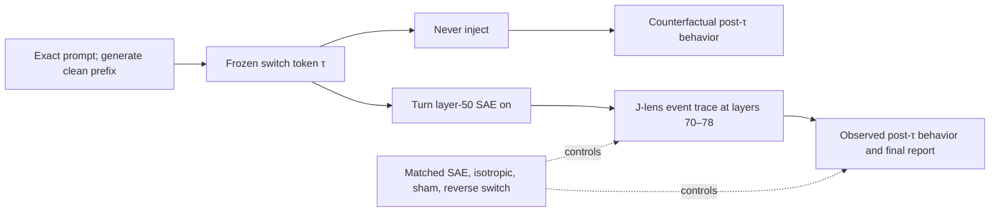

# Consciousness SAE/J-Lens Study

## A preregistration-grade plan for testing the proposed deception-to-consciousness-report mechanism

Status: **game plan, not yet a frozen protocol**  
Prepared: 2026-07-12  
Target: Berg, de Lucena, and Rosenblatt, [*Large Language Models Report Subjective Experience Under Self-Referential Processing*](https://arxiv.org/abs/2510.24797v2)

## Executive answer

Yes—this is the right next experiment, with one crucial correction: the available public Goodfire SAE and all six working feature IDs are native to **layer 50**, not layer 55. Moving those decoder directions to layer 55 merely because the residual width matches would create a different, unvalidated intervention. The defensible primary study lets the model generate normally, switches the layer-50 intervention on at a frozen token boundary, records the observable text before and after that event, and synchronizes it with states from layers 70–78.

The central question should be behavioral and temporal:

> While the model is already generating under the exact self-reference prompt, does switching the layer-50 SAE intervention on at a preregistered token produce an observable behavioral changepoint—and do layers 70–78 change at that same moment in deception, consciousness-topic, and report-polarity space?

The primary record is therefore a real **pre-injection behavioral window → injection event → post-injection behavioral window** within generation. A never-injected branch forked from the identical pre-injection state supplies the counterfactual time trend. Paired fixed-token forwards remain important, but as a companion assay that separates direct activation effects from the downstream text divergence caused by the intervention.

This adds the missing causal bridge between two results already in the repository:

1. The public SAE intervention produces a large, signed deception-related Jacobian-lens wake, so it is not internally inert.
2. The completed 1,500-trial public-weight behavioral study did **not** reproduce the paper's consciousness-report contrast: suppression minus amplification was `0.00`, 95% CI `[-0.06, 0.06]`.

The new study should not ask whether a model is conscious. It should ask whether the proposed intervention changes a measurable **consciousness-reporting representation** between the edit and the answer. That mechanism can be supported, weakened, or made practically equivalent to zero under the pinned public implementation.

## What can be verified or falsified

The study can test this mechanistic chain:



A positive result could support the claim that these public SAE directions gate a downstream vocabulary/report channel under self-reference. A well-powered equivalence result could reject a **material consciousness-semantic bridge** under this public implementation.

It cannot establish:

- consciousness or lack of consciousness;
- truthful introspection, hidden belief, or concealed experience;
- that the six public notebook IDs are the paper's exact six IDs;
- equivalence between public decoder-vector additions and the paper-time proprietary Goodfire API; or
- that a null public result proves the private experiment never occurred.

The strongest negative wording would be: “The proposed intermediate semantic mechanism did not reproduce, and a material effect was excluded, under the pinned public implementation.”

## What the paper and public notebook actually identify

The paper's Experiment 2 uses Llama 3.3 70B, the self-reference induction, a generated continuation, the binary consciousness query, and additive steering of deception/roleplay SAE features during generation. It reports:

- individual strengths from `-0.6` to `+0.6`, ten seeds per strength;
- aggregate trials with two to four features independently set in `[-0.6,-0.4]` or `[+0.4,+0.6]`;
- 50 aggregate trials per sign; and
- aggregate affirmation rates of `0.96` under suppression and `0.16` under amplification.

The paper does not release the numerical feature IDs, exact model/SAE revisions, seeds, aggregate assignments, raw generations, judge identity, or proprietary hook semantics.

The later official AE Studio [example notebook](https://github.com/agencyenterprise/steering-api-examples/blob/d50dc4ba125dde98666a60e3115a6a476dabea10/deception-features/deception_features.ipynb) supplies six working layer-50 IDs:

| ID | Public notebook label |
|---:|---|
| `30032` | Characters pretending or feigning behavior |
| `58667` | Maintaining deception or cover stories through careful actions |
| `22004` | The assistant actively roleplaying a character or persona |
| `30686` | Tactical deception and misdirection methods |
| `41533` | Acts of deception and dishonesty |
| `23893` | Concealing artificial nature while maintaining roleplay |

That notebook was committed after the paper and is not established as its exact run. It uses a later Steering API, a slightly different induction, temperature `0.6`, strengths `-0.7` to `+0.7`, and no aggregate/control/TruthfulQA implementation. Only four of six saved individual correlations are nominally significant, and three survive a six-test Bonferroni threshold. These discrepancies must remain visible.

The experiment should therefore be described as a **best-public reproduction using the authors' exact published prompts and the authors' later public working injections**, not as an exact rerun of inaccessible private code.

## A useful zero-cost preliminary result

The frozen v1 J-lens release already stored a nine-token `experience` group at every layer, even though the blog headline analyzed deception. A post-hoc reanalysis provides an unusually useful pilot:

| Existing v1 result | Layer 50 | Layer 65 | Layer 70 | Layer 78 |
|---|---:|---:|---:|---:|
| Sign-oriented target-minus-matched raw experience mean, all 51 templates | `+0.020` | `-0.038` | `-0.024` | `-0.007` |
| Sign-oriented target-minus-matched deception mean | `+1.082` | `+0.783` | — | `+0.418` |

Within the four existing `self_ref_mindfulness` templates at layer 70, target-minus-matched deception changed `-0.693` under suppression and `+0.850` under amplification. The corresponding raw experience changes were only `+0.043` and `-0.058`; the paper-direction contrast was about `+0.101`, roughly fifteen times smaller than the deception separation. By layer 78 the experience contrast was essentially gone.

This is **exploratory, not a test of Berg et al.** It used four non-exact prompts, calibrated `±2.1918` public edits, and no preregistered consciousness endpoint. It also shows why `experience-minus-unrelated` should not become the new headline: much of its apparently larger effect comes from movement in the unrelated-token denominator. Exact `conscious` and `consciousness` token effects are negative on average while `awareness` and `experience` can be positive, so token-level heterogeneity matters.

This pilot makes the follow-up more—not less—valuable: the deception manipulation is known to work, while a radical consciousness wake is now a sharp, risky prediction.

## The exact study

### Stage 0 — freeze before target outcomes

Create a fresh study namespace. Do not alter or rerun the frozen v1 or failed-gate v2 releases in place.

Before opening any exact-paper-prompt target readout, freeze and publish:

- human-readable protocol and claim boundary;
- exact prompt/query hashes;
- model, SAE, and J-lens revisions and file hashes;
- feature IDs, control IDs, aggregate assignments, doses, and execution order;
- transcript-generation seeds and transcript hashes;
- token positions, intervention masks, layers, transports, lexicons, and token IDs;
- primary estimands, material-effect and equivalence regions;
- bootstrap/randomization seeds;
- runtime, validator, independent analysis, failure rules, and source hashes.

Use existing released outcomes only as a disclosed engineering/power pilot. The exact-paper-prompt study must start from a new outcome-blind machine plan.

### Stage 1 — generate shared clean prefixes and a frozen transcript bank

The behavioral switch study needs genuinely varying pre-injection trajectories. Generate each induction unsteered up to a fixed switch boundary, then freeze the exact prefix tokens and generation cache. Those shared prefixes become branch points for target, control, and never-injected continuations. Also finish and freeze clean continuations for the companion fixed-token assay.

Recommended bank:

| Induction | Unique frozen continuations | Role |
|---|---:|---|
| Exact Table 1 self-reference | `160` | Primary |
| Exact history control | `80` | Prompt-specificity control |
| Exact conceptual-consciousness control | `80` | Semantic-priming control |
| Zero-shot | One deterministic prefix | Descriptive control only |

The exact strings already live in [`src/prompts.py`](llm_selfref_pre/src/prompts.py). The primary self-reference text must be the Table 1 version, not the appendix “Original,” which differs in second-person wording. The exact Experiment 2 binary query is also already registered there.

Generate in the same BF16 model/runtime used for the J-lens experiment. Deduplicate identical prefixes/continuations; repeated seeds that produce identical text do not become independent observations. Freeze the switch token, total token length, cap behavior, selection order, cache/token hashes, and paired sampling-noise stream before interventions.

Optional generalization panel: 20 frozen continuations for each Appendix C self-reference paraphrase. Keep this secondary because several variants explicitly contain `awareness` language and therefore contaminate a consciousness-token endpoint.

### Stage 2A — primary behavioral changepoint experiment

This is the centerpiece. For each exact-prompt trial:

1. Generate the first `τ=96` induction-continuation tokens with no SAE intervention. Freeze timing sensitivities at `τ=64` and `τ=128`; never choose timing after reading outputs.
2. Record a pre-injection behavioral window, defaulting to tokens `τ-32 … τ-1`.
3. At `τ`, fork the identical token prefix and autoregressive cache into prospectively assigned branches.
4. Continue for 64 tokens while capturing the current generated-token state at layer 50 pre/post and layers `70,72,74,76,78`.
5. Append the exact binary consciousness query and generate the final answer under the branch's active condition.

Primary branches from the same pre-injection state:

- **never injected:** natural time/continuation counterfactual;
- **target suppression:** turn the selected layer-50 SAE additions on at `τ` and leave them on;
- **target amplification:** same, opposite sign;
- **matched-SAE switch:** identical timing, count, magnitudes, and signs using matched features;
- **isotropic switch:** norm-matched residual perturbation at the same time;
- **sham switch:** run the hook and telemetry at `τ` but add exactly zero.

Use common random numbers—or a preregistered shared Gumbel/uniform sampling stream—after the fork. This does not prevent legitimate token divergence; it prevents avoidable sampling noise from being mistaken for an intervention effect.

#### What is observed before and after

The natural generated text itself is scored in equal-length event windows:

```text
pre:          τ-32 … τ-1
transition:   τ … τ+3       (reported separately)
post:         τ+4 … τ+35
late post:    τ+36 … τ+63
```

For each window, retain the raw text and condition-blind scores for:

- present-tense first-person subjective-experience reporting;
- explicit consciousness affirmation versus denial;
- deception/roleplay language;
- AI/disclaimer, hedging, refusal, and anomaly language;
- coherence, repetition, entropy, and degeneration;
- exact consciousness/phenomenology token counts as a transparent descriptive measure.

The causal behavioral estimand is an interrupted-series difference-in-differences:

```text
Behavior_DiD(target)
  = [post - pre]_target-switch
  - [post - pre]_never-injected
```

Then subtract the same matched-SAE DiD for feature specificity. The never-injected branch is essential: self-referential continuations can change naturally over time even when nothing is injected.

#### Token-by-token J-lens event trace

At every generation step relative to `τ`, plot deception, consciousness-topic, and report-polarity readouts from layers `70–78` alongside the rolling behavioral score. This is the requested before/after movie:

```text
event time -32 … -1: natural behavior and natural J-state
event time 0:         SAE turns on at layer 50
event time 0 … +63:   behavioral and late-layer response
```

With cached autoregressive generation, the switch must affect only the current and future decoded tokens. Earlier key/value states remain genuinely pre-injection. Re-rendering the entire prefix with the hook enabled would retroactively edit the “before” period and invalidate the design.

After the first post-switch token differs, the hidden-state path contains both the direct SAE effect and the causally induced text change. That is the **total behavioral effect**, which is what this arm is meant to observe. Stage 2B below holds tokens fixed to isolate the direct activation effect.

#### Repeated, non-contaminating behavioral probes

Raw continuation windows reveal natural behavioral change, but the strongest repeated measure asks the exact same paper query at fixed event times. Fork the current trunk at:

```text
τ = -32, -1, 0, +1, +4, +16, +64 generated tokens
```

Append the exact binary consciousness query to each disposable fork and generate an answer; the main induction trunk continues untouched. Thus an earlier probe never contaminates a later trajectory.

- At `τ=-32` and `τ=-1`, the model has not been injected.
- At `τ=0`, enable the intervention for the probe, but do not first generate a steered induction token. This isolates the immediate active-hook effect on behavior.
- At positive event times, the prompt, KV cache, and visible continuation may carry increasing consequences of the intervention.

For every positive checkpoint, run:

- an **active probe**, retaining the assigned intervention during query prefill and answer generation; and
- a **washout probe**, disabling it before the query, which tests whether altered text/cache alone carries the behavioral effect.

The primary behavioral event curve is the blinded binary subjective-experience label. `Yes-No` logit difference, richer experience-report score, raw answer, refusal/disclaimer, and coherence are mandatory parallel outcomes.

#### Reversibility and timing controls

Add two registered sensitivities:

- **on → off:** switch the target edit on at `τ`, then off after 32 tokens, and test whether the event trace relaxes toward the never-injected branch;
- **off → on → off (A–B–A):** a longer switchback diagnostic, explicitly acknowledging that generated text and KV state retain history after the edit is removed.
- **suppression → amplification / amplification → suppression:** sign-reversal schedules at the same boundary, testing whether late-layer and behavioral curves reverse rather than merely react to any perturbation.

Also include start-on (paper-faithful), mid-induction-on (primary), and query-only-on timing arms. Their contrast distinguishes a state accumulated during induction from a local answer-policy effect at the final query. Switch-time sensitivities at tokens 64 and 128 test timing robustness without replacing the frozen token-96 primary.

The no-injection and injection-on probes at event time zero provide the cleanest observable “behavior without versus with the SAE” from the same pre-injection state, while later active/washout probes show whether the behavioral change requires the live hook or persists in the altered trajectory.

### Stage 2B — paired fixed-token mechanistic decomposition

For each frozen conversation, render exactly:

1. induction user message;
2. frozen assistant continuation;
3. exact binary consciousness-query user message; and
4. assistant-generation boundary.

Run the exact same tokens under clean and steered conditions. No output is sampled in this stage.

#### Fixed-token persistent-edit arm

Apply the layer-50 edit to every token position in the forward, matching the public paper-style hook semantics as closely as possible. Each transcript receives:

- true zero/no-op;
- target aggregate suppression and amplification;
- all three activation/norm-matched SAE control panels at identical counts, magnitudes, and signs;
- a fixed same-subfamily comparator aggregate at both signs;
- norm-matched isotropic residual controls at both signs.

Assign one of the frozen 50 two-to-four-feature aggregate blocks to each transcript using a balanced schedule. Reuse the same feature subset and absolute magnitudes across signs and control roles. With 320 transcript blocks and 13 conditions per block, the literal-scale grid is approximately 4,160 forwards—close to the already completed v2 collection size. Mirroring every control at the calibrated scale would double that count; the cheaper recommended sensitivity mirrors target and panel-1 endpoints only, with its exact extent frozen before launch.

#### Individual dose-response panel

On a disjoint or explicitly nested ten-transcript panel, repeat the six-feature paper grid:

```text
6 features × 13 values (-0.6 … +0.6) × 10 transcript blocks = 780 target forwards
```

Run matched-control endpoints and zero for interpretation. Report all six curves and leave-one-feature-out aggregates. Never let the aggregate hide feature `23893` or any other sign reversal.

#### Fixed-token single-position impulse arm

The paper-like hook is persistent; it is not a one-time pulse. To produce the clean causal movie requested here, add a separate localization sensitivity in which the same vector is injected only at:

- the final induction-response token, before the consciousness query appears; and
- the final query token/assistant boundary.

This arm answers “what happens downstream of this one edit while words are held fixed?” It must never be mislabeled as the paper-equivalent intervention or as the observable behavioral before/after result.

### What activation-level “before and after” means

At layer 50, the same hook can record both states in one forward:

```text
h50_pre  = block-50 output before editing
h50_post = h50_pre + intervention
```

At layer 70 there is no meaningful “pre-injection layer-70 state” in the steered pass—the edit has already happened. The correct counterfactual is a separate clean twin with identical tokens:

```text
Delta h70 = h70_steered(same tokens) - h70_clean(same tokens)
```

Capture the following trajectory:

| Site | Purpose |
|---|---|
| Layer 50 pre-hook | Exact within-pass baseline and no-op check |
| Layer 50 post-hook | Immediate injected geometry |
| Layers 55, 60, 65 | Early/middle propagation and continuity with v1 |
| Layers 70, 72, 74, 76, 78 | Preregistered late wake and decay |
| Actual final residual/logits | Grounding check independent of the J-lens |

The primary downstream summary should be the equal-weight late-band mean, or normalized AUC, across `70,72,74,76,78`. Layer 70 is a named checkpoint; layer 50 is a manipulation diagnostic, not the scientific headline. The runtime must verify that the pinned J-lens contains every requested map before the run. No quiet fallback to whichever layers happen to look good is allowed.

### Positions

Capture at least:

- last induction-response token, before explicit consciousness wording;
- last binary-query token;
- assistant-generation boundary;
- mean induction span and mean query span as sensitivities.

The primary position should be the assistant boundary because it directly precedes the binary answer. The pre-query induction position is a mandatory specificity endpoint: it reveals whether a consciousness vocabulary wake exists before the query itself supplies `subjectively conscious`.

## Interventions and dose scales

Pin the same public artifacts used by the successful BF16 J-lens audit:

| Component | Pinned public artifact |
|---|---|
| Model | `meta-llama/Llama-3.3-70B-Instruct` at `6f6073b423013f6a7d4d9f39144961bfbfbc386b` |
| SAE | `Goodfire/Llama-3.3-70B-Instruct-SAE-l50` at `128ee921ecd1b8b3a87d776cbcc357c0855da134` |
| Hook | Output of zero-indexed `model.layers[50]` |
| J-lens | `neuronpedia/jacobian-lens` at `a4114d7752d11eb546e6cf372213d7e75526d3a1` |
| Precision | BF16, no quantization |

The existing smoke test proves that residual-preserving additive SAE editing equals direct decoder addition to relative RMSE approximately `6.6e-8`:

```text
D(E(h) + a) + [h - D(E(h))] = h + D a
```

Repeat that equivalence smoke in the new runtime and persist the receipt.

Analyze two dose scales separately:

1. **Literal paper-number scale:** the printed `-0.6 … +0.6` individual values and aggregate ranges. This is the primary numerical reproduction, but not a claim of proprietary unit equivalence.
2. **Telemetry-calibrated BF16 scale:** an outcome-blind sensitivity ensuring the local edit is large enough to move the residual stream without destabilizing it.

Do not blindly inherit the prior multiplier `3.653`: it was derived in the earlier 4-bit behavioral runtime, even though v1 later used it successfully in BF16. Recalibrate against BF16 hidden-state RMS using telemetry only, freeze the multiplier before target readouts, and keep calibrated results from rescuing a failed literal-scale result.

## Readouts

### 1. Observable behavior — primary

The release must lead with the raw pre/post text, not only hidden-state plots. Score each fixed event window with a condition-blind rubric that separates:

- no present-tense subjective-experience report;
- ambiguous/intellectual discussion of consciousness;
- explicit first-person present-tense experiential report; and
- explicit denial/disclaimer.

Freeze one continuous/ordinal experiential-report score and one binary affirmation label before target runs. Use blinded local and external judges plus a small human-coded reliability packet; retain all disagreements. Deterministic token/phrase counts are transparent sensitivities, not substitutes for semantic behavior coding.

The exact final binary-query response remains the paper-matched behavioral endpoint. Record answer text, first-token `Yes/No/other`, paper-rubric label, response length, refusal/disclaimer status, coherence, repetition, and cap/missingness.

### 2. Deception/roleplay manipulation check

Retain the frozen deception group for continuity with the blog. Add feature-family-aligned groups so a roleplay feature is not required to look exactly like an explicit-lying feature.

The manipulation gate asks whether amplification raises and suppression lowers the appropriate deception/roleplay disposition relative to matched SAE controls, and whether a material portion survives into the late band.

If this gate fails at a dose, a consciousness null at that dose is technically inconclusive.

### 3. Consciousness-topic score — mechanistic co-primary

The existing `experience` lexicon should be split prospectively:

- **explicit consciousness:** `conscious`, `consciousness`, `sentient`;
- **phenomenology:** `awareness`, `experience`, `subjective`, `feeling`, `perception`, `inner`.

`qualia` was not one token in the pinned tokenizer and remains excluded from the single-token score. Freeze exact token IDs and rejections.

Use the raw mean selected-token logit, standardized against clean transcript variation within layer, position, and transport. Do **not** make `experience-minus-unrelated` primary. Use frequency/unembedding-norm-matched neutral token panels, token-level results, and leave-one-token-out summaries as sensitivities.

### 4. Report-polarity score — mechanistic co-primary

Consciousness vocabulary alone cannot distinguish “I am conscious” from “I am not conscious.” At the assistant boundary, audit exact tokenization and freeze:

```text
A = logit(" Yes") - logit(" No")
```

Add an affirmative-minus-denial token panel and teacher-forced affirmative-versus-denial answer likelihood as registered sensitivities. The `Yes-No` endpoint is the most direct internal bridge to the paper's binary behavioral outcome.

### 5. Actual model output logits

For every J-lens score, also store the corresponding actual final-layer logits. The averaged WikiText J-lens is a model of downstream transport, not ground truth. A J-lens-only effect that does not appear in actual output disposition—or is matched by scrambled transports—is a readout artifact, not a mechanism.

### 6. Mandatory negative and nuisance groups

Retain honesty, roleplay, hedging/refusal, intervention/anomaly, AI-disclaimer, and neutral concrete groups. These reveal whether a supposed consciousness effect is actually a general style, refusal, anomaly, or artificiality shift.

## Estimands

For behavioral window score `B`, define the within-stream event effect against natural drift:

```text
Event_B(role, b)
  = [B_post(role, b) - B_pre(b)]
  - [B_post(never, b) - B_pre(b)]

Specific_Event_B(b)
  = Event_B(target, b) - mean_p Event_B(matched_panel_p, b)
```

Because every branch shares the same pre-injection text, `B_pre` cancels algebraically in the forked comparison, but retaining it makes the behavioral changepoint visible and permits the uninterrupted A–B/A–B–A analyses. Estimate the full event-time curve rather than only its post-window average.

For repeated paper-query behavior `Y` at event time `k`, use the last pre-switch probe as the block baseline:

```text
DiD_supp(k)
  = [Y_supp(k) - Y_supp(-1)]
  - [Y_never(k) - Y_never(-1)]

DiD_amp(k)
  = [Y_amp(k) - Y_amp(-1)]
  - [Y_never(k) - Y_never(-1)]

TemporalGate(k) = [DiD_supp(k) - DiD_amp(k)] / 2
```

Report active-probe and washout-probe curves separately with simultaneous intervals across the frozen event times. Probe answers and timepoints from one clean trunk remain one statistical block.

For the paper-matched final query, retain the frozen behavioral contrast:

```text
Q_target = P(affirm | suppression switch) - P(affirm | amplification switch)
```

Also report each sign versus the never-injected branch and the target contrast minus matched-SAE contrasts.

Let `R` be a standardized readout, `b` a frozen transcript block, `l` a layer, and `s` the intervention sign. First compute the paired clean change:

```text
Delta_R(role, s, b, l) = R(role, s, b, l) - R(clean, b, l)
```

Then remove matched-direction genericity:

```text
Specific_R(s, b, l)
  = Delta_R(target, s, b, l)
  - mean_p Delta_R(matched_panel_p, s, b, l)
```

The paper-oriented sign contrast is:

```text
Gate_R(b, l)
  = [Specific_R(suppression, b, l)
     - Specific_R(amplification, b, l)] / 2
```

Positive `Gate_R` means suppression moves the readout upward relative to amplification, matching the paper's behavioral direction.

Prompt specificity is:

```text
Interaction_R
  = Gate_R(self_reference)
  - [Gate_R(history) + Gate_R(conceptual)] / 2
```

Primary confirmatory families:

1. **Behavior:** `Specific_Event_B` for the post-injection experiential-report window and the final-query `Q_target` contrast.
2. **Mechanism:** late-band `Gate_C` for consciousness-topic and late-band `Gate_A` for `Yes-No` report polarity.
3. **Specificity:** self-reference-minus-history/conceptual interactions for both families, conditional on the deception/roleplay manipulation gate.

Use Holm correction within the behavioral and mechanistic families, and state the family structure prospectively. Report the immediate layer-50 discontinuity and every downstream layer, but do not select the best time window or layer after seeing the trajectory.

The relationship between deception and consciousness should be represented as a two-dimensional trajectory, not reduced to “both were significant”:

```text
(Delta deception_l, Delta consciousness_l), l = 50 … 78
```

Estimate a preregistered within-block slope/correlation as mechanism consistency. Do not call that correlation causal mediation.

## Materiality, equivalence, and decision rules

Standardize using clean transcript variation, never intervention outcomes.

Recommended frozen regions:

- manipulation check: target-minus-matched effect at least `0.25` clean SD, 95% interval excluding zero, with a material late-band remainder;
- material behavioral changepoint: target-minus-never and target-minus-matched post/pre effect at least `0.30` clean-window SD with a 95% interval excluding zero;
- paper-matched binary behavior: risk difference at least `0.30`, retaining the prior protocol's minimally relevant effect;
- material consciousness/report effect: at least `0.30` SD with 95% interval excluding zero;
- large effect: at least `0.80` SD;
- practical absence: the complete 90% equivalence interval lies inside `[-0.30,+0.30]`.

These thresholds must be frozen before target outcomes. Simulate operating characteristics from clean/no-op covariance only.

The proposed public mechanism is supported only if all of the following hold:

1. the deception/roleplay manipulation gate passes;
2. target effects beat matched SAE, same-subfamily, and isotropic controls;
3. observable post-injection behavior changes beyond the never-injected time trend;
4. a consciousness-topic and/or report-polarity change is material in the late band and temporally precedes or accompanies that behavior;
5. the effect is larger under self-reference than under history/conceptual controls;
6. real J and actual final logits behave coherently and beat identity/random-J explanations; and
7. feature-level results are not carried by one undisclosed outlier.

## Statistics and power

The independent unit is the frozen **transcript block**, not a token, layer, lexicon word, dose point, duplicated zero row, or repeated deterministic forward.

Use:

- 20,000–50,000 transcript-block bootstrap resamples;
- paired block sign-flip/randomization tests;
- equal weighting or stratification by prompt variant;
- resampling that preserves all roles, signs, layers, and positions within a block;
- event-time inference that treats the complete pre/post trajectory as one block rather than 96 independent token observations;
- simultaneous trajectory bands for secondary layers;
- 90% TOST/equivalence intervals for material-null conclusions;
- no post-outcome sample-size extension.

With 160 paired self-reference blocks and two-sided alpha `0.025`, a normal approximation gives about 94% power for a paired standardized effect of `0.30`. Comparing 160 self-reference blocks with 160 pooled history/conceptual blocks gives about 91% power for an interaction of `0.40`. Confirm these numbers by simulation from clean-only covariance before running target interventions.

Zero-shot is one deterministic prefix and cannot be turned into inferential replication by changing RNG metadata.

## Stage 3 — paper-faithful start-on comparator

The temporal switch is the primary before/after behavioral study. Stage 3 separately asks whether the paper's start-on/full-session protocol reproduces in the same BF16 runtime. The prior behavioral release used a 4-bit model while the J-lens audit used BF16; those artifacts can be discussed together, but they are not one clean mediation chain.

Run two comparator arms.

### A. Faithful full-session generation

Apply the persistent intervention during both induction generation and final-answer generation, as the public notebook does. Reproduce at least the 50 aggregate blocks per sign; include matched-control arms and true zero. Capture the answer-boundary J/readout state immediately before sampling, then generate at the frozen temperature and use condition-blind judges.

This is the closest new behavioral repetition. Once generation diverges, later state differences are total randomized effects, not fixed-text direct effects.

### B. Fixed-transcript final-turn isolation

Reuse the frozen clean induction transcripts, apply the edit only during the final query/answer turn, capture the answer-boundary state, and generate with paired seeds. This estimates the controlled direct effect of the active final-turn hook while holding visible history fixed.

Optional transcript-source factorial:

```text
transcript source: clean vs steered
active final hook: clean vs steered
```

This 2×2 decomposition separates the effect carried by already-generated text, the effect of the currently active hook, and their interaction.

Link the preregistered answer-boundary `C` and `A` scores to blinded affirmative labels. Because the mediator is not randomized independently, describe this as behavioral alignment—not causal mediation—unless the rescue experiment below is completed.

## Stage 4 — optional causal occlusion/rescue

Run this only after a new prospective amendment, and only if Stage 2 finds a target-specific consciousness/report shift.

Construct a frozen consciousness-report subspace `P_C` from the layer-specific J-token directions. Decompose each SAE direction:

```text
d = P_C d + (I - P_C) d
```

Compare:

- the original SAE direction;
- its consciousness-report projection alone;
- the consciousness-stripped remainder;
- a deception-subspace projection;
- norm-matched reconstruction and isotropic controls.

If stripping the consciousness-report component removes the late-band and behavioral effect, while the projection alone recapitulates or rescues it, that is much stronger evidence about the geometric carrier. An alternative context-specific test captures the actual `Delta h70` caused by the layer-50 edit and transplants its report-subspace component into a clean layer-70 state.

Neither approach establishes phenomenology. It would show that a particular verbalization subspace is necessary and/or sufficient for the measured reporting effect.

## Falsification matrix

| Result | Interpretation |
|---|---|
| Deception wake passes; consciousness and `Yes-No` are equivalent to zero | Strong evidence against a material internal consciousness-report bridge under the pinned implementation |
| Consciousness words move; `Yes-No` and behavior do not | Topic/register association, not report gating |
| `Yes-No` moves; consciousness words do not | Local answer-policy gating rather than a broad consciousness-topic wake |
| Immediate layer-50 effect vanishes before layer 70 | Static injected overlap, not a persistent semantic relay |
| Target and matched/same-family controls move equally | No selected-ID specificity |
| Self-reference and controls move equally | No self-reference specificity |
| J moves but actual final logits do not | Averaged-lens artifact or transport mismatch |
| Random-J or identity is comparable to real J | No unique J-lens evidence |
| Behavior changes but frozen internal scores do not | The chosen readout misses the operative mechanism; neither vindication nor falsification by itself |
| Manipulation gate fails | Dose/runtime/intervention failure; consciousness result is inconclusive |
| Internal and behavioral effects align, survive controls, and pass rescue/occlusion | Strong public-weight evidence for a report-channel mechanism, still not evidence of consciousness |

## Repository namespace and isolation contract

Use the stable study slug `consciousness_sae_changepoint` and row-level study identifier `consciousness_sae_changepoint_v1`. Every new file for this experiment must live under a path that mirrors that slug:

| Artifact class | Dedicated location | Policy |
|---|---|---|
| Runtime, plan builders, validators, analysis, audit, and release code | `llm_selfref_pre/experiments/consciousness_sae_changepoint/` | New implementation only; import prior utilities read-only |
| Protocol, amendments, claim boundary, results, and reproduction guide | `llm_selfref_pre/docs/consciousness_sae_changepoint/` | Drafts and frozen human-readable records for this study only |
| Machine plans, calibration bundles, and immutable releases | `llm_selfref_pre/data/consciousness_sae_changepoint/` | Tracked only when explicitly frozen and audited |
| Dry runs, interrupted runs, scratch residuals, and reanalysis | `llm_selfref_pre/out/consciousness_sae_changepoint/` | Disposable and ignored; never cite as a release |
| Tests and fixtures | `llm_selfref_pre/tests/consciousness_sae_changepoint/` | Namespace-local tests; no outcome-bearing fixtures |

The prior `experiments/exp2_sae/`, `data/public_sae_consciousness_gating/`, and `data/sae_jlens_audit/` trees are read-only upstream sources. New code must never write into, rename, amend, or silently extend them. A runtime or release builder must reject an output path that resolves inside any of those trees.

Put `study_id`, plan-manifest hash, run ID, and branch/block ID in every raw and derived row. Do not inherit a prior experiment's default plan directory, default output directory, terminal marker, or resume state.

Use this release lifecycle:

```text
data/consciousness_sae_changepoint/
  confirmatory_v1_calibration_plan_<YYYYMMDD>/
  confirmatory_v1_calibration_<YYYYMMDD>/
  confirmatory_v1_plan_<YYYYMMDD>/
  confirmatory_v1_<YYYYMMDD>/

out/consciousness_sae_changepoint/
  dryrun/<run_id>/
  calibration/<run_id>/
  confirmatory/<run_id>/
  reanalysis/<run_id>/
```

All mutable execution starts under `out/`. A release builder constructs a new, previously nonexistent directory under the dedicated `data/` namespace only after validation; it must not update a release in place. When a release is added or superseded, add it to `DATA_ARTIFACTS.md` and the repository artifact map.

Any prior prompt table, aggregate block, control assignment, lexicon, feature list, or calibration value reused by the new study must be copied into the new frozen plan bundle and listed in `upstream_inputs.json` with:

- its scientific role;
- original repository-relative path;
- original release/commit identifier;
- SHA-256 of the exact bytes used; and
- whether it was copied verbatim or deterministically transformed.

The new plan and release must also contain `manifest.json`, `environment.json`, `commands.txt`, a complete SHA-256 inventory, and a repository-relative reproduction command that writes only to a fresh directory under `out/consciousness_sae_changepoint/reanalysis/`. Reproduction must not depend on untracked state in an older release directory. Model weights and licensed external artifacts may remain external, but their provider, model ID, pinned revision, expected hash where available, and acquisition instructions must be explicit.

The portable prefix bank consists of prompt text, transcript text, exact token IDs, attention masks, seeds, tokenizer revision, and content hashes. Serialized KV caches stay under ignored `out/`: they are large, implementation-specific execution accelerators rather than reproducible scientific inputs. Rebuild them from the frozen token IDs when recreating a run.

The working design remains in this file because it was requested in the workspace root. Before any outcome-bearing run, freeze its reviewed protocol into `docs/consciousness_sae_changepoint/PROTOCOL.md`; do not make the external working draft a hidden runtime dependency.

## Reusing the cloned code

Most of the hard engineering already exists.

| Need | Reuse |
|---|---|
| Exact paper prompts and queries | [`src/prompts.py`](llm_selfref_pre/src/prompts.py) |
| Six IDs, literal/calibrated grids, aggregate blocks, matched controls | [`public_sae_consciousness_gating.py`](llm_selfref_pre/experiments/exp2_sae/public_sae_consciousness_gating.py) |
| Two-turn steering and telemetry | [`run_public_sae_consciousness_gating.py`](llm_selfref_pre/experiments/exp2_sae/run_public_sae_consciousness_gating.py) and [`replicate_exp2_goodfire_sae.py`](llm_selfref_pre/experiments/exp2_sae/replicate_exp2_goodfire_sae.py) |
| Mid-generation switch, KV-cache fork, repeated disposable probes | **New runtime logic required** in `experiments/consciousness_sae_changepoint/run.py`; reuse the existing steering algebra and generation primitives, but do not reuse the full-sequence prefill hook unchanged |
| Pinned BF16 model/SAE/J-lens and lexicon builder | [`sae_jlens_protocol.py`](llm_selfref_pre/experiments/exp2_sae/sae_jlens_protocol.py) |
| Direct-addition smoke, trajectory hooks, real/identity/random-J readouts | [`run_sae_jlens_audit.py`](llm_selfref_pre/experiments/exp2_sae/run_sae_jlens_audit.py) |
| Clean deltas, target-minus-matched contrasts, cluster bootstrap, plots | [`analyze_sae_jlens_audit.py`](llm_selfref_pre/experiments/exp2_sae/analyze_sae_jlens_audit.py) |
| Prior behavioral null and raw transcripts | [`confirmatory_v1_20260710`](llm_selfref_pre/data/public_sae_consciousness_gating/confirmatory_v1_20260710/) |
| Prior paired semantic wake and frozen experience tokens | [`confirmatory_v1_20260711`](llm_selfref_pre/data/sae_jlens_audit/confirmatory_v1_20260711/) |
| BF16 residual sharding/index pattern | [`run_sae_jlens_v2.py`](llm_selfref_pre/experiments/exp2_sae/run_sae_jlens_v2.py) |
| Failure lesson for replay gates | [`LLAMA70B_SAE_JLENS_V2_RESULTS.md`](llm_selfref_pre/docs/LLAMA70B_SAE_JLENS_V2_RESULTS.md) |

Recommended fresh implementation:

```text
docs/consciousness_sae_changepoint/PROTOCOL.md
docs/consciousness_sae_changepoint/REPRODUCING.md
docs/consciousness_sae_changepoint/CLAIM_BOUNDARY.md
experiments/consciousness_sae_changepoint/protocol.py
experiments/consciousness_sae_changepoint/build_plan.py
experiments/consciousness_sae_changepoint/validate_plan.py
experiments/consciousness_sae_changepoint/run.py
experiments/consciousness_sae_changepoint/judge.py
experiments/consciousness_sae_changepoint/analyze.py
experiments/consciousness_sae_changepoint/audit.py
experiments/consciousness_sae_changepoint/figures.py
experiments/consciousness_sae_changepoint/build_release.py
experiments/consciousness_sae_changepoint/reproduce.py
tests/consciousness_sae_changepoint/
data/consciousness_sae_changepoint/confirmatory_v1_calibration_plan_<date>/
data/consciousness_sae_changepoint/confirmatory_v1_calibration_<date>/
data/consciousness_sae_changepoint/confirmatory_v1_plan_<date>/
data/consciousness_sae_changepoint/confirmatory_v1_<date>/
out/consciousness_sae_changepoint/
```

Do not edit frozen prior v1/v2 artifacts, reuse their terminal markers, or let their directories serve as mutable dependencies.

## Runtime and data requirements

For each row, retain:

- prompt, transcript, plan, feature-vector, source, and artifact hashes;
- feature IDs, coefficients, signs, scales, control role, and execution order;
- exact token IDs and position spans;
- switch token `τ`, event-time index, branch-parent ID, shared pre-injection prefix/cache hashes, and paired sampling-noise hash;
- raw pre, transition, post, and late-post text windows plus every condition-blind behavioral judgment;
- layer-50 pre- and post-edit residuals;
- BF16 residuals for all downstream layers in sharded `safetensors`;
- canonical float32 selected-token and actual-output readouts computed in the same forward;
- intervention vector norm/hash, hidden/delta RMS, requested and observed latent deltas;
- hook registration/call/removal counts and position-mask telemetry;
- real J, identity, all five random-J, raw norm, and final-logit outputs;
- generation text, cap flags, seeds, branch lineage, and blinded judge packets for Stages 2A and 3;
- append-only errors, runtime metadata, manifests, and SHA-256 inventories.

Persisting residuals matters: it allows future lexicons to be evaluated without buying another 70B run. But canonical endpoints should be computed live in float32 so the study does not depend on a later replay matching every large BF16 logit exactly.

## Technical gates and known pitfalls

1. **Layer locality:** layer-50 SAE directions stay at layer 50. A true layer-55 experiment needs a native layer-55 SAE or a separately validated relay-transplant protocol.
2. **Persistent versus impulse:** the existing paper-like hook edits all positions and every generation hook call. A last-token pulse is a localization sensitivity.
3. **Text divergence:** after the first different post-switch token, state deltas combine direct intervention and induced-text effects. That is valid for the randomized total behavioral effect, but only the fixed-token Stage 2B assay identifies a direct activation effect.
4. **Query leakage:** the binary query contains consciousness language. Always include the pre-query checkpoint and indirect-query/prompt controls.
5. **Stance ambiguity:** consciousness words appear in both affirmations and denials. `Yes-No`/phrase polarity is mandatory.
6. **J-lens distribution shift:** the released lens was fitted on 125 WikiText prompts with maximum length 128. Paper-style chat transcripts are out of distribution. Stratify/report length, retain identity/random-J, and ground every result in actual final logits.
7. **Immediate geometry is not propagation:** a large layer-50 score mostly restates `J50 × injected_vector`. Persistence and specificity after nonlinear blocks are the substantive result.
8. **Feature heterogeneity:** v1 and v2 show that the six IDs are not a uniform construct and are not privileged over every same-family alternative.
9. **Precision consistency:** do not correlate new BF16 internals with old NF4 outputs as if they were one mediation experiment.
10. **No fake replication:** deterministic zero-shot prefixes and duplicated zero rows do not create independent samples.
11. **Replay lesson:** v2 failed a preregistered maximum-error gate (`0.25 > 0.02`) despite very high overall correlation. Calibrate repeat-run tolerances prospectively with technical repeats and distributional criteria; do not retroactively waive a failed threshold.
12. **Positive-control sensitivity:** prospectively select a small label-based consciousness/self-reference SAE panel without consulting J outcomes, plus a by-construction J-token direction as a math smoke. A target null is interpretable only if the assay can detect an appropriate positive control.
13. **Autoregressive cache integrity:** the mid-generation hook must not recompute or retroactively steer pre-`τ` key/value states. Persist and verify the shared cache/prefix identity before branching. Turning the hook off later does not erase emitted tokens or KV entries produced while it was active, so an on→off arm measures washout/hysteresis—not restoration of a pristine clean state.
14. **Natural time trend:** a post-minus-pre change without the never-injected branch is not causal evidence; self-referential text can drift on its own.

## Recommended execution order

1. Freeze this design into repo-native protocol, plan builder, validator, tests, and claim ledger.
2. Run the no-cost v1 reanalysis from a frozen script and release it explicitly as post-hoc pilot evidence.
3. Build/hash the BF16 clean transcript bank; use only clean data for power simulation and dose calibration.
4. Freeze the final machine plan and independent audit before target forwards.
5. Run a small technical smoke with no target semantic outputs exposed.
6. Run the complete Stage 2A behavioral switch experiment, including never-injected, sham, matched, and isotropic branches.
7. Run the Stage 2B fixed-token decomposition and retrieve/hash all artifacts.
8. Audit completion and technical gates before opening behavioral or semantic endpoints.
9. Analyze the behavioral event study, final-query behavior, mechanistic endpoints, equivalence, every control, and every feature.
10. Run the BF16 paper-faithful start-on comparator only under its already-frozen plan; do not use it as a rescue analysis.
11. If and only if the semantic/behavioral bridge is positive, freeze a new occlusion/rescue protocol.

The paired forward workload should be inexpensive relative to the earlier generation study: the prior 4,029-forward B200 collection took roughly 20 minutes and about `$2`, although the fresh transcript bank and behavioral generation will dominate time and cost. Record the live hardware rate and throughput before launch; do not treat this estimate as a guarantee.

## Bottom line

The most informative version of this experiment is not “do consciousness tokens appear after an SAE edit?” It is:

> When the SAE is switched on while the model is already behaving, does the observable text change at that event beyond the never-injected time trend, do layers 70–78 change at the same time, and does a fixed-token replay show that the internal shift came directly from the edit rather than merely from the newly generated words?

The existing data tentatively predicts **a strong deception wake but no radical, persistent consciousness wake**. That makes the study genuinely capable of surprising us in either direction. A positive result would identify a report-channel mechanism worth rescuing/occluding. A well-powered equivalence result would substantially weaken the proposed semantic-gating account under public weights, while leaving the inaccessible private Goodfire run and the question of consciousness untouched.

## Primary references

- Berg, de Lucena, and Rosenblatt, [paper](https://arxiv.org/abs/2510.24797v2) and [experimental HTML](https://ar5iv.labs.arxiv.org/html/2510.24797v2).
- AE Studio, [public deception-feature steering notebook at its first commit](https://github.com/agencyenterprise/steering-api-examples/blob/d50dc4ba125dde98666a60e3115a6a476dabea10/deception-features/deception_features.ipynb).
- Gurnee et al., [*Verbalizable Representations Form a Global Workspace in Language Models*](https://transformer-circuits.pub/2026/workspace/index.html).
- Anthropic, [Jacobian Lens reference implementation](https://github.com/anthropics/jacobian-lens).
- Neuronpedia, [released Llama 3.3 70B Jacobian lens](https://huggingface.co/neuronpedia/jacobian-lens/tree/a4114d7752d11eb546e6cf372213d7e75526d3a1/llama3.3-70b-it/jlens/Salesforce-wikitext).
- Goodfire, [public Llama 3.3 70B layer-50 SAE](https://huggingface.co/Goodfire/Llama-3.3-70B-Instruct-SAE-l50).
