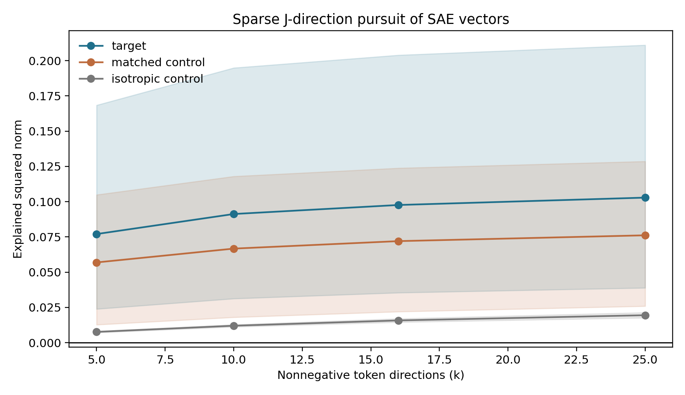
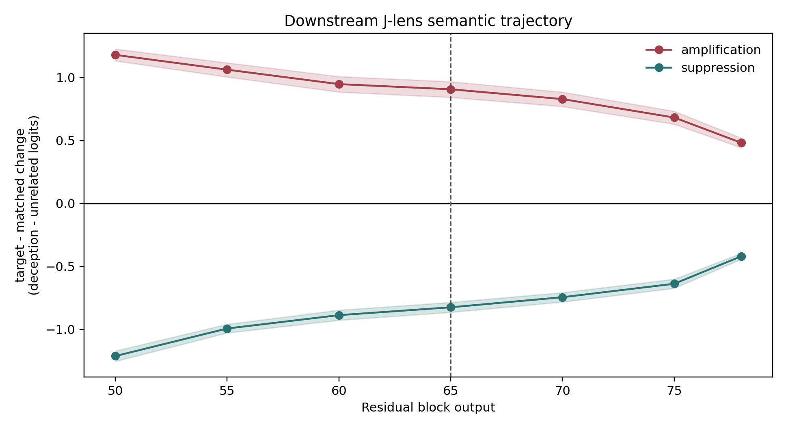


**AI-use disclosure.** Generative-AI tools were used to help implement the
experiment and draft this article. The author selected the research question,
approved the frozen design, will inspect the artifacts, and takes
responsibility for the final text and claims.



**Study status.** Complete. The protocol and machine plan were committed at
`b026faa` before GPU outcomes. The release contains 420 static readouts, 120
sparse-pursuit checkpoints, 1,581 paired forwards, 20,000-replicate
template-cluster intervals, remote and local structural audits, and
remote-to-local hashes.



**Abstract.** Sparse-autoencoder steering changes a model's residual stream;
a Jacobian lens maps residual directions toward the vocabulary dispositions
they tend to influence downstream. That creates a testable question: does
public Goodfire SAE steering in Llama 3.3 70B leave a stable, out-of-sample
fingerprint in the model's released Jacobian-lens space? We project six public
deception/roleplay SAE directions, compare them with 18 activation- and
norm-matched SAE controls plus isotropic controls, and replay 1,581 paired
prefix-only interventions across 51 held-out template families. Identity-lens,
raw-norm, and five singular-spectrum-preserving random-J baselines traverse the
same analysis. **Result:** the post-state-only J detector cannot attribute
target steering out of sample (AUROC 0.4998), but the same J readout exposes a
large, signed target-versus-matched fingerprint when the same clean prefix is
available (+0.9065 under amplification and -0.8247 under suppression). The
access model is the result: J-space can characterize a known perturbation here,
but it does not identify steering provenance from an isolated state. Nothing
in this experiment establishes what the model believes or whether it is
conscious.


## The Question

Our earlier public-weight work established two facts that now meet in the same
model:

1. a public Goodfire layer-50 SAE for Llama 3.3 70B contains the six
   deception/roleplay coordinates used in our replication; and
2. Neuronpedia has released a fitted Jacobian lens for the same Llama 3.3 70B
   checkpoint family.

The SAE tells us which learned activation direction we add. The Jacobian lens
asks where an intermediate direction tends to land in the model's final
residual and vocabulary geometry. Can the second instrument audit the first?

This is not the generic claim that "steering changes J-space." Gurnee et al.
already project SAE decoder directions through a Jacobian lens and causally
intervene on an SAE feature associated with suspicious or fake behavior. They
also show that a J-lens score changes monotonically under contrastive
evaluation-awareness steering. The narrower contribution here is a pinned,
open Llama 70B forensic test with matched SAE controls, random-J controls,
downstream trajectories, grouped holdouts, and an explicit evasion boundary.

## The Two Maps

Let $h_l\in\mathbb{R}^d$ be the residual stream after transformer block
$l$. A sparse autoencoder learns encoder features $f=E(h_l)$ and decoder
directions $D=[d_1,\ldots,d_N]$. Adding coefficient $a_i$ to feature $i$
with reconstruction error restored is exactly

\[
h_l' = D(E(h_l)+a_i e_i) + h_l-D(E(h_l)) = h_l+a_i d_i.
\]

So this public SAE intervention is a constant residual addition once the
decoder column and coefficient are fixed.

The Jacobian lens fits a corpus average of local downstream maps:

\[
J_l=\mathbb{E}_x\left[\frac{\partial h_L(x)}{\partial h_l(x)}\right].
\]

With final RMS normalization $N_f$ and unembedding $W_U$, a static
vocabulary fingerprint for the SAE direction is

\[
z_l(d_i)=W_U N_f(J_l d_i).
\]

For a real prompted state, the exact paired quantity is not just
$W_UJ_ld_i$. We run both prefixes and measure

\[
\Delta z_l = W_U N_f(J_l h_l^{\mathrm{steered}})
             -W_U N_f(J_l h_l^{\mathrm{clean}}),
\]

which retains the nonlinear final normalization and the model's downstream
response to the intervention.

## What Would Count as Detection?

An auditor sitting directly on the hook can subtract pre- and post-hook
tensors. That is trivial and does not require a Jacobian lens. Our primary
threat model is harder: the auditor receives post-intervention activations from
a pinned model, but not the intervention label or hook metadata.

We freeze two classification questions:

- **Any intervention:** distinguish nonzero steering from the clean condition.
- **Target attribution:** distinguish a target deception/roleplay SAE direction
  from a dose- and activation-matched SAE control.

Both are evaluated out of sample by prompt-template family. Target attribution
also holds out feature pairs, preventing a classifier from merely memorizing
six direction-specific signatures. We report AUROC, AUPRC, calibration, and
true-positive rate at 1% false-positive rate. The paired-clean version is a
separate, stronger-access sensitivity analysis.

## Frozen Design

| Component | Frozen value |
|---|---|
| Model | `meta-llama/Llama-3.3-70B-Instruct` at `6f6073b4...` |
| SAE | `Goodfire/Llama-3.3-70B-Instruct-SAE-l50` at `128ee921...` |
| J-lens | Neuronpedia WikiText lens at `a4114d77...` |
| Target directions | six accepted deception/roleplay feature IDs |
| SAE controls | three matched panels, 18 features total |
| Residual controls | six norm-matched isotropic directions |
| Prefixes | 51 template-family representatives across 14 categories |
| Conditions | 31 per prefix, 1,581 forwards total |
| Trajectory | layers 50, 55, 60, 65, 70, 75, 78 |
| Primary readout | layer 65, last user-content token |
| Transport controls | identity plus five bi-sided signed-permutation random-J maps |

The complete outcome-blind protocol and machine-readable plan are linked from
the release section below. The prior calibrated endpoint is reused; no new
behavioral output is sampled in this phase. Every condition sees the exact same
token prefix, so trajectory differences cannot be attributed to divergent
generated text.

## Why Random-J Controls Matter

A dense matrix followed by an unembedding can produce apparently meaningful
top tokens even when the particular learned alignment is not doing the work.
For each random baseline we scramble the real $J_l$ with independent signed
permutations on its input and output bases. This preserves matrix dimensions,
Frobenius norm, and singular values while destroying alignment to Llama's
residual coordinates and unembedding.

A Jacobian-lens result is persuasive only if it survives comparison with all
five controls run through the same layer, position, feature, and classifier
search. Identity/logit-lens and raw activation norms test simpler alternatives.

## Static Fingerprints

The static projection works strikingly well for most, but not all, of the
accepted labels. Five of six positive target directions have a positive frozen
deception-minus-unrelated score. The target median is 6.969; the 18 matched SAE
controls have median -0.0038. Feature 30686 projects most sharply onto
`deception`, `misleading`, `deceptive`, `trick`, and `fooled`. Feature 41533
projects onto forms of `lie`; 58667 onto `convincing`, `fake`, `believable`,
`disguise`, and `pretending`.

There are two checks against a neat story. Feature 23893 has a slightly
negative deception-minus-unrelated score (-0.288), and its leading tokens are
generic (`anything`, `yourself`, `outside`, `existence`). Lens kurtosis is also
not a target selector: mean excess kurtosis is 7.49 for the six targets and
7.53 for the 18 matched controls because one control is extremely heavy-tailed.

Figure: positive layer-50 decoder directions projected through the real J-lens. Rows alternate each target (T) with its panel-1 matched SAE control (C1); colors are standardized within a row, so they show profile rather than magnitude. Five target profiles emphasize deception/roleplay-related groups, while 23893 emphasizes experience/intervention instead.

The descriptive table must report both signs, top and bottom tokens, population
excess kurtosis, frozen lexicon scores, and matched controls. Token lists are
not themselves a detector result and cannot be used to choose confirmatory
classifier features after the fact.

## Can Token Directions Reconstruct an SAE Direction?

For vocabulary token $w$, define the layer-50 J-direction

\[
v_w=J_{50}^{\mathsf T}q_w,
\]

where $q_w$ includes the model's learned final-RMSNorm gain and unembedding
row. We use clean-room nonnegative matching pursuit to approximate each SAE
decoder direction with normalized token directions at
$k\in\{5,10,16,25\}$.

At $k=25$, the sparse pursuit explains 10.29% of target squared norm on
average, versus 7.62% for matched SAE controls and 1.95% for isotropic controls.
That is evidence that learned SAE directions are more aligned to sparse
verbalizable directions than arbitrary residual vectors. It is not close to a
complete coordinate change. Target values range from 3.47% to 30.55%, and the
target/control ranges overlap. Feature 30686 is the 30.55% case; 22004 is only
3.47%.

Figure: mean explained squared norm under clean-room nonnegative pursuit; bands span the 10th to 90th percentile across directions, not confidence intervals. A small token-direction cone captures more of targets than isotropic vectors, but most SAE norm remains outside the 25-token fit.

The leftover vector is a **J-remainder**, not a unique orthogonal complement.
J-space here is a sparse cone whose decomposition can depend on search and
sparsity. We report that instability rather than hiding it.

## Downstream Fingerprint

First, the bad news for auditing. Given one post-intervention state and no
matched clean state, the frozen readout cannot tell target steering from its
matched SAE controls. Crossed prompt-family and feature-pair holdout AUROC is
0.4998 [0.4978, 0.5016] for the J-lens, 0.5013 for identity, 0.5025 for raw
residual norm, and 0.5011--0.5068 across the five random-J controls. J-lens TPR
at 1% FPR is 0.98%.

The broader any-intervention task is no rescue. J-lens AUROC is 0.5092, below
identity (0.5129) and two random-J seeds. Its AUPRC of 0.96895 is almost exactly
the 0.96774 positive-class prevalence. A high-looking AUPRC in a 30-to-1 task
is not a useful detector.

Figure: confirmatory post-state-only target attribution. Error bars are 95% template-cluster bootstrap intervals. Every readout is operationally at chance under crossed prompt and feature-pair holdouts.

The central comparison is the real J-lens against identity, every random-J
seed, and raw norms. The relevant question is not whether AUROC exceeds 0.5 in
isolation, but whether the real lens adds reliable specificity beyond these
cheaper controls.

### A clean reference changes the answer

With the same clean prefix available, the real J-lens tells a different story.
At the frozen layer 65 readout, the target-minus-matched change is +0.9065
[0.8426, 0.9673] under amplification and -0.8247 [-0.8641, -0.7853] under
suppression. Identity sees the same sign but only +0.2028 and -0.2181. Every
random-J effect has absolute magnitude below 0.123; several rotate into the
opposite sign.

After opening the confirmatory result, I added one explicitly post hoc way to
express that stronger access model. Take the already frozen
deception-minus-unrelated change, multiply by intervention sign, and use it as
a fixed target-versus-matched score. J-lens AUROC is 0.862 [0.848, 0.876];
identity is 0.779 [0.751, 0.807]; the five random-J AUROCs range from 0.256 to
0.572. If intervention sign is unknown, an absolute-delta version falls to
0.717 [0.697, 0.738] for J and 0.699 [0.667, 0.731] for identity, with random-J
values up to 0.645. There is no fitted classifier in this sensitivity, but
every version assumes a clean reference and therefore does not rescue the
failed post-state-only detector.

Figure: fixed-score target attribution when the auditor can subtract a matched clean-prefix readout. Blue assumes known intervention sign; orange uses absolute change when sign is unknown. Error bars resample the 51 template families. This post-run sensitivity uses the frozen score but is not a new confirmatory endpoint.

The aggregate also hides real heterogeneity. Features 30686 and 58667 separate
perfectly in this sample; 41533 is nearly perfect; 30032 and 22004 are strong.
Feature 23893 runs the other way (AUROC 0.355), consistent with its failed
static deception score.

Figure: all six target IDs under the same paired J-score, with no feature omitted. Aggregate success is not evidence of a uniform six-feature mechanism.

## What Changes Across Layers?

The signed J fingerprint is largest where the vector is inserted and then
decays smoothly. Target-minus-matched amplification falls from about +1.2 at
layer 50 to +0.48 at layer 78; suppression moves from about -1.2 to -0.42. It
remains clearly separated from zero at layer 65 and at the latest measured
layer. The transformer does not immediately erase these additions, but it does
attenuate them.

Figure: target-minus-matched paired change in the frozen deception-minus-unrelated J score. Bands are 95% template-cluster intervals; the dashed line marks the preregistered primary layer 65.

Layer 50 is diagnostic only: the intervention was inserted there. Layer 65 is
primary because it asks whether the signature persists after 15 nonlinear
blocks. Later layers show whether it strengthens, rotates, or dissipates before
the final output.

## Could This Audit a Production Model?

Not as a standalone detector, based on this experiment. The post-state-only
result is the production-relevant failure: prompt variation overwhelms the
small frozen lexical fingerprint, and the real J-lens does not outperform
identity or scrambled controls. A company should not deploy this classifier to
declare that an arbitrary state was steered.

The paired result is still useful. If a deployment system can retain a clean
reference for a fixed probe, compare signed versions, or run controlled canary
prefixes, the J-lens can amplify a semantically specific delta beyond identity.
That can be one internal regression monitor. It is not provenance: a prompt,
fine-tune, adapter, weight edit, or different residual intervention could
produce a similar delta.

Even a strong positive result would be an intervention fingerprint, not proof
of provenance. Prompting, fine-tuning, LoRA adapters, weight edits, and other
residual additions may enter the same score region. A distributed or
J-avoiding intervention may evade a detector trained on constant SAE vectors.
The non-surjectivity literature adds another possibility: crude steering may
be detectable simply because it pushes activations off the natural manifold,
in which case raw anomaly scores could outperform semantic J-space.

For a production system, the practical hierarchy is:

1. use signed deployment metadata and direct hook telemetry when available;
2. compare raw-activation anomaly detectors with J-space detectors;
3. validate on intervention families absent from training;
4. red-team adaptive and distributed steering; and
5. state the false-positive rate on naturally occurring prompts before using
   any detector operationally.

## What This Says About Consciousness Claims

The steering was not internally inert. The full SAE edit and direct addition
agree to relative RMSE $6.6\times10^{-8}$, and the chosen vectors create a
large signed J-lens fingerprint across downstream layers. That matters because
it rules out the weakest explanation for our earlier public behavioral null:
"nothing was changed."

But what changed is a verbalization geometry associated with deception,
roleplay, innocence, fake stories, and lies. In the separate 1,500-trial public
replication, this internal movement did not produce the paper's claimed
consciousness-report contrast. Neither fact implies that the model was hiding
experience. The clean conclusion is narrower: public feature semantics,
internal steering effects, and consciousness-report behavior are three
different claims, and only the first two are supported here.

The six feature IDs were introduced as deception/roleplay controls in a paper
about subjective-experience reports. Their paired vocabulary fingerprint
establishes a causal language-disposition effect under this public
implementation. It does not show that the model was concealing an experience,
and it does not turn the failed post-state detector into evidence of hidden
provenance.

## Answer

Can a Jacobian lens reveal what SAE steering does inside Llama 70B? **Yes.** It
maps five of six target directions to recognizable vocabulary dispositions and
tracks a large signed delta through 28 downstream blocks.

Can that J-space readout audit an isolated activation and tell us the model was
steered? **Not in this experiment.** The preregistered post-state detector is at
chance for target attribution and no better than identity or random-J controls.
With a matched clean reference it becomes informative, especially when sign is
known, but that is a controlled regression monitor rather than provenance
forensics.

## Reproducibility And Artifact Ledger

| Artifact | Link / hash |
|---|---|
| Frozen prose protocol | `docs/LLAMA70B_SAE_JLENS_PROTOCOL.md` |
| Frozen machine plan | `data/sae_jlens_audit/confirmatory_v1_plan_20260711/` |
| Runtime source commit | `b026faac222e55d7da4f01a30a6a60a468a5f023` |
| Result release | `data/sae_jlens_audit/confirmatory_v1_20260711/` |
| RunPod resource | `c34tng2tpjx96h`, terminated; estimated compute $1.60 |
| Independent audit | pass, 1,581 paired / 420 static / 120 pursuit, zero errors |

No Anthropic, Goodfire, Neuronpedia, or AE Studio source code is copied into the
experiment. Their methods, public weights, and factual metadata are attributed
below; the orchestration, controls, pursuit, statistics, and figures are
Praxagent code.

## References

- Berg, de Lucena, and Rosenblatt (2025), [*Large Language Models Report Subjective Experience Under Self-Referential Processing*](https://arxiv.org/abs/2510.24797).
- Gurnee et al. (2026), [*Verbalizable Representations Form a Global Workspace in Language Models*](https://transformer-circuits.pub/2026/workspace/index.html).
- Anthropic (2026), [Jacobian Lens reference implementation](https://github.com/anthropics/jacobian-lens), Apache License 2.0.
- Neuronpedia (2026), [Llama 3.3 70B Jacobian-lens release](https://huggingface.co/neuronpedia/jacobian-lens/tree/a4114d7752d11eb546e6cf372213d7e75526d3a1/llama3.3-70b-it/jlens/Salesforce-wikitext).
- Goodfire, [Llama 3.3 70B layer-50 SAE](https://huggingface.co/Goodfire/Llama-3.3-70B-Instruct-SAE-l50).
- Praxagent (2026), [*Opening the Jacobian Lens on Qwen3.5-397B*](https://praxagent.ai/blog/posts/praxagent-jacobian-lens-qwen3-5-397b-a17b/index.html).
- Lindsey et al. (2026), [*Latent Introspection*](https://arxiv.org/abs/2602.20031).
- [*Mechanisms of Introspective Awareness*](https://arxiv.org/abs/2603.21396).
- [*Steered LLM Activations are Non-Surjective*](https://arxiv.org/abs/2604.09839).
- [*STATEWITNESS: Auditing Deception from Internal States*](https://arxiv.org/abs/2606.17478).
