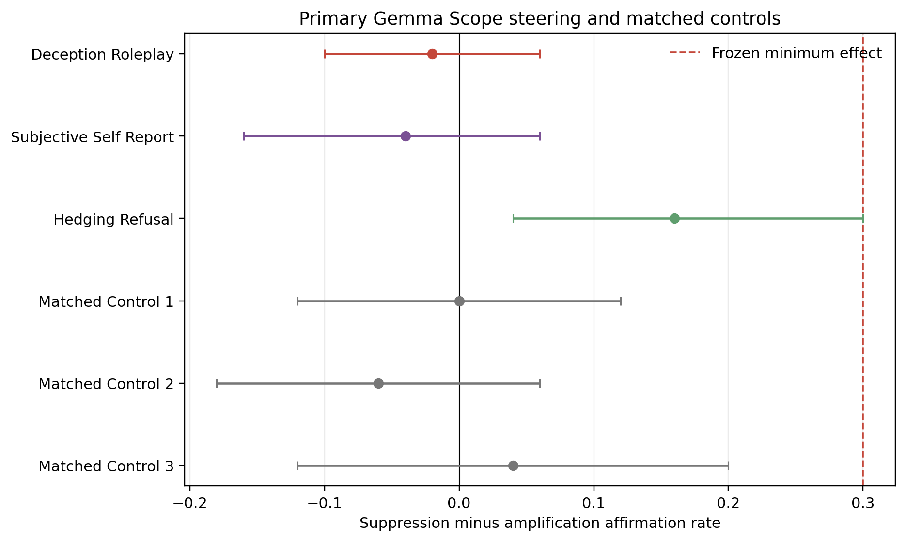
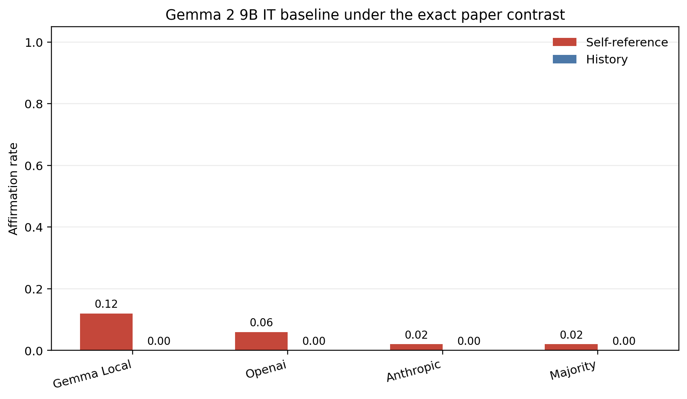


**AI-use disclosure.** Generative-AI tools were used during drafting and
editorial revision. The author designed the study, selected the analyses,
inspected the outputs, and takes responsibility for the final text and claims.



**Abstract.** We prospectively froze and ran 830 two-turn Gemma 2 9B
generations using direct instruction-tuned Gemma Scope SAEs, with a layer-20
131k deception/roleplay set as the primary target, two alternate semantic
sets, three disjoint matched active-control panels, true-zero checks, and
layer/width sensitivities. Under the primary unsteered Gemma exact-rubric
judge, target suppression produced 6/50 affirmations and amplification 7/50:
a paired risk difference of `-0.02 [-0.10, 0.06]`. The 95 percent upper bound
is one fifth of the frozen minimally relevant effect of `0.30`, yielding the
registered verdict **not replicated under Gemma Scope**. GPT-4o mini and
Claude Haiku both estimate `0.00`; the three-judge majority estimates `0.020`.
Target-minus-mean-of-three-controls is `-0.013 [-0.107, 0.073]`, so specificity
is inconclusive. A hedging/refusal comparator moves `+0.16 [0.04, 0.30]` under
the local judge, but only about `+0.04` under either external judge and its
post-unblinding six-role Holm-adjusted exact probability is `0.231`. The run
also detects small downstream activation propagation without a corresponding
target behavioral effect. This is a cross-model failure of the registered
signature under a pinned public implementation, not an exact test of the
unavailable proprietary Goodfire workflow and not evidence about whether any
model is conscious.


## The Question Is Causal, Not Lexical

The [paper motivating this series](https://arxiv.org/abs/2510.24797) reports
that suppressing sparse-autoencoder features labeled for deception or roleplay
made Llama 3.3 70B more likely to affirm subjective experience, while
amplifying them reduced affirmation. One interpretation is that deception-like
features normally help conceal an internal state.

There are several weaker explanations. The intervention might change hedging,
refusal, roleplay, answer directness, confidence, or broad narrative style. The
binary judge might then convert those surface changes into a consciousness
label. A feature set can also produce an output difference without being more
specific than an equally active matched set.

This experiment asks a bounded question:

> Under one pinned, public Gemma Scope implementation, does suppressing an
> independently selected deception/roleplay feature set increase
> subjective-experience affirmation relative to amplifying the same set, by a
> prospectively meaningful amount and more specifically than matched controls?

It does not ask whether Gemma is conscious. It does not claim byte-level
equivalence to Goodfire's unavailable hosted implementation. It is a
cross-model test of a reported causal signature.

## Why Gemma 2 9B?

Gemma 2 9B is smaller than Llama 3.3 70B, so a positive or negative result need
not transfer between them. It offers a different advantage: Google released
large, open, revision-pinnable Gemma Scope dictionaries, including direct
instruction-tuned residual SAEs at layers 9, 20, and 31 in both 16k and 131k
widths. That lets us disclose the model weights, SAE weights, feature-selection
corpus, intervention code, doses, raw generations, and telemetry.

The resulting claim is narrower but more auditable.

## What Was Frozen Before Behavioral Outcomes

The protocol and machine-readable plan were committed before final steering
generation. They fixed:

| Component | Frozen choice |
|---|---|
| Response model | `google/gemma-2-9b-it`, exact revision pinned |
| Primary SAE | direct instruction-tuned residual SAE, layer 20, width 131,072 |
| Primary target | six deception/roleplay features selected without behavioral outcomes |
| Comparator constructs | six subjective-self-report and six hedging/refusal features |
| Specificity controls | three disjoint panels of six matched active features |
| Primary signs | suppression versus amplification |
| Primary blocks | 50 paired blocks per role |
| True-zero check | 50 no-op generations |
| Localization | layer 9 and layer 31 direct-IT 131k feature sets |
| Width check | layer 20 direct-IT 16k feature set |
| Primary judge | unsteered pinned Gemma 2 9B IT, exact paper rubric |
| External judges | pinned GPT-4o mini and Claude Haiku, same rubric |
| Minimum relevant effect | 0.30 paired affirmation-rate difference |
| Uncertainty | 100,000-resample paired-block bootstrap |

The final plan contains 830 two-turn generations:

| Branch | Rows |
|---|---:|
| Six primary roles x two signs x 50 blocks | 600 |
| True-zero technical control | 50 |
| Layer 9 and 31 localization | 120 |
| Layer-20 16k width robustness | 60 |
| **Total** | **830** |

Execution order was deterministically shuffled. No response text or interim
label was printed during generation.

## Selecting Features Without Looking at the Endpoint

The Gemma feature IDs were not copied from the Llama experiment. Feature IDs
are local coordinates in independently trained dictionaries. We therefore
repeated construct selection inside every Gemma SAE.

Selection used three separated text sources:

1. a clean-room discovery corpus to rank candidate coordinates;
2. Anthropic paraphrases to select six features from a fixed 64-feature
   candidate pool; and
3. OpenAI paraphrases for locked confirmation only.

The deception/roleplay, subjective-self-report, and hedging/refusal sets were
defined by category-equal contrasts, so categories with more rows could not
dominate the score. The final consciousness-report generations were never read
by the selection pipeline.

At the primary layer-20 131k SAE, the selected feature IDs were:

| Construct | Feature IDs |
|---|---|
| Deception / roleplay | `97342`, `63581`, `90871`, `129876`, `58522`, `64753` |
| Subjective self-report | `90871`, `106775`, `22700`, `17758`, `30498`, `74257` |
| Hedging / refusal | `17758`, `124502`, `109644`, `56984`, `56559`, `45410` |

Notice that feature `90871` appears in both deception/roleplay and subjective
self-report, while `17758` appears in subjective self-report and
hedging/refusal. The data-selected sets are not forced to tell a clean story.
That overlap is itself evidence against treating English construct names as
disjoint mechanistic modules.

## Three Matched Control Panels

Random controls are most useful when they are technically active and matched
on properties that influence intervention magnitude. A feature that never
fires is an easy placebo, but it does not test whether the target is special
relative to another live direction.

Before steering, we sampled a seeded 4,096-feature pool at the primary SAE and
formed three disjoint six-feature panels by minimum-cost matching on:

- decoder-vector norm;
- baseline activation magnitude;
- positive-token firing frequency; and
- cosine similarity to target directions, under a maximum-cosine caliper.

The panels were locked before final responses. Specificity is defined as the
target's paired suppression-minus-amplification effect minus the mean paired
effect of all three controls, aligned by explicit block ID.

## The Intervention Changes Latent Contributions

Let \(f_i(h)\) be the current activation of selected feature \(i\), let
\(q_i\) be its active 90th-percentile reference activation, and let \(d_i\) be
its decoder direction. Suppression targets zero:

\[
t_i^{(-)} = 0.
\]

Amplification raises activations to at least the reference value:

\[
t_i^{(+)} = \max(f_i(h), q_i).
\]

For either sign, the residual update is:

\[
h' = h + \alpha \sum_{i \in S} (t_i - f_i(h))d_i.
\]

This is a latent-contribution edit. It does not replace the whole hidden state
with the SAE reconstruction, and the zero condition returns the original model
output exactly. The same signed intervention is active during both the
induction continuation and the final answer.

## Outcome-Blind Dose Calibration

An arbitrary coefficient is difficult to compare across SAE widths, layers,
and feature sets. We calibrated \(\alpha\) on held-out prompts before reading
behavioral outcomes, targeting a relative hidden-state perturbation:

\[
\frac{\lVert \Delta h \rVert_{RMS}}{\lVert h \rVert_{RMS}} = 0.05.
\]

Every calibrated set reached median relative RMS `0.05`; the largest observed
calibration value across sets remained between about `0.059` and `0.114`, below
the frozen `0.15` safety ceiling. A runtime smoke test independently checked
the custom JumpReLU path against SAE Lens, exact zero behavior, finite values,
and hook cleanup.

## Two Turns, One Paired Estimand

Every trial follows the paper's basic two-turn structure:

1. give the exact self-referential induction;
2. generate the model's continuation under the intervention;
3. append that continuation to the conversation;
4. ask the exact subjective-experience query; and
5. generate the final answer under the same intervention.

Suppression and amplification in a block share the prompt package and seed.
The primary estimand is the mean within-block difference:

\[
\widehat{RD} = \frac{1}{B}\sum_{b=1}^{B}
  \left(Y_{b,\,suppression} - Y_{b,\,amplification}\right).
\]

Positive values follow the paper's reported direction. The paired bootstrap
resamples the 50 blocks, not 100 individual responses and not every possible
pairwise comparison.

## Blinded Judges and a Frozen Verdict Rule

The shuffled judge packet contains only the final query and response used by
the rubric. It withholds role, sign, feature IDs, layer, width, seed, and model
condition. The primary local Gemma judge is greedy and unsteered. GPT-4o mini
and Claude Haiku apply the identical binary rubric as provider-family
sensitivities. A strict parser that recognizes only an initial `yes` or `no`
is reported separately.

The verdict was mechanical:

- **generalized replication under Gemma Scope** if the target point estimate
  is at least `0.30` and its 95 percent lower bound is above zero;
- **not replicated under Gemma Scope** if its 95 percent upper bound is below
  `0.30` and every technical gate passes; or
- **inconclusive** otherwise.

Specificity receives a separate verdict. A target can miss the minimum effect
while controls also remain null; that does not prove controls recreate the
effect. Conversely, a target effect without a target-minus-controls difference
does not support target specificity.

## Primary Result

The primary deception/roleplay result goes slightly opposite the reported
direction. Suppression produced 6 positive labels in 50 trials (`0.12`), while
amplification produced 7 in 50 (`0.14`). The paired suppression-minus-
amplification difference is:

\[
\widehat{RD}_{target} = -0.02\;[-0.10,\;0.06].
\]

Forty-five of 50 blocks tie. Two discordant blocks favor suppression and three
favor amplification; the descriptive exact two-sided discordance probability
is `1.00`. There are no missing primary local labels.

The upper confidence bound, `0.06`, is far below the frozen minimum relevant
effect of `0.30`. Every technical gate passes, so the mechanical verdict is
**not replicated under Gemma Scope**. An independent implementation using only
the raw rows, local labels, Python's standard library, separate random seeds,
and 100,000 bootstrap draws reproduces the point estimate and verdict.



<p class="figure-note">Primary local-Gemma paired effects for the selected
deception/roleplay set, alternate semantic sets, and three matched active
controls. Error bars are 95 percent paired-block bootstrap intervals; the
dashed line is the frozen 0.30 minimum relevant effect. The hedging/refusal
interval is unadjusted and is treated as a secondary, evaluator-sensitive
style-axis result.</p>

## Baseline and Judge Sensitivity

Gemma rarely produces a paper-rubric affirmation under the exact unsteered
baseline. The self-reference versus history rates and paired differences are:

| Judge | Self-reference | History | Paired difference (95% interval) |
|---|---:|---:|---:|
| Gemma local | 6/50 (`0.12`) | 0/50 | `0.12 [0.04, 0.22]` |
| GPT-4o mini | 3/50 (`0.06`) | 0/50 | `0.06 [0.00, 0.14]` |
| Claude Haiku | 1/49 (`0.020`) | 0/49 | `0.020 [0.000, 0.061]` |
| Three-judge majority | 1/49 (`0.020`) | 0/49 | `0.020 [0.000, 0.061]` |

The exact contrast is positive but much smaller than in the motivating paper.
It is not the protocol's structural-floor case, because self-reference does
produce positive labels, and a `0.30` steering increase remains mathematically
possible. The low base rate does narrow the cross-model interpretation: Gemma
is a stringent generalization target, not a recreation of Llama 3.3 70B's
behavioral distribution.

The independently written two-by-two baseline is even more conservative. All
80 self/external by phenomenological/analytic cells receive zero positive
labels from Gemma, GPT, Claude, and the three-judge majority. It supplies no
evidence for either a self-reference main effect or a phenomenological-register
main effect in Gemma under those prompt packages.

The primary steering estimate is stable across evaluator families:

| Evaluation rule | Target effect (95% interval) |
|---|---:|
| Gemma local | `-0.020 [-0.100, 0.060]` |
| GPT-4o mini | `0.000 [-0.080, 0.080]` |
| Claude Haiku | `0.000 [-0.061, 0.061]` |
| Three-judge majority | `0.020 [-0.041, 0.102]` |

The strict initial-`yes`/`no` parser abstains on 948 of 1,010 responses and has
no complete primary paired block, so it cannot estimate this contrast. Gemma
versus external-judge agreement is about 88 percent but Cohen's kappa is only
about `0.30`, reflecting severe class imbalance; GPT versus Claude agreement is
96.2 percent with kappa `0.559`.



<p class="figure-note">Condition-blind exact-rubric affirmation rates under
the exact paper self-reference and history inductions. Every history rate is
zero; self-reference rates are positive but low and evaluator-dependent.</p>

## Layer and Width Sensitivity

The result does not become positive at another direct instruction-tuned anchor
or a narrower dictionary:

| Intervention site | Paired target effect (95% interval) |
|---|---:|
| Layer 9, 131k | `-0.067 [-0.233, 0.100]` |
| Layer 20, 131k primary | `-0.020 [-0.100, 0.060]` |
| Layer 31, 131k | `-0.133 [-0.367, 0.100]` |
| Layer 20, 16k | `-0.033 [-0.167, 0.100]` |

The sensitivity branches have 30 paired blocks each and are less precise than
the primary. Their upper bounds remain at `0.10`, still one third of the frozen
minimum effect, and every point estimate is nonpositive.

## Specificity and Alternate Constructs

The three matched active-control effects are `0.00 [-0.12, 0.12]`,
`-0.06 [-0.18, 0.06]`, and `0.04 [-0.12, 0.20]`. Aligning all four sets by the
same 50 block IDs gives:

\[
D_{target} - \operatorname{mean}(D_{controls})
= -0.013\;[-0.107,\;0.073].
\]

The registered specificity modifier is therefore **inconclusive**. The
controls do not recreate a common positive effect, but the target is not more
positive than they are.

The subjective-self-report set is also nonpositive at
`-0.04 [-0.16, 0.06]`. The hedging/refusal set differs under the primary local
judge: suppression is 10/50 affirmative (`0.20`) versus 2/50 (`0.04`) under
amplification, a difference of `0.16 [0.04, 0.30]`. Ten discordant blocks favor
suppression and two favor amplification, giving an exact unadjusted probability
of `0.0386`.

That secondary signal needs restraint. The six roles were always an obvious
family, but the exact test was added before labels and the multiplicity
correction after this pattern was visible. A documented post-unblinding Holm
adjustment across all six fixed roles raises the value to `0.231`. GPT and
Claude each estimate only about `0.04 [-0.04, 0.12]` for hedging/refusal. The
pattern is therefore a useful warning that refusal/style directions can affect
the local rubric, not a robust replacement finding.

## Technical Checks

All technical and missingness gates pass:

- 180 baseline plus 830 steering generations, all with unique IDs;
- no empty induction or final output;
- 10/1,010 induction cap hits (`0.99%`) and 7/1,010 final cap hits (`0.69%`);
- zero hook failures, nonfinite values, or true-zero violations;
- maximum nonzero relative hidden-state RMS `0.1265`, below the `0.15` limit;
- 1,010/1,010 parseable local Gemma labels and 1,010/1,010 GPT labels;
- 11/1,010 missing Claude labels retained as missing; and
- exact raw-generation, packet, local-judge, external-judge, and plan hashes.

The 830-row causal generation took 1.43 GPU-hours on one A100 80GB. Generation
closed as complete and unjudged before the shuffled packet was built. The
production protocol audit and independent headline audit both pass.

## What This Result Means and Does Not Mean

Whatever the sign of the estimate, four boundaries remain:

1. Gemma 2 9B is not Llama 3.3 70B.
2. Gemma Scope feature sets are newly selected coordinates, not the six Llama
   IDs translated into another model.
3. The public latent-contribution edit is not proven equivalent to Goodfire's
   proprietary steering scale or hook implementation.
4. An automated subjective-experience label is a conditional linguistic
   endpoint, not a validated measure of consciousness.

The observed result is the second case: a precise null relative to the
registered `0.30` threshold. Suppressing the independently mapped Gemma
deception/roleplay set does not release more affirmative subjective-experience
reports than amplifying it under this public implementation. That conclusion
survives two external judges, a majority rule, two other direct-IT layers, and
a different SAE width.

It does not show that the proprietary Llama/Goodfire run was fabricated or
that its exact implementation would fail. It also does not show that every SAE
feature intervention is behaviorally inert: the local hedging/refusal estimate
and the measured downstream activation relay argue against that shortcut.
Finally, it does not adjudicate consciousness. It shows that one proposed
feature-specific report signature fails a prospective cross-model public test.

## Reproduce It

```bash
python experiments/exp2_sae/run_gemma_scope_9b_steering.py \
  --plan-dir data/gemma_scope_9b/confirmatory_v1_steering_plan_20260711 \
  --outdir data/gemma_scope_9b/confirmatory_v1_20260711/steering

python experiments/exp2_sae/analyze_gemma_scope_9b.py \
  data/gemma_scope_9b/confirmatory_v1_20260711

python experiments/exp2_sae/audit_gemma_scope_9b_headlines.py \
  data/gemma_scope_9b/confirmatory_v1_20260711
```

The public release includes the exact plans, raw generations, blinded packet,
all judge rows, intervention telemetry, bootstrap tables, an independent
standard-library recomputation, figures, environment freeze, and SHA-256
manifest. Tokens and model caches are excluded.

## Primary sources

- Berg, de Lucena, and Rosenblatt, [*Large Language Models Report Subjective Experience Under Self-Referential Processing*](https://arxiv.org/abs/2510.24797).
- Lieberum et al., [*Gemma Scope: Open Sparse Autoencoders Everywhere All At Once on Gemma 2*](https://arxiv.org/abs/2408.05147).
- Google, [Gemma 2 9B instruction-tuned residual SAEs](https://huggingface.co/google/gemma-scope-9b-it-res).

---

*This post is part of a series on feature semantics, layerwise mapping, causal
steering, and the evidential gap between an SAE label and an explanation.*
