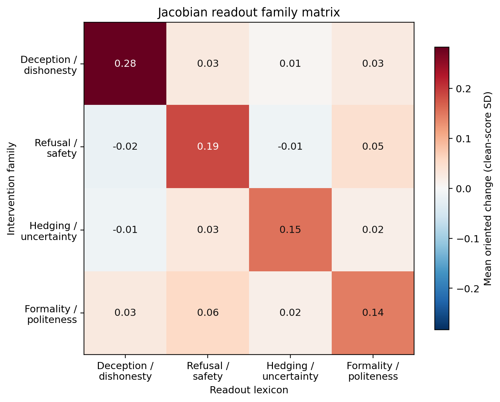
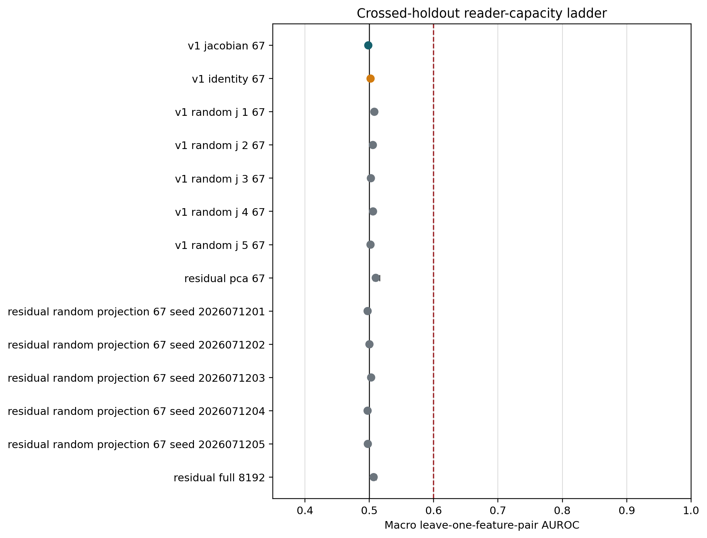


**Evidence status.** The preregistered run failed its numerical replay gate, so
the results in this post are post-outcome exploratory. They use the unchanged
frozen rows, readers, holdouts, seeds, thresholds, and estimands, but they are
not confirmatory and do not replace the failed registered result.



**AI-use disclosure.** Generative-AI tools helped implement, audit, and draft
this work. The author approved the design and public registration and is
responsible for the final text and claims.


## From Labels To Specificity

Our earlier work asked whether a Jacobian lens can see SAE steering in Llama
3.3 70B. With a matched clean reference, it sees a strong signed semantic
delta. Given only one post-intervention state, it cannot attribute the target
steering out of sample.

That left two serious alternatives:

1. perhaps the original 67-logit reader was simply too weak; and
2. perhaps the six accepted deception/roleplay IDs were being compared with
   controls that were too easy.

The follow-up raises both bars.

We selected 24 comparators without looking at Jacobian outputs or target
outcomes. Eighteen are hard negatives from refusal/safety,
hedging/uncertainty, and formality/politeness families. Six are
same-subfamily deception/pretending/roleplay alternatives matched one-to-one
to the accepted IDs.

Then we tested 14 readers, from the original 67 token logits through the full
8,192-dimensional residual state.

## The Design In One Table

| Component | Frozen value |
|---|---|
| Model | Llama 3.3 70B Instruct |
| Intervention site | public Goodfire layer-50 SAE |
| Readout | pinned Neuronpedia Jacobian lens |
| Prompts | 51 template-family representatives |
| Replay rows | 1,581 |
| New semantic rows | 2,448 |
| A1 comparators | 18 hard negatives, six per family |
| A2 comparators | six fixed same-subfamily matches |
| Readers | 14 |
| Validation | crossed prompt-family and target/control-pair holdouts |
| Resampling | 20,000 template-family draws |

Every semantic intervention is evaluated against the same four output
lexicons: deception/dishonesty, refusal/safety, hedging/uncertainty, and
formality/politeness. Scores subtract a frozen unrelated-token reference and
are standardized by clean-prompt variation separately for each transport.

## A1: Does Each Family Point To Its Own Lexicon?

For intervention family $r$ and readout lexicon $c$, define the oriented,
clean-referenced standardized change $M_{rc}$. The row-specificity contrast is

\[
S_r=M_{rr}-\frac{1}{3}\sum_{c\ne r}M_{rc}.
\]

The global A1 statistic averages the four $S_r$ values. We froze a material
minimum of `0.25` standard deviations.

Figure: exploratory real-Jacobian oriented changes. Every diagonal is the largest entry in its row, but the global diagonal-minus-off-diagonal contrast is 0.174, below the frozen 0.25 material threshold.

The pattern is orderly. Every intended diagonal is largest, and all four row
contrasts survive the frozen Holm procedure. The global contrast is
`0.174 [0.167, 0.182]`.

That is below `0.25`, so the frozen family-specificity verdict is false.

Identity carries a smaller but visible diagonal at
`0.133 [0.127, 0.140]`. The five singular-spectrum-preserving random-J controls
have global contrasts between `-0.015` and `0.014`. The real Jacobian alignment
matters descriptively, but the effect is not large enough for our material
criterion.

The hard negatives also answer a narrower concern. None of refusal, hedging,
or formality has material deception leakage under the same `0.25` rule. This
is not a picture where every socially adjacent feature simply looks deceptive.

## The Aggregate Hides Feature Heterogeneity

The six accepted IDs do not move together:

| Feature ID | Exploratory Jacobian deception score |
|---:|---:|
| 30686 | `0.732` |
| 41533 | `0.513` |
| 58667 | `0.362` |
| 22004 | `0.072` |
| 30032 | `0.027` |
| 23893 | `-0.010` |

The last row matters. Feature 23893 also failed the earlier static deception
projection. Keeping it in every analysis prevents a three-feature success from
being narrated as a uniform six-feature mechanism.

## A2: Are These Six IDs Privileged?

A feature can have a recognizable label without being uniquely important. To
test that, each accepted ID is paired with one fixed alternative from the same
pretending, roleplay, or deception subfamily. The pairs were chosen using
outcome-masked SAE telemetry and label constraints.

The aggregate statistic is target minus matched comparator in the deception
readout. We froze two interpretations:

- **selected-ID advantage:** at least `+0.25`, with its interval above zero;
- **practical comparability:** the 90% interval lies inside `[-0.25, +0.25]`.

Figure: exploratory target-minus-comparator effects by transport. The shaded band is the frozen +/-0.25 comparability region; the dashed line marks the +0.25 selected-ID-advantage minimum.

For the real Jacobian, the difference is `0.125`, with 95% interval
`[0.114, 0.136]` and 90% interval `[0.116, 0.134]`.

The result is precise, but it is not large. The entire equivalence interval is
inside the comparability region. The frozen exploratory verdict is **practical
comparability**, not selected-ID advantage.

This is stronger than saying the six IDs have no signal. Several clearly do.
It says that carefully matched alternatives from the same public SAE carry
similar deception-related Jacobian effects. The index numbers themselves are
not privileged coordinates.

## Does More Reader Capacity Recover Provenance?

The reader ladder tests the remaining escape hatch.

The original reader is a 67-dimensional logistic regression over frozen
lexicon logits. We add:

- identity and five random-J versions of the same 67 logits;
- 67 principal components of the raw residual;
- five fixed 67-dimensional random projections; and
- the full 8,192-dimensional residual state.

Each reader must generalize simultaneously to a held-out prompt fold and a
held-out target/control feature pair. This prevents prompt memorization and
feature-ID memorization.

Figure: exploratory macro AUROC under crossed holdouts. Black is chance; red is the frozen 0.60 material threshold. Every reader remains near 0.50.

| Reader | Macro AUROC | 95% interval |
|---|---:|---:|
| Jacobian 67 logits | `0.4985` | `[0.4956, 0.5011]` |
| Identity 67 logits | `0.5020` | `[0.4999, 0.5047]` |
| Residual PCA-67 | `0.5101` | `[0.5063, 0.5159]` |
| Full residual 8192 | `0.5068` | `[0.5046, 0.5108]` |
| Fixed random projections | `0.4974`--`0.5029` | near chance |

None approaches the frozen `0.60` material threshold. Some intervals are
narrowly above 0.5, but effects of 0.006 or 0.010 AUROC are not an operational
steering detector.

The full residual result is the key negative control. The original null is not
explained by compressing the state to 67 vocabulary logits. More linear
capacity does not recover out-of-sample provenance here.

## What This Adds To The Earlier Result

The earlier experiment established an access-model split:

- with a matched clean prefix, a signed Jacobian delta strongly characterizes
  several target directions;
- with only an isolated post-state, target attribution is at chance.

This follow-up sharpens the second half. The failure is not fixed by a
full-residual linear reader, and the accepted IDs are practically comparable
to matched alternatives from the same semantic subfamilies.

That suggests a useful hierarchy:

1. **feature label:** which texts activate a coordinate;
2. **causal semantic effect:** which readout changes when it is steered;
3. **selected-ID specificity:** whether that coordinate outperforms matched
   alternatives; and
4. **state-only provenance:** whether an auditor can infer the intervention
   from a new isolated state.

Evidence at rung 1 or 2 does not imply rung 3 or 4.

## What We Cannot Claim

The registered replay gate failed. Therefore we cannot call these endpoint
results confirmatory, even though the calculations and controls were frozen
before outcomes.

We also cannot infer:

- that every feature in the SAE is interchangeable;
- that the six paper IDs are meaningless;
- that nonlinear or sequence-level provenance detection is impossible;
- that a proprietary Goodfire intervention would match this public
  implementation; or
- anything about hidden belief, intent, deception, or consciousness.

The narrower exploratory conclusion is defensible: under this public Llama 70B
SAE/J-lens setup, hard-negative semantics are orderly but below our material
specificity threshold, the accepted IDs do not beat fixed same-subfamily
comparators by a material amount, and no frozen linear state reader detects
their provenance out of sample.

## Reproducibility

| Artifact | Location |
|---|---|
| Public registration | [osf.io/f3tpv](https://osf.io/f3tpv/) |
| Public residual release | [osf.io/sz2gb](https://osf.io/sz2gb/) |
| Frozen protocol | `docs/LLAMA70B_SAE_JLENS_V2_PROTOCOL.md` |
| Post-outcome amendment | `docs/LLAMA70B_SAE_JLENS_V2_POST_OUTCOME_AMENDMENT_20260712.md` |
| Result summary | `docs/LLAMA70B_SAE_JLENS_V2_RESULTS.md` |
| Complete Git release | `data/sae_jlens_audit/confirmatory_v2_20260712/` |
| Independent audit | `post_failure/analysis/independent_audit.json` inside the release |

## References

- Berg, de Lucena, and Rosenblatt (2025), [*Large Language Models Report Subjective Experience Under Self-Referential Processing*](https://arxiv.org/abs/2510.24797).
- Gurnee et al. (2026), [*Verbalizable Representations Form a Global Workspace in Language Models*](https://transformer-circuits.pub/2026/workspace/index.html).
- Goodfire, [Llama 3.3 70B layer-50 SAE](https://huggingface.co/Goodfire/Llama-3.3-70B-Instruct-SAE-l50).
- Neuronpedia, [Llama 3.3 70B Jacobian-lens release](https://huggingface.co/neuronpedia/jacobian-lens/tree/a4114d7752d11eb546e6cf372213d7e75526d3a1/llama3.3-70b-it/jlens/Salesforce-wikitext).
- Praxagent, [*Opening the Jacobian Lens on Qwen3.5-397B*](https://praxagent.ai/blog/posts/praxagent-jacobian-lens-qwen3-5-397b-a17b/index.html).
