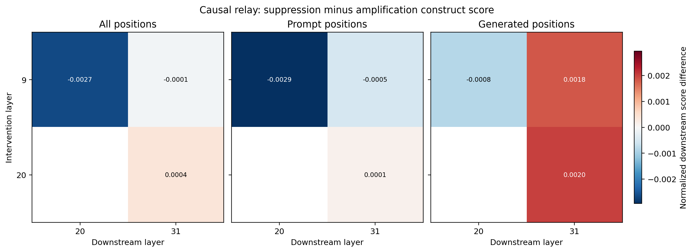


**AI-use disclosure.** Generative-AI tools were used during drafting and
editorial revision. The author designed the study, selected the analyses,
inspected the outputs, and takes responsibility for the final text and claims.



**Abstract.** A layerwise feature map shows association; a causal relay requires
an intervention upstream and a measured change downstream. In a prospectively
frozen Gemma 2 9B study, suppressing versus amplifying six independently mapped
layer-9 deception/roleplay features produces a small but precise difference in
the corresponding layer-20 construct score. On the final turn, the all-position
difference is `-0.00266 [-0.00364, -0.00178]`, with the expected negative sign
because amplification raises downstream activation. The prompt-position effect
is `-0.00294 [-0.00394, -0.00209]`; the generated-position interval includes
zero. At layer 31, layer-9 and layer-20 interventions yield near-zero or
sign-changing readouts with intervals that generally include zero. The same
interventions do not produce the reported behavioral direction: layer-9,
layer-20, and layer-31 subjective-experience affirmation effects are all
nonpositive. The experiment therefore demonstrates local activation
propagation while withholding the stronger claims of persistent feature
identity, a stable multi-layer circuit, behavioral mediation, or consciousness.


## Similarity Is Not a Relay

Layerwise sparse-autoencoder maps can show that separately learned features in
adjacent layers rank the same texts similarly. They can also show decoder
directions with positive cosine similarity. Those are useful observations, but
neither demonstrates that the upstream feature causes the downstream feature
to activate.

A causal relay claim needs an intervention:

\[
do(F_{upstream} = f') \rightarrow \Delta F_{downstream}.
\]

Even that arrow requires care. Editing one SAE feature set changes a residual
vector, the model recomputes every later layer, and a downstream SAE measures a
new projection of the resulting state. A measured downstream difference is
evidence of propagation under the intervention. It is not automatically a
complete circuit or a mediation proof.

## Three Different Questions

This project keeps three levels of evidence separate:

| Level | Question | Evidence |
|---|---|---|
| Descriptive map | Where do construct-associated coordinates appear? | held-out activation contrasts by layer |
| Descriptive link | Do adjacent-layer coordinates respond similarly? | activation rank correlation, decoder cosine, top-item overlap |
| Causal relay | Does changing an upstream feature set alter downstream construct activation? | paired suppression-versus-amplification telemetry |
| Behavioral endpoint | Does the intervention alter the final judged report? | blinded paired affirmation difference |

The same experiment can produce evidence at one level and not another. For
example, an upstream edit may move downstream feature activity without changing
the binary report, or a report may change through a pathway not captured by the
selected downstream feature set.

## The Relay Design

The direct instruction-tuned Gemma Scope residual SAEs provide three 131k
anchor layers: 9, 20, and 31. Our causal plan intervenes on deception/roleplay
sets at all three for registered localization, with layer 20 as the primary
behavioral site.

During every nonzero layer-9 intervention, the runner measures the normalized
activation of the independently selected deception/roleplay sets at layers 20
and 31. During every nonzero layer-20 intervention, it measures layer 31.
Layer-31 interventions have no later direct-IT anchor and therefore no
downstream relay readout.


flowchart LR
  L9["Layer 9 direct-IT SAE<br/>intervention"] --> L20["Layer 20 direct-IT SAE<br/>readout"]
  L9 --> L31["Layer 31 direct-IT SAE<br/>readout"]
  L20I["Layer 20 direct-IT SAE<br/>intervention"] --> L31
  L31I["Layer 31 direct-IT SAE<br/>intervention"] --> O["Final output only"]


These are direct instruction-tuned SAEs. The failed pretrained-to-instruction
transfer gate does not enter the causal relay analysis.

## Independent Coordinates at Every Layer

The downstream readout never reuses the upstream feature IDs. Each layer has
its own six-feature set selected under the same frozen deception/roleplay
construct:

| Layer | Direct-IT 131k feature IDs |
|---:|---|
| 9 | `107581`, `33267`, `93815`, `120222`, `100221`, `78281` |
| 20 | `97342`, `63581`, `90871`, `129876`, `58522`, `64753` |
| 31 | `113111`, `15266`, `35118`, `84713`, `43780`, `3036` |

Each downstream feature activation is divided by its own active
90th-percentile value before aggregation. This places the six coordinates on a
rough common scale without claiming their raw SAE units are equivalent.

## Prompt Positions and Generated Positions Are Separated

Autoregressive generation has two computational regimes. The first forward
pass processes the whole prompt. Later forward passes process newly generated
tokens through the key-value cache. Combining them into one mean can hide where
an intervention propagates.

The telemetry therefore logs, for every turn and downstream layer:

- activation mean across all observed positions;
- prompt-position activation mean and maximum;
- generated-position activation mean and maximum;
- number of activation elements and hook calls; and
- intervention hidden-state RMS, hook removal, and finite-value checks.

We report induction and final turns separately. This prevents a large prompt
effect from being narrated as a generated-answer mechanism.

## The Paired Relay Estimand

For a fixed upstream layer, downstream layer, turn, and position scope, the
relay effect is:

\[
\widehat{\Delta}_{relay} = \frac{1}{B}\sum_{b=1}^{B}
\left(A^{down}_{b,\,suppression} - A^{down}_{b,\,amplification}\right).
\]

The 95 percent interval resamples complete prompt/seed blocks. Positive values
mean the downstream deception/roleplay set is more active under upstream
suppression than amplification. A simple sign expectation is not guaranteed:
nonlinear recomputation, compensatory features, and the use of independently
trained dictionaries can produce attenuation or reversal.

## Relay Results

The clearest relay appears from layer 9 to layer 20. Negative values are the
expected direction: suppressing the upstream set should leave less downstream
deception/roleplay activation than amplifying it.

| Turn and position scope | Layer 9 to layer 20 effect (95% interval) |
|---|---:|
| Induction, all positions | `-0.00381 [-0.00510, -0.00271]` |
| Induction, prompt positions | `-0.00218 [-0.00218, -0.00218]` |
| Induction, generated positions | `-0.00258 [-0.00389, -0.00125]` |
| Final turn, all positions | `-0.00266 [-0.00364, -0.00178]` |
| Final turn, prompt positions | `-0.00294 [-0.00394, -0.00209]` |
| Final turn, generated positions | `-0.00084 [-0.00220, 0.00050]` |

The induction prompt interval is degenerate because every paired block
processes the same prompt before any sampled token exists; the observed prompt
activation difference is identical across blocks. Generated positions include
different sampled continuations and carry the relevant between-block
variation.

Propagation does not remain coherent to layer 31. For the final turn, layer 9
to layer 31 is `-0.00007 [-0.00134, 0.00116]` over all positions and
`0.00183 [-0.00111, 0.00476]` over generated positions. A layer-20 intervention
read at layer 31 is `0.00035 [-0.00072, 0.00145]` over all positions and
`0.00201 [-0.00001, 0.00415]` over generated positions. These estimates are
small, uncertain, and sometimes opposite the simple feed-forward sign story.



<p class="figure-note">Final-turn downstream construct-score differences for
all, prompt, and generated positions. Cells are suppression minus amplification
of an independently selected downstream deception/roleplay set, normalized by
feature-specific active 90th percentiles. Blank cells have no later direct-IT
anchor. The color scale is symmetric around zero.</p>

## Prompt Versus Generated-Token Results

Pooling all positions would hide the main qualification. The reliable negative
layer-9-to-20 effect is strongest on prompt positions. On the final generated
tokens it attenuates to about one third of the all-position magnitude and its
interval crosses zero. Meanwhile, generated-position point estimates at layer
31 become positive for both layer-9 and layer-20 interventions.

That is plausible in an autoregressive system. Suppression and amplification
change early hidden states, which change sampled tokens, which then become new
inputs. Later SAE scores can reflect both direct residual propagation and
different generated text. A sign reversal is not proof of compensation, but it
is evidence against narrating one stable feature quantity as moving unchanged
through the network.

The induction turn provides a useful comparison. Layer 9 to layer 20 remains
negative on generated induction tokens at
`-0.00258 [-0.00389, -0.00125]`, while layer-9-to-31 and layer-20-to-31 generated
effects are positive but imprecise. The immediate next-anchor relation is the
repeatable part; the later relation is not.

## Relation to the Behavioral Endpoint

The measured local relay does not accompany the paper-direction behavioral
signature. Under the primary exact-rubric Gemma judge, subjective-experience
affirmation effects are:

| Intervention layer/width | Suppression minus amplification |
|---|---:|
| Layer 9, 131k | `-0.067 [-0.233, 0.100]` |
| Layer 20, 131k | `-0.020 [-0.100, 0.060]` |
| Layer 31, 131k | `-0.133 [-0.367, 0.100]` |
| Layer 20, 16k | `-0.033 [-0.167, 0.100]` |

All four point estimates are nonpositive. At the primary layer 20 site, GPT-4o
mini and Claude Haiku each estimate exactly `0.00`, and the registered verdict
is **not replicated under Gemma Scope**.

We can therefore make a narrow causal statement: the layer-9 latent edit
changes an independently selected layer-20 readout under the frozen prompt
distribution. We cannot say that this relay mediates more affirmative reports,
because the behavioral endpoint does not move in the predicted direction and
the construct-score relation does not remain stable at layer 31.

Two cautions apply when comparing relay and report effects:

1. The binary report judge discards nearly all textual variation. A real
   downstream activation shift may not cross its decision boundary.
2. Parallel movement does not establish mediation. To show mediation, a future
   experiment would need to block or restore the downstream direction under
   the upstream intervention and preregister the predicted behavioral change.

## Why the Exploratory Cross-Layer Edges Are Still Useful

The 42-layer PT-on-IT atlas is exploratory because the transfer gate failed.
Its adjacent-layer links can nevertheless suggest candidate regions for a
future direct-IT SAE suite or a dedicated intervention study. The relay
analysis provides a calibration point: it shows how much stronger the language
must become when we move from "these features look similar" to "changing this
upstream set changed that downstream readout."

That distinction is the central lesson. A map generates hypotheses. A
controlled intervention tests one. A circuit explanation requires additional
necessity, sufficiency, and mediation evidence.

## Failure Modes to Watch

- **Hook mismatch:** a tensor with the right layer number but the wrong
  pre/post-projection location invalidates the readout.
- **ID reuse:** carrying one integer across SAE checkpoints invents an identity
  that training did not provide.
- **Prompt/generated pooling:** a prompt-dominated mean can be mistaken for a
  generation mechanism.
- **Outcome-driven feature search:** choosing downstream coordinates after
  seeing report effects inflates the relay story.
- **Inactive controls:** a dead feature cannot show that the named target is
  more specific than another active direction.
- **Mediation language:** upstream and downstream movement alone does not show
  the behavioral effect travels exclusively through the measured set.

## Reproduce the Relay Table

```bash
python experiments/exp2_sae/analyze_gemma_scope_9b.py \
  data/gemma_scope_9b/confirmatory_v1_20260711
```

The generated `analysis/relay_effects.csv` contains one row per design, role,
intervention layer, width, downstream layer, turn, and position scope. It
records complete-block counts, the paired point estimate, and the bootstrap
interval. The raw per-trial relay accumulators remain in
`steering/steering_generations.jsonl`, linked to the frozen plan and release
manifest by SHA-256.

## Primary sources

- Lieberum et al., [*Gemma Scope: Open Sparse Autoencoders Everywhere All At Once on Gemma 2*](https://arxiv.org/abs/2408.05147).
- Marks et al., [*Sparse Feature Circuits: Discovering and Editing Interpretable Causal Graphs in Language Models*](https://arxiv.org/abs/2403.19647).
- Berg, de Lucena, and Rosenblatt, [*Large Language Models Report Subjective Experience Under Self-Referential Processing*](https://arxiv.org/abs/2510.24797).

---

*This post is part of a series on feature semantics, layerwise mapping, causal
steering, and the evidential gap between an SAE label and an explanation.*
