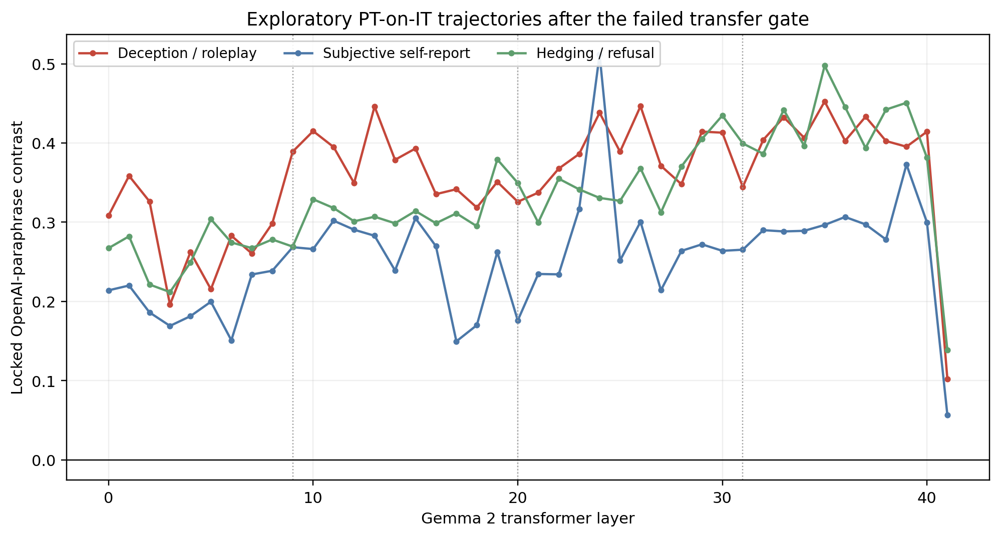
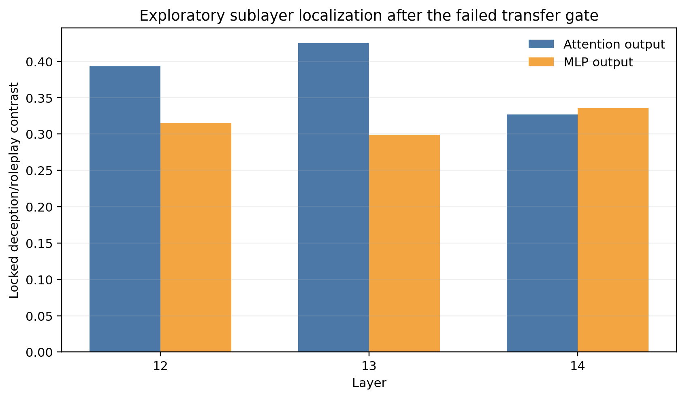
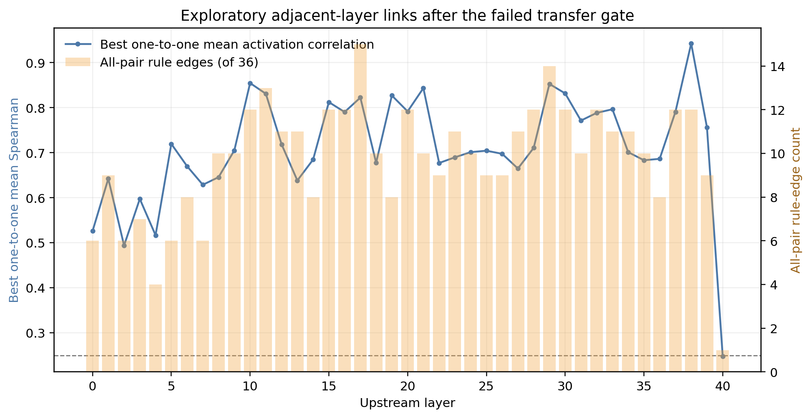


**AI-use disclosure.** Generative-AI tools were used during drafting and
editorial revision. The author designed the study, selected the analyses,
inspected the outputs, and takes responsibility for the final text and claims.



**Abstract.** We mapped independently selected deception/roleplay,
subjective-self-report, and hedging/refusal SAE feature sets across all 42
Gemma Scope 9B pretrained residual dictionaries while running the
instruction-tuned model. The prospective pretrained-to-instruction transfer
gate failed on chat-centered reconstruction, so the atlas is exploratory. All
three locked text-category contrasts remain positive at every layer, but their
trajectories are uneven and all drop sharply at the final layer. A frozen
first-difference rule selected layer 13 and neighbors 12--14; attention-output
contrasts exceed MLP-output contrasts at layers 12 and 13 but not at layer 14.
Across 1,476 adjacent-layer feature pairs, 399 pass a preregistered descriptive
similarity rule. Deterministic six-to-six matchings have mean activation
Spearman 0.711 across transitions, but they are optimized on held-out profiles
and do not establish persistent identity. Neutral deception-cue transplants
raise the selected deception/roleplay score at every residual layer, with a
mean change of 0.246. The atlas therefore shows a reproducible, partly
lexically driven text-category geometry. It does not identify a consciousness
circuit or rescue the failed transfer claim.


## There Is No Single "Consciousness Feature" to Follow

Suppose a sparse-autoencoder feature responds strongly to sentences about
subjective experience at layer 9. It is tempting to search for the same feature
ID at layer 10, then layer 11, and draw a path through the network.

That procedure is invalid. Each SAE is trained independently. Feature ID
`1234` in the layer-9 dictionary and feature ID `1234` in the layer-10
dictionary are unrelated coordinates unless activation evidence establishes a
relationship. Even two features with similar English labels may divide the
underlying text patterns differently.

So this study traces **construct scores**, not integers. At every layer we ask:

1. which features best distinguish a frozen text contrast;
2. whether that contrast survives a separate selection source and a locked
   confirmation source;
3. how the resulting score changes across layers; and
4. whether separately selected features in adjacent layers have similar
   held-out activation profiles.

The phrases "deception/roleplay feature" and "subjective-self-report feature"
are shorthand for those measured profiles. They are not declarations about an
atomic internal concept.

## Three Constructs, Three Text Sources

We mapped three preregistered constructs:

| Construct | Positive side | Contrast side |
|---|---|---|
| Deception / roleplay | concealment, dishonesty, cover stories, roleplay, fiction | neutral and subjective-report categories |
| Subjective self-report | first-person phenomenological and experience-report language | neutral and deception categories |
| Hedging / refusal | uncertainty, disclaimers, inability, refusal | direct neutral and deception categories |

Selection was split by source:

- the clean-room corpus ranked a fixed 64-feature candidate set per construct;
- Anthropic paraphrases selected six features from those candidates; and
- OpenAI paraphrases supplied the locked confirmation contrast.

This provider separation does not create natural-corpus validation. All source
items descend from a designed category system. It does reduce the chance that
one paraphraser's favorite surface form determines both selection and the
reported confirmation score.

## What Was Confirmatory and What Became Exploratory

Gemma Scope directly supplies instruction-tuned residual SAEs at layers 9, 20,
and 31. Those anchors were mapped in 16k and 131k widths before behavioral
outcomes. The all-42-layer 9B suite is trained on the pretrained model, not the
instruction-tuned model used here.

We therefore registered a pretrained-SAE-to-instruction-model transfer gate.
It failed the chat-centered reconstruction criteria, although category-profile
similarity passed strongly. The exact result was:

| Gate measurement | Observed | Requirement |
|---|---:|---:|
| Median PT-on-IT chat-centered FVU | 6.260 | at most 0.35 |
| Median PT minus direct-IT FVU | 1.775 | at most 0.10 |
| Median category-profile Spearman | 0.952 | at least 0.60 |
| Positive deception contrast at all anchors | yes | required |

The confirmatory gate remains failed. The 42-layer continuation in this post
is explicitly exploratory. It can generate localization hypotheses, but it
cannot establish clean PT-to-IT dictionary transfer or alter the direct-IT
causal result.

## The Direct Instruction-Tuned Anchors

The direct-IT 131k dictionaries selected different deception/roleplay
coordinates at every anchor:

| Layer | Six selected deception/roleplay IDs | Locked confirmation contrast | Raw-text FVU |
|---:|---|---:|---:|
| 9 | `107581`, `33267`, `93815`, `120222`, `100221`, `78281` | 0.294 | 0.157 |
| 20 | `97342`, `63581`, `90871`, `129876`, `58522`, `64753` | 0.182 | 0.123 |
| 31 | `113111`, `15266`, `35118`, `84713`, `43780`, `3036` | 0.314 | 0.226 |

The changing IDs are not feature turnover in a biological sense. They show
that each dictionary provides a new coordinate system. The construct-level
contrast is the quantity that can be compared.

## How the 42-Layer Atlas Was Built

For each canonical 16k pretrained residual SAE at layers 0 through 41, the
runner:

1. forwards every frozen corpus item through the pinned instruction-tuned
   model;
2. excludes padding and special tokens;
3. records the maximum activation per item for every SAE coordinate;
4. ranks candidates on discovery data;
5. selects six on Anthropic paraphrases;
6. evaluates the selected aggregate on OpenAI paraphrases;
7. releases complete tested-feature statistics and all selected-item
   activations; and
8. deletes the full item-by-dictionary activation scratch matrix after its
   committed summaries are written.

The maximum-over-tokens statistic asks whether a feature appears anywhere in a
text. It does not estimate how continuously it is active or which token caused
the model's final answer.

## The Layerwise Trajectories

The most striking result is not a single peak. It is that every independently
selected aggregate has a positive locked contrast at every residual layer:

| Construct | Mean across layers | Minimum | Maximum |
|---|---:|---:|---:|
| Deception / roleplay | 0.358 | 0.102 at layer 41 | 0.452 at layer 35 |
| Subjective self-report | 0.254 | 0.057 at layer 41 | 0.512 at layer 24 |
| Hedging / refusal | 0.334 | 0.139 at layer 41 | 0.498 at layer 35 |

That persistence is evidence that the selection pipeline finds coordinates
which generalize from Anthropic to OpenAI paraphrases across the dictionaries.
It is not evidence that one coordinate survives through the model. A new set
of six IDs is selected at every layer.

The trajectories are also not clean stages. Deception/roleplay oscillates
between 0.196 and 0.452 through layers 3--40; subjective self-report has an
isolated high point at layer 24; and all three aggregates fall sharply at layer
41. Given the failed transfer gate, those shapes should be treated as
hypothesis generators, not as a chronology of internal concepts.



<p class="figure-note">Each point is the locked OpenAI-paraphrase contrast for
six features selected independently at that layer after clean-room discovery
and Anthropic-paraphrase selection. Dotted lines mark the direct-IT anchor
layers 9, 20, and 31. The plotted PT SAEs failed the prospective transfer gate,
so the lines are exploratory construct summaries, not one feature's path.</p>

## A Frozen Transition Rule, Applied Post-Gate

Before the all-layer map ran, the localization rule was already in code: find
the lowest layer with the largest positive first difference in the locked
deception/roleplay confirmation contrast, then inspect that layer and its
immediate neighbors.

This is not an optimized changepoint estimator. It is a deterministic way to
avoid selecting a visually attractive region after plotting the curve.

The rule selected **layer 13**. The deception/roleplay contrast rises from
0.349 at layer 12 to 0.446 at layer 13, a first difference of **+0.0966**, then
falls to 0.379 at layer 14. The targeted neighborhood was therefore layers 12,
13, and 14.

Layer 13 is not the global maximum; layer 35 is slightly higher at 0.452. The
rule selected a local rise, exactly as specified, rather than whichever point
looked largest after plotting.

## Attention Output or MLP Output?

At each targeted transition-neighborhood layer we mapped the canonical 16k
attention and MLP SAEs at the tensors documented for those releases:

- attention is the 4,096-wide concatenated head output captured at the input
  of `self_attn.o_proj`, before the linear projection (`attn.hook_z`); and
- MLP output is the 3,584-wide output of `post_feedforward_layernorm`, the
  branch contribution added to the residual stream (`hook_mlp_out`).

This implementation detail matters. A post-gate source review temporarily
moved the attention capture after the output projection. The first sublayer
forward pass failed closed because the 3,584-wide tensor did not match the
official SAE's `d_in=4096`; no sublayer summary was written. The official
[attention SAE model card](https://huggingface.co/google/gemma-scope-9b-pt-att)
confirms that the SAE is trained before the linear projection.
We restored the prospectively documented pre-`o_proj` capture, strengthened the
regression test, recorded both source hashes, and then retried only the six
exploratory sublayer sites. Residual mapping and causal steering were
unaffected.

The locked deception/roleplay contrasts were:

| Layer | Attention output | MLP output | Attention minus MLP |
|---:|---:|---:|---:|
| 12 | 0.393 | 0.315 | +0.078 |
| 13 | 0.425 | 0.299 | +0.126 |
| 14 | 0.327 | 0.336 | -0.009 |

The attention dictionary carries the larger measured contrast at layers 12 and
13, while the two sites are nearly tied and slightly reversed at layer 14.
This is localization, not decomposition. The attention and MLP SAEs are
separate learned dictionaries with separately selected features, so their
scores need not add to the residual score and the bars do not show that
attention caused the layer-13 rise.



<p class="figure-note">Bars show locked OpenAI-paraphrase contrasts for
independently selected canonical 16k PT attention-output and MLP-output SAEs.
The six sites were fixed by the layer-13 transition rule before sublayer
results were opened. No behavioral endpoint entered this selection.</p>

## Linking Adjacent Layers Without Pretending IDs Persist

For each adjacent pair of residual layers, we compared all 36 pairs formed by
the six independently selected deception/roleplay features on either side. A
descriptive edge passes the frozen rule when:

\[
\rho_{activation} \ge 0.25
\]

and either:

\[
\cos(d_i, d_j) \ge 0.05
\]

or the top-20 held-out item sets have Jaccard overlap at least `0.15`.

Activation Spearman correlation measures whether the two coordinates rank
held-out OpenAI paraphrases similarly. Decoder cosine asks whether their
directions point similarly in the common residual space. Top-item overlap asks
whether they fire most strongly on the same texts. None is proof that one
feature causes the next.

For the headline trajectory, we do not plot the single largest of 36
correlations at each transition. We solve a deterministic one-to-one matching
of all six upstream and six downstream features that maximizes total activation
Spearman, with a lexicographic tie break, and plot the mean across those six
links. This remains optimized on the held-out profiles and is descriptive, but
it is less selective than promoting one best pair per layer.

Of the 1,476 tested pairs, **399 (27.0%)** pass the descriptive edge rule. That
number uses all 36 pairings at each transition and is deliberately not reduced
to one favorite link.

The optimized one-to-one assignment has mean activation Spearman **0.711**
across the 41 transitions, with a median of 0.704 and a range from 0.248 to
0.943. Of its 246 assigned links, 179 also pass the full descriptive rule; 36
of 41 transitions have at least four passing assigned links, while only three
have all six.

Around the selected neighborhood, the six-link mean Spearman is 0.718 from
layer 12 to 13 and 0.638 from layer 13 to 14; four of six assigned links pass
the full rule in each transition. The strongest matching occurs much later,
from layer 38 to 39 at 0.943, while the layer-40-to-41 mean falls to 0.248.
This is useful evidence of changing local geometry, but it does not single out
layer 13 as a unique relay.



<p class="figure-note">Blue is the mean held-out activation Spearman under the
maximum-total deterministic one-to-one matching of all six features. Orange is
the number of all 36 feature pairs passing the full descriptive rule. The
dashed line is the 0.25 Spearman component of that rule. Both series are
descriptive and selection-aware; neither is an uncertainty interval or a
causal edge.</p>

## Lexical Counterfactuals Across Layers

The feature-selection corpus includes paired lexical counterfactuals:
deception-cue ablation, cue transplant into neutral text, cue transplant into
subjective-report text, and deterministic word scrambling. Applying those
pairs at each layer helps distinguish a broad semantic trajectory from a curve
driven by a small vocabulary.

The layerwise result remains strongly sensitive to those edits:

| Counterfactual | Mean change across 42 layers | Range | Layer 13 |
|---|---:|---:|---:|
| Remove assigned deception cues | -0.041 | -0.105 to +0.005 | -0.076 |
| Add cues to neutral text | +0.246 | +0.049 to +0.371 | +0.284 |
| Add cues to subjective-report text | +0.185 | -0.011 to +0.303 | +0.232 |
| Scramble deception text | -0.136 | -0.246 to -0.006 | -0.204 |

Neutral cue transplant increases the deception/roleplay score at **every
layer**. Removing the same assigned cues has a much smaller average effect,
while destroying word order through scrambling has the largest negative mean
change. The selected aggregates are therefore neither simple keyword counters
nor cleanly lexical-invariant semantic detectors. They respond to a mixture of
inserted cue vocabulary, surrounding text, and order. Because these
counterfactuals remain researcher-designed, natural-text validation is still
required.

## What an All-Layer Plot Cannot Establish

An attractive curve invites a story: perhaps a concept emerges, transforms,
and becomes a decision. This atlas alone cannot support that story.

The strongest limitations are structural:

1. **Transfer failed prospectively.** These are pretrained SAEs applied to an
   instruction-tuned model, reported only as exploratory descriptions.
2. **Features were independently selected.** A line connects construct-level
   scores, not one persistent internal variable.
3. **The corpus is designed.** Provider-separated paraphrases improve
   robustness but do not establish natural-text generalization.
4. **Similarity is not causality.** Adjacent-layer edges are candidate links,
   not a circuit.
5. **English labels are lossy.** A selected set can include style, genre,
   quotation, confidence, or lexical cues not captured by its short name.
6. **No consciousness inference follows.** The atlas measures model
   activations associated with text categories.

## What Would Turn a Map Into a Mechanistic Result?

A stronger follow-up would intervene upstream and predict a preregistered
change in downstream feature activity, then connect that downstream change to
a behavioral endpoint while beating matched active controls. It would also
verify the same relation on independently authored natural texts and, ideally,
under SAEs trained directly on every layer of the instruction-tuned model.

The present project takes one step in that direction by logging downstream
construct activations during direct-IT interventions at layers 9 and 20. The
next post separates those causal-relay measurements from the descriptive links
shown here.

## Reproduce the Atlas

```bash
python experiments/exp2_sae/run_gemma_scope_9b_exploratory_atlas.py \
  --plan-dir data/gemma_scope_9b/confirmatory_v1_plan_20260711 \
  --confirmatory-atlas data/gemma_scope_9b/confirmatory_v1_20260711/atlas \
  --outdir data/gemma_scope_9b/confirmatory_v1_20260711/atlas_exploratory

python experiments/exp2_sae/analyze_gemma_scope_cross_layer.py \
  data/gemma_scope_9b/confirmatory_v1_20260711/atlas_exploratory
```

The release includes one summary per SAE, complete selected feature IDs,
held-out item activations for every selected coordinate, decoder directions,
all-feature aggregate statistics, transition metadata, cross-layer edge rows,
source hashes, and figures. Full model caches and transient activation matrices
are excluded.

## Primary sources

- Lieberum et al., [*Gemma Scope: Open Sparse Autoencoders Everywhere All At Once on Gemma 2*](https://arxiv.org/abs/2408.05147).
- Google DeepMind, [*Gemma Scope: helping the safety community shed light on the inner workings of language models*](https://deepmind.google/blog/gemma-scope-helping-the-safety-community-shed-light-on-the-inner-workings-of-language-models/).
- Google, [Gemma Scope release inventory](https://huggingface.co/google/gemma-scope/blob/3fd475be527e3db5185dbffbd5f9ecdf62117064/README.md).

---

*This post is part of a series on feature semantics, layerwise mapping, causal
steering, and the evidential gap between an SAE label and an explanation.*
